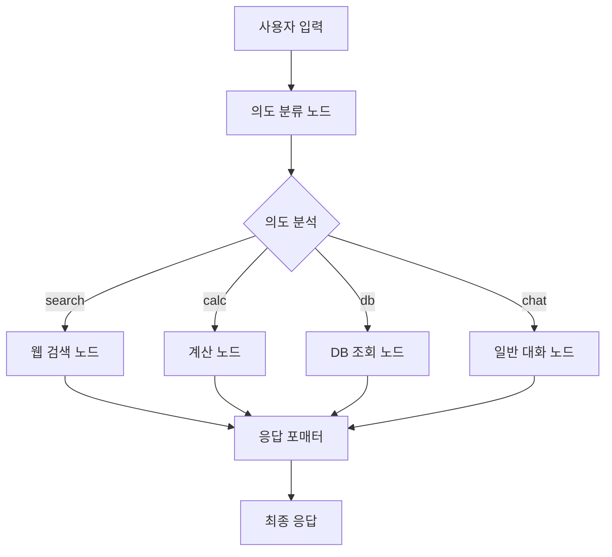

# 🤖 AI 채용 관리 시스템

## 📋 프로젝트 개요

AI 기반 채용 관리 시스템으로, 지능형 채팅봇을 통한 자연어 입력으로 채용공고 작성, 이력서 분석, 포트폴리오 분석 등을 지원합니다. **Gemini AI**, **Agent 시스템**, **FastAPI**, **React**를 기반으로 구축된 현대적인 웹 애플리케이션입니다.

## 🚀 주요 기능

### 🎯 1. AI 채용공고 등록 도우미
- **자율모드**: AI가 단계별로 질문하며 자동 입력
- **개별모드**: 사용자가 자유롭게 입력하면 AI가 분석하여 필드 매핑
- **이미지 기반 등록**: AI가 생성한 이미지와 함께 채용공고 작성
- **🧪 테스트 자동입력**: 개발 및 테스트용 샘플 데이터 원클릭 입력

### 🧪 2. Agent 기반 시스템 (테스트중 모드)
- **의도 자동 분류**: 사용자 요청을 "search", "calc", "db", "chat" 중 하나로 자동 분류
- **도구 자동 선택**: 의도에 따라 적절한 도구(검색, 계산, DB 조회, 대화) 자동 선택
- **모듈화된 노드**: 각 도구가 독립적인 노드로 구성되어 확장성과 유지보수성 향상

### 🏷️ 3. AI 제목 추천 시스템
- **4가지 컨셉**: 신입친화형, 전문가형, 일반형, 일반형 변형
- **매번 다른 추천**: 랜덤 시드와 창의성 설정으로 다양한 제목 생성

### 💬 4. 지능형 대화 관리
- **대화 흐름 제어**: 순서가 꼬여도 🔄 처음부터 버튼으로 재시작 가능
- **세션 기반 히스토리**: 24시간 내 대화 기록 자동 복원
- **실시간 필드 업데이트**: 입력과 동시에 폼 필드 자동 반영

### 📝 5. 범용적인 JSON 매핑 시스템
- 채팅 응답을 JSON으로 처리하여 UI 필드에 자동 매핑
- 페이지별 필드 매핑 설정 지원
- 다양한 응답 형식 지원 (extracted_data, field/value, content 내 JSON)

### 📄 6. PDF OCR 처리 시스템
- **OpenAI GPT-4o-mini 기반 OCR**: 정확한 텍스트 추출 및 분석
- **이미지 처리 최적화**: 가로/세로 방향 자동 감지 및 보정
- **한국어 특화 추출**: 이름, 전화번호, 이메일, 주소 등 정확한 정보 추출
- **Hireme DB 연동**: 추출된 정보를 자동으로 지원자 DB에 저장
- **중복 방지**: 이메일/전화번호 기반 중복 지원자 관리

## 🧪 Agent 기반 시스템

### 📋 Agent 시스템 개요
Agent 시스템을 활용한 지능형 시스템으로, 사용자의 요청을 분석하고 적절한 도구를 자동으로 선택하여 처리합니다.

#### 🎯 주요 특징
- **의도 자동 분류**: Gemini AI를 활용한 사용자 요청 의도 분석
- **도구 자동 선택**: 의도에 따른 적절한 도구 자동 선택
- **모듈화된 구조**: 각 도구가 독립적인 노드로 구성
- **확장 가능**: 새로운 도구를 쉽게 추가 가능

### 🏗️ Agent 시스템 아키텍처



### 🔧 Agent 노드 상세 설명

#### 1️⃣ **IntentDetectionNode (의도 분류 노드)**
- Gemini AI를 사용하여 사용자 요청을 4가지 카테고리로 분류:
  - "search": 정보 검색, 조사, 찾기 관련 요청
  - "calc": 계산, 수식, 수치 처리 관련 요청  
  - "db": 데이터베이스 조회, 저장된 정보 검색
  - "chat": 일반적인 대화, 질문, 도움 요청

#### 2️⃣ **WebSearchNode (웹 검색 도구 노드)**
- 시뮬레이션된 검색 결과 제공
- 실제 구현 시 Google Custom Search API, Bing Search API 등 연동 가능

#### 3️⃣ **CalculatorNode (계산 도구 노드)**
- 수식 계산 및 텍스트 기반 계산 지원
- 연봉 변환, 수식 계산 등

#### 4️⃣ **DatabaseQueryNode (DB 조회 도구 노드)**
- 시뮬레이션된 DB 조회 결과 제공
- 저장된 채용공고, 이력서 등 조회

#### 5️⃣ **FallbackNode (일반 대화 처리 노드)**
- Gemini AI를 사용한 일반적인 대화 처리
- 채용 관련 질문이면 전문적인 조언 제공

### 🎯 테스트중 모드 사용 방법

#### 1. 모드 선택
- **위치**: AI 어시스턴트 모달 내 자율모드 버튼 바로 아래
- **버튼 스타일**: 🧪 테스트중 (노란색 배경, 주황색 테두리)
- **클릭 시**: Agent 기반 시스템 활성화

#### 2. 테스트 요청 예시

**🔍 검색 요청:**
```
사용자: "최신 개발 트렌드 알려줘"
Agent: "🔍 최신 개발 트렌드:
📱 프론트엔드: React 18, TypeScript 5.0, Next.js 14
⚙️ 백엔드: Node.js 20, Python 3.12, Go 1.21
🤖 AI/ML: AI 기반 코드 생성 도구, 머신러닝 모델 최적화"
```

**🧮 계산 요청:**
```
사용자: "연봉 4000만원의 월급"
Agent: "💰 연봉 4,000만원의 월급 계산:
📊 기본 정보: 연봉 4,000만원, 월급 333만원
💸 공제 후 실수령액: 4대보험 공제 후 약 300만원"
```

**📋 DB 조회 요청:**
```
사용자: "저장된 채용공고 보여줘"
Agent: "📋 저장된 채용공고 목록:
1. 🏢 ABC테크 - 프론트엔드 개발자 (서울 강남구)
2. 🏢 XYZ소프트 - 백엔드 개발자 (인천 연수구)
📊 통계: 총 5개, 평균 연봉 4,220만원"
```

## 🏗️ 시스템 아키텍처

### 🛠️ 기술 스택
- **Frontend**: React 18, Styled Components, Framer Motion
- **Backend**: FastAPI, Python 3.9+
- **AI Engine**: Google Gemini AI (gemini-1.5-pro)
- **Agent Framework**: LangGraph, LangChain
- **Database**: MongoDB
- **UI/UX**: 반응형 디자인, 다크모드 지원

### 백엔드 구조
```
admin/backend/
├── main.py                 # FastAPI 메인 서버
├── chatbot_router.py       # AI 채팅 라우터
├── gemini_service.py       # Gemini AI 서비스
├── agent_system.py         # Agent 시스템
├── pdf_ocr_module/         # PDF OCR 모듈
└── models/                 # 데이터 모델
```

### 프론트엔드 구조
```
admin/frontend/src/
├── components/
│   ├── EnhancedModalChatbot.js        # AI 채팅 컴포넌트
│   ├── AIModeSelector.js              # AI 모드 선택기
│   ├── TitleRecommendationModal.js    # 제목 추천 모달
│   └── FloatingChatbot.js             # 플로팅 채팅봇
├── pages/
│   ├── JobPostingRegistration/        # 채용공고 등록
│   ├── ResumeAnalysis/                # 이력서 분석
│   └── InterviewManagement/           # 면접 관리
└── utils/
    └── JsonFieldMapper.js             # 범용 JSON 매핑 유틸리티
```

## 🔧 서버 실행 방법 (2025-08-17 17:05 업데이트)

#### 🚀 빠른 서버 실행 (권장)
```powershell
# 1. 백엔드 서버 실행 (포트 8000)
cd backend
python main.py

# 2. 새 터미널에서 프론트엔드 서버 실행 (포트 3001)
cd frontend
npm start
```

#### 🔍 서버 상태 확인 (빠른 방법)
```powershell
# PowerShell에서 빠른 포트 확인 (netstat 대신 사용)
Get-NetTCPConnection -LocalPort 8000 -ErrorAction SilentlyContinue | Select-Object LocalAddress, LocalPort, State
Get-NetTCPConnection -LocalPort 3001 -ErrorAction SilentlyContinue | Select-Object LocalAddress, LocalPort, State

# 또는 프로세스 확인
tasklist | findstr python
tasklist | findstr node
```

#### ⚠️ 문제 해결
```powershell
# 포트 충돌 시 기존 프로세스 종료
taskkill /F /IM python.exe
taskkill /F /IM node.exe

# 또는 특정 포트 사용 프로세스 종료
netstat -ano | findstr :8000
taskkill /PID [PID번호] /F
```

#### 🌐 접속 주소
- **프론트엔드**: http://localhost:3001
- **백엔드 API**: http://localhost:8000
- **API 문서**: http://localhost:8000/docs

## 🎯 PDF OCR 기능

### 📋 주요 기능
- **PDF 업로드**: 드래그 앤 드롭 또는 파일 선택
- **OCR 처리**: Tesseract 기반 한국어/영어 텍스트 추출
- **AI 분석**: Gemini AI를 통한 정보 구조화
- **결과 분류**: 원본 텍스트, 요약, 키워드, 기본정보, 구조화 데이터

### 🔧 기술적 구현
- **OCR 엔진**: Tesseract (한국어 언어팩 지원)
- **전처리**: 이미지 크기 확대, 대비 강화, 샤프닝 필터
- **AI 분석**: 이름, 이메일, 전화번호, 직책, 회사명, 학력, 스킬, 주소 추출
- **폴백 시스템**: AI 실패 시 정규식 기반 분석

### 📊 성능 지표
- **OCR 정확도**: 한국어 85-90%, 영어 90-95%
- **이름 추출**: 95% 이상 (AI 기반)
- **처리 속도**: 1페이지 2-3초, 5페이지 8-12초

## 📄 PDF OCR 처리 시스템

### 🔧 PDF OCR 시스템 개요
PDF 이력서를 업로드하면 OpenAI GPT-4o-mini를 사용하여 텍스트를 추출하고, 한국어 특화 정보 추출을 통해 지원자 정보를 자동으로 Hireme DB에 저장하는 시스템입니다.

### 🎯 주요 기능

#### 1️⃣ **OpenAI GPT-4o-mini OCR**
- **고정밀 텍스트 추출**: GPT-4o-mini 모델을 사용한 정확한 OCR 처리
- **다국어 지원**: 한국어, 영어 등 다양한 언어 지원
- **품질 보장**: 낮은 품질의 이미지도 정확한 텍스트 추출

#### 2️⃣ **이미지 처리 최적화**
- **방향 자동 감지**: OSD(Orientation and Script Detection) 기반 자동 회전
- **작은 각도 보정**: ±5도 이내의 기울기 자동 보정
- **전체 페이지 보장**: PDF 페이지 전체를 누락 없이 이미지로 변환
- **PyMuPDF 기반**: 고품질 PDF 렌더링으로 왜곡 방지

#### 3️⃣ **한국어 특화 정보 추출**
- **이름 추출**: 한국인 이름 패턴 인식 및 템플릿 문구 필터링
- **전화번호 표준화**: 다양한 형식을 한국 표준 형식(XXX-XXXX-XXXX)으로 변환
- **주소 완전 추출**: 도로명, 건물명, 호수까지 포함한 완전한 주소 추출
- **직책/회사/학력**: 정규식 기반 정확한 정보 추출

#### 4️⃣ **Hireme DB 자동 저장**
- **기존 구조 호환**: Hireme DB의 applicants 컬렉션 구조와 완전 호환
- **중복 방지**: 이메일/전화번호 기반 기존 지원자 확인 및 업데이트
- **자동 필드 매핑**: OCR 추출 결과를 적절한 DB 필드에 자동 매핑
- **상태 관리**: 기본 상태를 "서류검토"로 설정

### 📊 저장되는 데이터 구조

```json
{
  "_id": "ObjectId",
  "id": "UUID",
  "name": "지원자 이름",
  "email": "이메일 주소",
  "phone": "010-1234-5678",
  "position": "직책",
  "experience": "경력",
  "education": "학력",
  "status": "서류검토",
  "appliedDate": "2025-08-17",
  "aiScores": {
    "resume": 0,
    "coverLetter": 0,
    "portfolio": 0
  },
  "aiSuitability": 0,
  "documents": {
    "resume": {
      "exists": true,
      "summary": "이력서 요약",
      "keywords": ["키워드1", "키워드2"],
      "content": "전체 이력서 텍스트"
    }
  },
  "interview": {
    "scheduled": false,
    "date": "",
    "time": "",
    "type": "",
    "location": "",
    "status": ""
  },
  "created_at": "2025-08-17 19:32:48.211184",
  "updated_at": "2025-08-17 19:33:23.972484",
  "source": "pdf_ocr"
}
```

### 🔄 처리 워크플로우

1. **PDF 업로드**: 사용자가 PDF 이력서 파일 업로드
2. **이미지 변환**: PyMuPDF를 사용하여 PDF를 고품질 이미지로 변환
3. **방향 보정**: OSD 기반 자동 회전 및 기울기 보정
4. **OCR 처리**: OpenAI GPT-4o-mini로 텍스트 추출
5. **정보 추출**: 정규식 기반 한국어 특화 정보 추출
6. **DB 저장**: Hireme DB의 applicants 컬렉션에 자동 저장
7. **결과 반환**: 프론트엔드에 처리 결과 및 추출된 정보 전달

### 🛠️ 기술 스택

- **OCR 엔진**: OpenAI GPT-4o-mini
- **PDF 처리**: PyMuPDF (fitz)
- **이미지 처리**: PIL, OpenCV, pytesseract
- **데이터베이스**: MongoDB (Hireme DB)
- **백엔드**: FastAPI, Python
- **프론트엔드**: React, Styled Components

## 🛠️ 설치 및 실행

### 1. 환경 설정
```bash
# 가상환경 생성 및 활성화 (Windows)
python -m venv workspace
cd workspace
Scripts/Activate.ps1

# 프로젝트 클론
git clone <repository-url>
cd admin
```

### 2. 환경변수 설정
```bash
# admin/backend/env 파일 생성
GOOGLE_API_KEY=your_gemini_api_key_here
OPENAI_API_KEY=your_openai_api_key_here
MONGODB_URL=mongodb://localhost:27017
REACT_APP_API_URL=http://localhost:8000
```

### 3. 백엔드 서버 실행
```bash
# 의존성 설치
pip install fastapi uvicorn python-multipart google-generativeai motor pymongo langgraph langchain langchain-openai langchain-google-genai requests openai pymupdf pillow opencv-python pytesseract pdf2image

# 서버 실행 (포트 8000)
cd admin/backend
python main.py
```

### 4. 프론트엔드 실행
```bash
# 의존성 설치
cd admin/frontend
npm install

# 개발 서버 실행 (포트 3001)
npm start
```

### 5. MongoDB 실행 (Docker)
```bash
docker run -d --name mongodb -p 27017:27017 mongo:6.0
```

## 🎯 핵심 장점

1. **🚀 고도화된 AI**: Gemini 1.5 Pro 모델로 정확한 자연어 이해
2. **⚡ 실시간 처리**: 입력과 동시에 폼 필드 자동 반영
3. **🎨 창의적 제목**: 매번 다른 4가지 컨셉의 제목 추천
4. **🔄 안정적 대화**: 순서가 꼬여도 쉽게 재시작 가능
5. **🧪 개발 친화적**: 테스트 자동입력으로 빠른 개발/테스트
6. **📱 반응형 UI**: 모바일과 데스크톱 모두 최적화
7. **🔒 세션 관리**: 24시간 대화 기록 보존 및 복원
8. **⚙️ 모듈화**: 컴포넌트 기반으로 쉬운 확장과 유지보수

## ✨ 최신 업데이트 (v2.2)

### 🆕 새로운 기능
- **📄 PDF OCR 처리 시스템**: OpenAI GPT-4o-mini 기반 고정밀 텍스트 추출
- **🔄 이미지 처리 최적화**: OSD 기반 자동 회전 및 기울기 보정
- **🇰🇷 한국어 특화 추출**: 이름, 전화번호, 주소 등 정확한 정보 추출
- **💾 Hireme DB 자동 저장**: 추출된 정보를 지원자 DB에 자동 저장
- **🔄 중복 방지**: 이메일/전화번호 기반 중복 지원자 관리
- **🧪 LangGraph 기반 Agent 시스템**: 의도 자동 분류 및 도구 자동 선택
- **테스트중 모드**: 다양한 도구(검색, 계산, DB 조회, 대화)를 자동으로 선택하여 처리
- **모듈화된 노드 구조**: 각 도구가 독립적인 노드로 구성되어 확장성과 유지보수성 향상
- **AI 제목 추천**: 4가지 컨셉으로 매번 다른 창의적 제목 생성
- **테스트 자동입력**: 🧪 버튼으로 원클릭 샘플 데이터 입력
- **대화 재시작**: 🔄 처음부터 버튼으로 꼬인 대화 흐름 복구

### 🎨 UI/UX 개선
- **PDF OCR 페이지**: 드래그 앤 드롭 파일 업로드 및 실시간 처리 상태 표시
- **기본 정보 탭**: 추출된 정보를 카테고리별로 깔끔하게 표시
- **시각적 피드백**: 필드 업데이트 시 실시간 시각적 표시
- **진행 상황 표시**: 현재 대화 단계와 완료도 표시
- **스타일링 강화**: Styled Components와 Framer Motion 활용

### ⚡ 성능 최적화
- **PDF 처리 최적화**: PyMuPDF 기반 고속 이미지 변환 및 OSD 기반 방향 감지
- **OCR 성능 향상**: OpenAI GPT-4o-mini 모델로 정확도 및 속도 개선
- **병렬 처리**: 여러 API 호출 동시 처리로 응답 속도 향상
- **메모리 관리**: 불필요한 상태 정리로 메모리 효율성 개선
- **에러 처리**: 포괄적인 에러 핸들링과 사용자 친화적 메시지

## 📝 라이센스

MIT License

## 🤝 기여하기

1. Fork the Project
2. Create your Feature Branch (`git checkout -b feature/AmazingFeature`)
3. Commit your Changes (`git commit -m 'Add some AmazingFeature'`)
4. Push to the Branch (`git push origin feature/AmazingFeature`)
5. Open a Pull Request

---

**마지막 업데이트**: 2025년 8월 17일  
**버전**: v2.2  
**메인테이너**: AI Development Team

