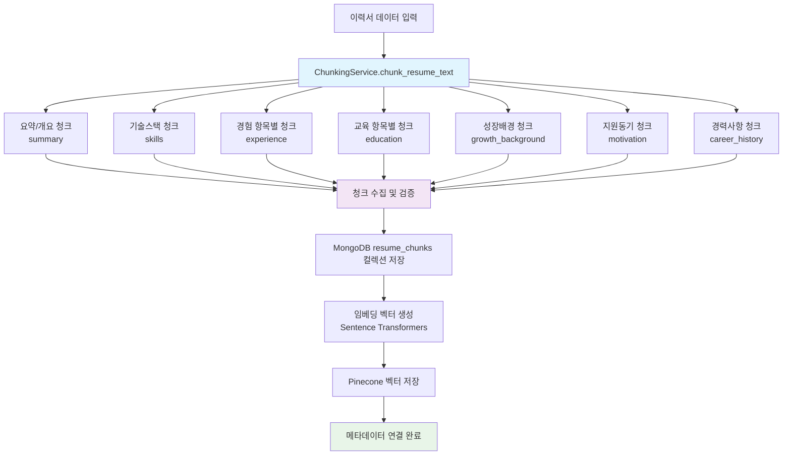
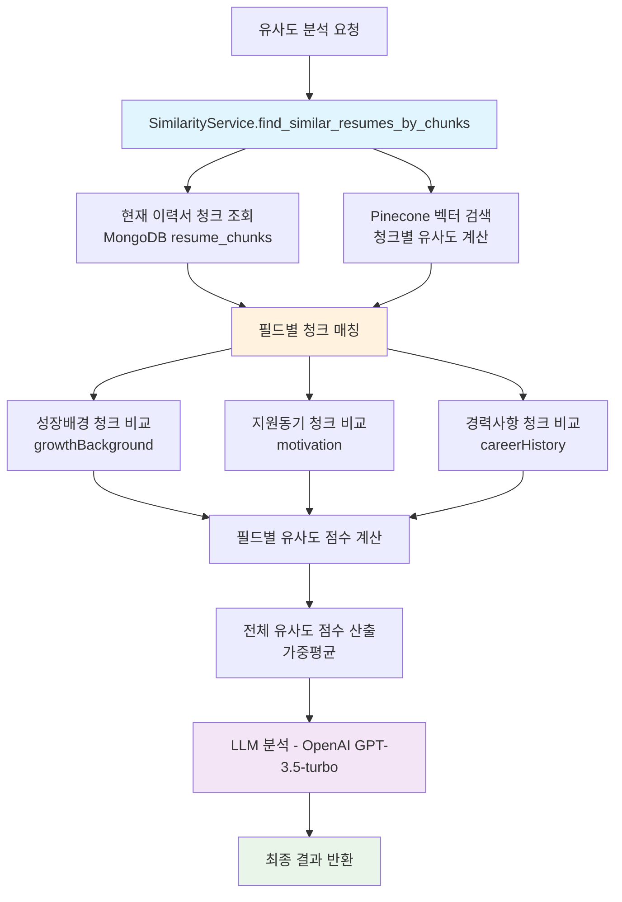
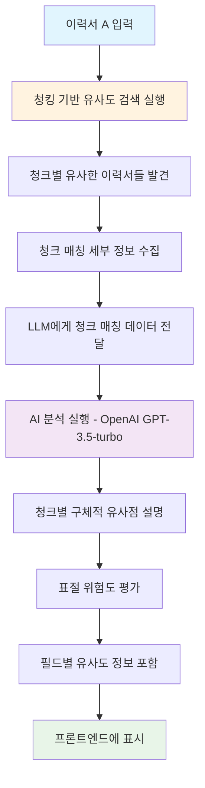

# 이력서 분석 시스템 (RAG 적용)

이력서 원본을 MongoDB에 저장하고, 임베딩된 벡터를 Pinecone 벡터 DB에, 키워드 검색을 위해 Elasticsearch에 저장하는 하이브리드 시스템입니다.
**RAG (Retrieval-Augmented Generation) 기술**을 적용하여 유사도 검색 결과를 **OpenAI GPT-3.5-turbo**가 자연어로 분석하고 설명합니다.

## 설치 및 설정

1. Python 패키지 설치:
```bash
pip install -r requirements.txt
```

2. 환경변수 설정:
```bash
cp env.example .env
```
`.env` 파일에서 다음 키들을 설정하세요:
- `OPENAI_API_KEY`: OpenAI API 키
- `PINECONE_API_KEY`: Pinecone API 키
- `PINECONE_ENVIRONMENT`: Pinecone 환경 (예: gcp-starter)
- `PINECONE_INDEX_NAME`: Pinecone 인덱스 이름
- `ELASTICSEARCH_HOST`: Elasticsearch 호스트 (기본값: localhost:9200)
- `ELASTICSEARCH_INDEX`: Elasticsearch 인덱스 이름 (기본값: resume_search)

3. MongoDB 실행:
로컬 MongoDB가 실행 중이어야 합니다.

4. Elasticsearch 및 MongoDB 실행: 🆕
Docker Compose를 사용하여 Elasticsearch와 MongoDB를 함께 실행합니다.

**권장 방법: Docker Compose 사용**
```bash
# 프로젝트 루트에서 실행
docker-compose up -d

# 상태 확인
docker ps

# 중지할 때
docker-compose down
```


## 연결 테스트 (웹 브라우저에서 http://localhost:9200 접속)
```

5. Pinecone 인덱스 생성:
Pinecone 콘솔에서 `resume-vectors` 인덱스를 생성하세요.

## 사용법

### 서버 실행
```bash
python server.py
```

### 데이터베이스 초기화
```bash
python database/init.py
```

## API 엔드포인트

### 1. 이력서 업로드 및 분석
```
POST /api/resume/upload
```
**요청:**
```json
{
  "name": "김지원",
  "email": "jiwon@example.com",
  "phone": "010-1234-5678",
  "resume_text": "프론트엔드 개발자...",
  "cover_letter_text": "안녕하세요...",
  "portfolio_text": "GitHub 프로젝트..."
}
```

**응답:**
```json
{
  "success": true,
  "message": "이력서가 성공적으로 업로드되었습니다.",
  "data": {
    "resume_id": "...",
    "analysis": {
      "score": 85,
      "summary": {...},
      "skills": ["React", "TypeScript"],
      "experience_years": 3
    }
  }
}
```

### 2. 이력서 목록 조회
```
GET /api/resumes?page=1&limit=10&sort=created_at&order=desc
```

### 3. 이력서 상세 조회
```
GET /api/resume/{resume_id}
```

### 4. 유사 이력서 검색
```
POST /api/resume/search
```
**요청:**
```json
{
  "query": "React 개발자",
  "type": "resume",
  "limit": 5
}
```

### 5. 이력서 삭제
```
DELETE /api/resume/{resume_id}
```

### 6. Vector Service APIs

#### 6.1. 벡터 생성 및 저장
```
POST /api/vector/create
```
**요청:**
```json
{
  "text": "프론트엔드 개발자로 3년간 근무...",
  "document_id": "resume_001",
  "metadata": {
    "type": "resume",
    "applicant_id": "app_001"
  }
}
```

**응답:**
```json
{
  "message": "Vector created successfully",
  "document_id": "resume_001",
  "vector_dimension": 384,
  "status": "success"
}
```

#### 6.2. 벡터 유사도 검색
```
POST /api/vector/search
```
**요청:**
```json
{
  "query": "React 개발 경험이 있는 개발자",
  "top_k": 5,
  "threshold": 0.7
}
```

**응답:**
```json
{
  "results": [
    {
      "document_id": "doc_001",
      "score": 0.95,
      "text": "검색된 텍스트 샘플 1",
      "metadata": {
        "type": "resume",
        "applicant_id": "app_001"
      }
    }
  ],
  "total_found": 2
}
```

### 7. Chunking Service APIs

#### 7.1. 텍스트 분할 및 DB 저장 🆕
```
POST /api/chunking/split
```
**요청:**
```json
{
  "text": "저는 어린 시절부터 컴퓨터와 기술에 관심이 많았습니다...",
  "resume_id": "6899630301e8bfaa47925da8",
  "field_name": "growthBackground",
  "chunk_size": 800,
  "chunk_overlap": 150,
  "split_type": "recursive"
}
```

**응답:**
```json
{
  "chunks": [
    {
      "id": "6899630301e8bfaa47925daa",
      "resume_id": "6899630301e8bfaa47925da8",
      "chunk_id": "chunk_000",
      "text": "저는 어린 시절부터 컴퓨터와...",
      "start_pos": 0,
      "end_pos": 800,
      "chunk_index": 0,
      "field_name": "growthBackground",
      "vector_id": "resume_6899630301e8bfaa47925da8_chunk_000",
      "metadata": {
        "length": 800,
        "split_type": "recursive",
        "chunk_size": 800,
        "chunk_overlap": 150
      },
      "created_at": "2025-08-11T12:26:59.039Z"
    }
  ],
  "total_chunks": 2,
  "original_length": 1500,
  "resume_id": "6899630301e8bfaa47925da8",
  "field_name": "growthBackground",
  "split_config": {
    "chunk_size": 800,
    "chunk_overlap": 150,
    "split_type": "recursive"
  }
}
```

#### 7.2. 이력서 전체 청킹 처리 🆕
```
POST /api/chunking/process-resume
```
**요청:**
```json
{
  "resume_id": "6899630301e8bfaa47925da8",
  "chunk_size": 800,
  "chunk_overlap": 150
}
```

**응답:**
```json
{
  "resume_id": "6899630301e8bfaa47925da8",
  "applicant_name": "김민수",
  "processed_fields": ["growthBackground", "motivation", "careerHistory"],
  "total_chunks": 8,
  "chunks_by_field": {
    "growthBackground": 3,
    "motivation": 2,
    "careerHistory": 3
  },
  "chunks": [...]
}
```

#### 7.3. 이력서별 청크 조회 🆕
```
GET /api/chunking/resume/{resume_id}
```

**응답:**
```json
{
  "resume_id": "6899630301e8bfaa47925da8",
  "chunks": [
    {
      "id": "6899630301e8bfaa47925daa",
      "resume_id": "6899630301e8bfaa47925da8",
      "chunk_id": "growthBackground_chunk_000",
      "text": "저는 어린 시절부터...",
      "field_name": "growthBackground",
      "chunk_index": 0,
      "vector_id": "resume_6899630301e8bfaa47925da8_growthBackground_chunk_000",
      "metadata": {
        "applicant_name": "김민수",
        "position": "프론트엔드",
        "length": 800
      }
    }
  ],
  "total_chunks": 8
}
```

#### 7.4. 청크 병합
```
POST /api/chunking/merge
```
**요청:**
```json
{
  "chunks": [
    {"text": "첫 번째 청크"},
    {"text": "두 번째 청크"}
  ],
  "separator": "\n\n"
}
```

**응답:**
```json
{
  "merged_text": "첫 번째 청크\n\n두 번째 청크",
  "total_length": 25,
  "chunks_merged": 2,
  "separator_used": "\n\n"
}
```

### 8. 이력서/자소서 유사도 체크 (하이브리드 검색 기반 RAG 적용) 🆕

#### 8.1. 하이브리드 이력서 유사도 체크 및 AI 분석 🔥
```
POST /api/resume/similarity-check/{applicant_id}
```
**설명**: 특정 지원자의 이력서와 다른 모든 이력서를 **하이브리드 검색(벡터 + 키워드)**으로 비교하여 정밀한 유사도를 계산하고, LLM을 통해 구체적인 유사성을 분석합니다.

#### 8.2. 자소서 표절체크 🔥
```
POST /api/coverletter/similarity-check/{applicant_id}
```
**설명**: 특정 지원자의 자소서와 다른 모든 자소서를 벡터 검색으로 비교하여 표절 가능성을 분석합니다.

**⚡ 하이브리드 검색 특징:**
- **벡터 검색 (50%)**: Vector DB에 저장된 이력서들의 의미적 유사도
- **Elasticsearch 검색 (50%)**: BM25 + 멀티필드 + 퍼지매칭 통합 엔진
- **폴백 처리**: Vector DB에 없는 데이터도 Elasticsearch로 포함
- **OCR 업로드 지원**: PDF OCR로 업로드된 이력서도 자동 처리
- **실시간 인덱싱**: 문서 생성/수정/삭제 시 Elasticsearch 자동 반영

**요청 (이력서):**
```json
POST /api/resume/similarity-check/68999dda47ea917329ee7aba
```

**응답 (이력서):**
```json
{
  "current_resume": {
    "id": "68999dda47ea917329ee7aba",
    "name": "김민수",
    "position": "프론트엔드 개발자",
    "department": "개발팀"
  },
  "similarity_results": [
    {
      "resume_id": "68999dda47ea917329ee7abe",
      "applicant_name": "박영희",
      "position": "프론트엔드 개발자",
      "overall_similarity": 0.65,
      "field_similarities": {
        "growthBackground": 0.72,
        "motivation": 0.58,
        "careerHistory": 0.65
      },
      "is_high_similarity": false,
      "is_moderate_similarity": true,
      "is_low_similarity": false,
      "llm_analysis": {
        "success": true,
        "analysis": "성장배경에서 '어려운 환경 극복' 표현과 지원동기의 '회사 발전 기여' 키워드가 매우 유사합니다. 경력사항에서도 비슷한 업무 경험을 언급하고 있어 전반적으로 높은 유사성을 보입니다.",
        "similarity_score": 0.65,
        "analyzed_at": "2025-01-15T10:30:00Z"
      }
    }
  ],
  "statistics": {
    "total_compared": 15,
    "high_similarity_count": 2,
    "moderate_similarity_count": 5,
    "low_similarity_count": 8,
    "average_similarity": 0.42
  },
  "plagiarism_analysis": {
    "success": true,
    "risk_level": "MEDIUM",
    "risk_score": 0.65,
    "analysis": "높은 유사도(65.0%)의 이력서가 발견되었습니다. 주의가 필요합니다.",
    "recommendations": [
      "일부 내용의 독창성을 확인해주세요",
      "개인만의 특색을 더 강조해주세요"
    ],
    "similar_count": 7,
    "analyzed_at": "2025-01-15T10:30:00Z"
  },
  "top_similar": [
    {
      "resume_id": "68999dda47ea917329ee7abe",
      "applicant_name": "박영희", 
      "overall_similarity": 0.65,
      "llm_analysis": {
        "analysis": "성장배경에서 '어려운 환경 극복' 표현이 매우 유사..."
      }
    }
  ],
  "analysis_timestamp": "2025-01-15T10:30:00Z"
}
```

**요청 (자소서):**
```json
POST /api/coverletter/similarity-check/68a7222b5f5e9bcde8bd227f
```

**응답 (자소서):**
```json
{
  "success": true,
  "document_type": "cover_letter",
  "analysis_type": "plagiarism_check",
  "data": {
    "original_cover_letter": {
      "id": "68a7222b5f5e9bcde8bd227f",
      "applicant_id": "app_001",
      "created_at": "2025-01-15T08:30:00Z"
    },
    "suspected_plagiarism": [
      {
        "similarity_score": 0.85,
        "similarity_percentage": 85.0,
        "plagiarism_risk": "HIGH",
        "cover_letter": {
          "_id": "67890abc123def456789",
          "applicant_id": "app_002",
          "created_at": "2025-01-10T14:20:00Z"
        },
        "plagiarism_analysis": {
          "success": true,
          "risk_level": "HIGH", 
          "analysis": "지원동기와 성장배경 부분에서 매우 높은 유사성을 보입니다. 표절 가능성이 높으니 즉시 검토가 필요합니다.",
          "recommendations": [
            "개인적인 경험을 더 구체적으로 작성해주세요",
            "독창적인 표현으로 수정이 필요합니다"
          ]
        }
      }
    ],
    "total": 1,
    "plagiarism_threshold": 0.7
  }
}
```

#### 8.3. 지원자 기반 유사 인재 추천 🔥
```
POST /api/applicants/similar-recommendation/{applicant_id}
```
**설명**: 특정 지원자를 기준으로 하이브리드 검색(벡터 50% + 키워드 50%)으로 유사한 지원자를 추천합니다.

**응답 예시:**
```json
{
  "success": true,
  "message": "유사 인재 추천 완료",
  "data": {
    "search_method": "applicant_hybrid",
    "weights": { "vector": 0.5, "keyword": 0.5 },
    "results": [
      {
        "final_score": 0.812,
        "vector_score": 0.74,
        "keyword_score": 0.88,
        "original_keyword_score": 8.8,
        "applicant": {
          "_id": "68a7...",
          "name": "박영희",
          "position": "프론트엔드 개발자",
          "skills": "React, TypeScript, JavaScript"
        },
        "search_methods": ["vector", "keyword"]
      }
    ],
    "total": 10,
    "vector_count": 7,
    "keyword_count": 9,
    "target_applicant": {"id": "6899...", "name": "김민수", "position": "프론트엔드"}
  }
}
```

### 9. 키워드 검색 APIs (Elasticsearch 기반) 🆕

#### 9.1. 키워드 기반 이력서 검색 🔥
```
POST /api/resume/search/keyword
```
**설명**: Elasticsearch BM25 엔진과 한국어 형태소 분석을 통한 고성능 키워드 검색

**요청:**
```json
{
  "query": "React 프론트엔드 개발자",
  "limit": 10
}
```

**응답:**
```json
{
  "success": true,
  "message": "'React 프론트엔드 개발자' 검색 결과입니다.",
  "data": {
    "query": "React 프론트엔드 개발자",
    "results": [
      {
        "bm25_score": 8.45,
        "resume": {
          "_id": "68999dda47ea917329ee7aba",
          "name": "김민수",
          "position": "프론트엔드 개발자",
          "skills": "React, TypeScript, JavaScript"
        },
        "highlight": "**React** **프론트엔드** **개발자**로 3년간 근무하며..."
      }
    ],
    "total": 5,
    "search_method": "keyword_bm25",
    "query_tokens": ["react", "프론트엔드", "개발자"]
  }
}
```

#### 9.2. 다중 하이브리드 검색 🔥
```
POST /api/resume/search/multi-hybrid
```
**설명**: 벡터 검색 + Elasticsearch 키워드 검색을 융합한 고도화된 검색

**요청:**
```json
{
  "query": "React 개발 경험 3년 이상",
  "type": "resume",
  "limit": 10
}
```

**응답:**
```json
{
  "success": true,
  "message": "다중 하이브리드 검색 완료: 'React 개발 경험 3년 이상'",
  "data": {
    "query": "React 개발 경험 3년 이상",
    "search_method": "multi_hybrid",
    "weights": {
      "vector": 0.5,
      "keyword": 0.5
    },
    "results": [
      {
        "final_score": 0.8743,
        "vector_score": 0.92,
        "keyword_score": 0.85,
        "original_keyword_score": 8.5,
        "resume": {
          "_id": "68999dda47ea917329ee7aba",
          "name": "김민수",
          "position": "프론트엔드 개발자"
        },
        "search_methods": ["vector", "keyword"]
      }
    ],
    "total": 8,
    "vector_count": 12,
    "keyword_count": 15
  }
}
```

#### 9.3. 키워드 검색 인덱스 관리
```
POST /api/resume/search/keyword/rebuild-index
```
**설명**: Elasticsearch 검색 인덱스 재구축

**응답:**
```json
{
  "success": true,
  "message": "Elasticsearch 인덱스 구축이 완료되었습니다.",
  "data": {
    "total_documents": 150,
    "failed_documents": 0,
    "index_created_at": "2025-08-18T10:30:00.000Z"
  }
}
```

#### 9.4. 키워드 검색 통계
```
GET /api/resume/search/keyword/stats
```

**응답:**
```json
{
  "success": true,
  "data": {
    "indexed": true,
    "total_documents": 150,
    "index_name": "resume_search",
    "index_size": 52428800,
    "shard_count": 1
  }
}
```

### 10. Similarity Service APIs

#### 10.1. 텍스트 유사도 비교
```
POST /api/similarity/compare
```
**요청:**
```json
{
  "text1": "프론트엔드 개발자입니다",
  "text2": "React 개발자로 일하고 있습니다",
  "method": "cosine"
}
```

**응답:**
```json
{
  "similarity_score": 0.8542,
  "method": "cosine",
  "text1_length": 12,
  "text2_length": 18,
  "comparison_result": {
    "highly_similar": true,
    "moderately_similar": false,
    "low_similar": false
  }
}
```

#### 10.2. 일괄 유사도 계산
```
POST /api/similarity/batch
```
**요청:**
```json
{
  "texts": [
    "프론트엔드 개발자",
    "백엔드 개발자",
    "풀스택 개발자"
  ],
  "reference_text": "React 개발자",
  "method": "cosine",
  "threshold": 0.7
}
```

**응답:**
```json
{
  "results": [
    {
      "index": 0,
      "text_preview": "프론트엔드 개발자",
      "similarity_score": 0.8945,
      "above_threshold": true
    }
  ],
  "filtered_results": [...],
  "total_compared": 3,
  "above_threshold_count": 1,
  "method": "cosine",
  "threshold": 0.7,
  "reference_text_length": 7
}
```

#### 10.3. 유사도 서비스 메트릭
```
GET /api/similarity/metrics
```

**응답:**
```json
{
  "total_comparisons": 1250,
  "average_similarity": 0.67,
  "supported_methods": ["cosine", "jaccard", "levenshtein", "semantic"],
  "performance_stats": {
    "average_processing_time_ms": 45,
    "comparisons_per_second": 220,
    "cache_hit_rate": 0.78
  },
  "usage_by_method": {
    "cosine": 850,
    "semantic": 300,
    "jaccard": 70,
    "levenshtein": 30
  }
}
```

## 데이터 구조

### MongoDB (원본 데이터)
- **데이터베이스**: `hireme`

#### 1. `resumes` 컬렉션 (기본 이력서 정보)
```javascript
{
  "_id": ObjectId("6899630301e8bfaa47925da8"),
  "resume_id": "6899630301e8bfaa47925da9",
  "name": "김민수",
  "position": "프론트엔드",
  "department": "개발",
  "experience": "3-5년", 
  "skills": "React, JavaScript, TypeScript, CSS",
  "growthBackground": "저는 어린 시절부터 컴퓨터와 기술에 관심이 많았습니다...",
  "motivation": "귀사의 혁신적인 프로젝트에 참여하고 싶습니다...",
  "careerHistory": "3년간 스타트업에서 프론트엔드 개발자로 근무하며...",
  "analysisScore": 85,
  "analysisResult": "우수한 프론트엔드 개발자로...",
  "status": "pending",
  "created_at": ISODate("2025-08-11T12:26:59.039Z")
}
```

#### 2. `resume_chunks` 컬렉션 (청킹된 텍스트 데이터) 🆕
```javascript
{
  "_id": ObjectId("6899630301e8bfaa47925daa"),
  "resume_id": "6899630301e8bfaa47925da8",
  "chunk_id": "growthBackground_chunk_000",
  "text": "저는 어린 시절부터 컴퓨터와 기술에 관심이 많았습니다. 초등학교 때부터...",
  "start_pos": 0,
  "end_pos": 800,
  "chunk_index": 0,
  "field_name": "growthBackground",
  "vector_id": "resume_6899630301e8bfaa47925da8_growthBackground_chunk_000",
  "metadata": {
    "applicant_name": "김민수",
    "position": "프론트엔드",
    "department": "개발",
    "length": 800
  },
  "created_at": ISODate("2025-08-11T12:26:59.039Z")
}
```

### Pinecone (벡터 데이터)
- **인덱스**: `resume-vectors`
- 저장 데이터: 청크별 텍스트 임베딩 벡터, 메타데이터

#### 청킹 적용 전 (기존)
```python
{
  "id": "resume_6899630301e8bfaa47925da8_full",
  "values": [0.1, 0.2, 0.3, ...],  # 384차원 벡터
  "metadata": {
    "resume_id": "6899630301e8bfaa47925da8",
    "type": "full_resume",
    "applicant_name": "김민수"
  }
}
```

#### 청킹 적용 후 (신규) 🆕
```python
# 성장배경 청크
{
  "id": "resume_6899630301e8bfaa47925da8_growthBackground_chunk_000", 
  "values": [0.1, 0.2, 0.3, ...],  # 384차원 벡터
  "metadata": {
    "resume_id": "6899630301e8bfaa47925da8",
    "chunk_id": "growthBackground_chunk_000",
    "field_name": "growthBackground",
    "applicant_name": "김민수",
    "chunk_index": 0
  }
}

# 지원동기 청크
{
  "id": "resume_6899630301e8bfaa47925da8_motivation_chunk_000",
  "values": [0.4, 0.5, 0.6, ...],  # 384차원 벡터  
  "metadata": {
    "resume_id": "6899630301e8bfaa47925da8",
    "chunk_id": "motivation_chunk_000", 
    "field_name": "motivation",
    "applicant_name": "김민수",
    "chunk_index": 0
  }
}

# 경력사항 청크
{
  "id": "resume_6899630301e8bfaa47925da8_careerHistory_chunk_000",
  "values": [0.7, 0.8, 0.9, ...],  # 384차원 벡터
  "metadata": {
    "resume_id": "6899630301e8bfaa47925da8", 
    "chunk_id": "careerHistory_chunk_000",
    "field_name": "careerHistory",
    "applicant_name": "김민수",
    "chunk_index": 0
  }
}
```

## 처리 과정

### 기본 이력서 처리
1. 이력서 원본 정보를 `resumes` 컬렉션에 저장
2. OpenAI GPT-3.5-turbo를 사용한 이력서 분석 및 점수 부여

### 청킹 기반 처리 🆕

#### 청킹 서비스 플로우



#### 청킹 기반 유사도 검색 플로우 🔥



#### 처리 단계별 세부 과정

1. **텍스트 청킹**: 이력서의 주요 필드들을 의미 단위로 분할
   - **summary**: 첫 200자 또는 기본정보 (이름, 직무, 부서)
   - **skills**: 전체 기술스택 정보
   - **experience**: 경험을 개별 항목으로 분할 (정규식 기반)
   - **education**: 교육을 개별 항목으로 분할
   - **growth_background**: 성장배경 전체
   - **motivation**: 지원동기 전체
   - **career_history**: 경력사항 전체

2. **청크 저장**: 각 청크를 `resume_chunks` 컬렉션에 저장
   - 고유 chunk_id 생성 (`{resume_id}_{chunk_type}`)
   - 메타데이터 (section, original_field) 포함

3. **벡터 변환**: **Sentence Transformers**를 사용하여 청크별 임베딩 생성

4. **벡터 저장**: 청크별 임베딩 벡터를 Pinecone에 저장
   - vector_id 생성 (`resume_{resume_id}_{chunk_id}`)

5. **메타데이터 연결**: 원본 이력서와 청크, 벡터를 연결

### 청킹의 장점
- ✅ **정확한 검색**: 긴 텍스트에서 특정 부분만 정확히 매칭
- ✅ **성능 향상**: 작은 단위로 유사도 계산하여 속도 개선
- ✅ **세밀한 분석**: 필드별/섹션별 독립적 유사도 분석
- ✅ **메모리 효율성**: 큰 문서도 작은 청크로 나누어 처리
- ✅ **유연한 검색**: 전체 문서가 아닌 관련 부분만 반환

## 청킹 기반 유사도 검색 시스템 🔥

### 임베딩 모델
- **모델**: `paraphrase-multilingual-MiniLM-L12-v2`
- **특징**: 한국어 및 다국어 지원, 384차원 벡터
- **장점**: 의미적 유사도 및 패러프레이즈 인식 성능 향상
- **청킹 최적화**: 작은 텍스트 단위에서 정확한 임베딩 생성

### 청킹 기반 유사도 계산 대상 필드
- **사용 필드** (청킹 후 유사도 계산에 포함):
  - **성장배경** (`growthBackground`) - 청크별 세밀한 비교
  - **지원동기** (`motivation`) - 의도와 목표 유사성 분석
  - **경력사항** (`careerHistory`) - 경험의 구체적 매칭

- **제외 필드** (유사도 계산에서 완전 제외):
  - ~~직무~~ (`position`)
  - ~~부서~~ (`department`)
  - ~~경력~~ (`experience`)
  - ~~기술스택~~ (`skills`)
  - ~~이름~~ (`name`)

### 청킹 기반 유사도 임계값 및 가중치
- **전체 유사도 임계값**: 30% (0.3)
- **필드별 임계값**:
  - 성장배경: 20% (0.2) - 청크별 매칭
  - 지원동기: 20% (0.2) - 청크별 매칭
  - 경력사항: 20% (0.2) - 청크별 매칭

### 청킹 기반 하이브리드 유사도 계산
- **청크별 벡터 유사도** (70%) + **청크별 텍스트 유사도** (30%)
- **필드별 가중치**: 
  - 성장배경 40% (가장 중요)
  - 지원동기 35%
  - 경력사항 25%
- **청크 매칭 검증**: 각 필드의 청크들 간 최적 매칭으로 정확도 향상
- **Pinecone 청크별 인덱싱**: 각 청크가 독립적으로 벡터 저장 및 검색

## 다중 하이브리드 검색 시스템 🔥

### 검색 방법별 특징 및 융합 (업데이트됨)
- **벡터 검색 (50% 가중치)**: 의미적 유사도 기반, 동의어/유의어 인식
- **Elasticsearch 키워드 검색 (50% 가중치)**: BM25 + 멀티필드 + 퍼지매칭 통합

### Elasticsearch 키워드 검색 엔진 🔥
- **검색 엔진**: Elasticsearch 7.x+ (Apache Lucene 기반)
- **알고리즘**: BM25 Okapi (Best Matching 25) - Elasticsearch 내장
- **형태소 분석**: Kiwi 분석기 (한국어 특화) + Standard Analyzer
- **멀티 필드 검색**: 이름(3x), 직무(2x), 기술스택(2x), 부서(1.5x) 가중치
- **퍼지 매칭**: 오타 허용 (`fuzziness: AUTO`)
- **복합어 처리**: IT 용어 복합어 사전 (프론트엔드, 머신러닝 등)
- **불용어 제거**: 조사, 어미, 의미없는 단어 자동 필터링
- **토큰화**: 의미있는 품사만 추출 (명사, 동사, 형용사, 외국어 등)
- **실시간 하이라이트**: 검색어 자동 강조 (`**키워드**`)
- **확장성**: 분산 인덱싱, 샤딩, 레플리카 지원

### 융합 점수 계산 방식 (업데이트됨)
```
최종점수 = (벡터점수 × 0.5) + (Elasticsearch점수 × 0.5)
```
- **Elasticsearch 점수**: 멀티필드 검색 + 토큰 매칭 조합
- **벡터 점수**: Pinecone 코사인 유사도
- **결과 정렬**: 최종 융합 점수 기준 내림차순
- **검색 방법 표시**: vector, keyword 매칭 여부 표시
- **성능 향상**: 3개 검색 → 2개 검색으로 최적화

## RAG (Retrieval-Augmented Generation) 시스템 🚀

### LLM 서비스 (OpenAI GPT-3.5-turbo)
- **AI 모델**: OpenAI GPT-3.5-turbo
- **기능**: 유사도 분석 결과를 자연어로 설명
- **추가**: OCR/자소서 필드 추출에는 gpt-4o-mini 사용
- **처리 과정**:
  1. 유사도 검색 결과 수집
  2. LLM에게 원본 + 유사 이력서 데이터 제공
  3. 구체적인 유사점 분석 및 자연어 생성
  4. 표절 위험도 평가 및 권장사항 제시

### 청킹 기반 RAG 플로우 🔥


### 환경변수 설정
```bash
# 환경변수
OPENAI_API_KEY=your_openai_api_key  # 변경: Gemini → OpenAI
PINECONE_API_KEY=your_pinecone_api_key
PINECONE_INDEX_NAME=resume-vectors
MONGODB_URI=mongodb://localhost:27017/hireme

# Elasticsearch 설정 🆕
ELASTICSEARCH_HOST=localhost:9200
ELASTICSEARCH_INDEX=resume_search
# 인증 사용 시 (선택)
ELASTICSEARCH_USERNAME=elastic
ELASTICSEARCH_PASSWORD=changeme123
```

### LLM 분석 결과 예시
**입력**: 두 이력서가 65% 유사함
**LLM 출력**: 
> "성장배경에서 '어려운 환경 극복' 표현과 지원동기의 '회사 발전 기여' 키워드가 매우 유사합니다. 경력사항에서도 비슷한 업무 경험을 언급하고 있어 전반적으로 높은 유사성을 보입니다."

### 표절 위험도 분석
- **HIGH (80% 이상)**: 표절 가능성 높음, 즉시 검토 필요
- **MEDIUM (60-80%)**: 주의 필요, 일부 수정 권장 
- **LOW (60% 미만)**: 적정 수준, 문제없음

## 주요 기능

### 기본 이력서 관리
- ✅ 이력서 업로드 및 자동 분석
- ✅ 유사 이력서 검색 (벡터 유사도)
- ✅ 이력서 목록 조회 및 페이징
- ✅ 이력서 상세 조회
- ✅ 이력서 삭제 (원본 + 벡터)
- ✅ AI 기반 이력서 분석 및 점수 부여

### 청킹 기반 RAG 유사도 분석 🔥
- ✅ **OpenAI GPT-3.5-turbo**를 활용한 지능형 청킹 기반 유사도 분석
- ✅ **청크별 구체적 유사점 설명**: 어떤 청크가 어떤 부분과 유사한지 자연어로 설명
- ✅ **필드별 세밀한 분석**: 성장배경, 지원동기, 경력사항 각각의 청크별 유사성 분석
- ✅ **표절 위험도 평가**: HIGH/MEDIUM/LOW 3단계 위험도 분석
- ✅ **청크 매칭 세부 정보**: 각 청크별 매칭 점수와 세부 내용 제공
- ✅ **개선 권장사항 제시**: AI가 제안하는 구체적인 수정 방향
- ✅ **실시간 청킹 분석**: 청킹 기반 유사도 검색과 동시에 LLM 분석 수행
- ✅ **프론트엔드 통합**: 청킹 기반 분석 결과를 사용자 친화적으로 표시

### 자소서 표절체크 시스템 🆕
- ✅ **자소서 전용 표절 검사**: 자소서간 벡터 유사도 기반 표절 검사
- ✅ **높은 임계값 적용**: 0.7 이상의 높은 유사도만 표절 의심으로 분류
- ✅ **위험도 분석**: HIGH(85%+), MEDIUM(70-85%) 등급별 위험도 제공
- ✅ **AI 분석 통합**: LLM을 통한 구체적인 표절 위험 분석
- ✅ **자동 벡터 저장**: 표절체크 시 자동으로 벡터 DB에 저장
- ✅ **JSON 직렬화 안정화**: MongoDB datetime 객체 완전 대응

### 시스템 안정성 개선 🛠️
- ✅ **포괄적 JSON 직렬화**: 모든 datetime 객체 자동 문자열 변환
- ✅ **에러 핸들링 강화**: 자소서 미등록 시 상세한 디버깅 정보 제공
- ✅ **다중 문서 타입 지원**: 이력서, 자소서, 포트폴리오 ID 필드 자동 매핑
- ✅ **DB 구조 호환성**: basic_info.names 배열 구조 완전 지원

### Vector Service 기능
- ✅ 텍스트를 벡터로 변환하여 저장
- ✅ 벡터 기반 의미적 유사도 검색
- ✅ 다차원 벡터 공간에서의 문서 검색
- ✅ 메타데이터 기반 필터링 지원

### Chunking Service 기능
- ✅ 긴 텍스트를 의미 단위로 분할
- ✅ 다양한 분할 전략 지원 (recursive, sentence, paragraph)
- ✅ 청크 크기 및 오버랩 설정 가능
- ✅ 분할된 청크의 병합 기능

### Similarity Service 기능
- ✅ 두 텍스트 간의 정확한 유사도 계산
- ✅ 다양한 유사도 측정 방법 지원 (cosine, jaccard, levenshtein)
- ✅ 여러 텍스트의 일괄 유사도 비교
- ✅ 임계값 기반 필터링
- ✅ 성능 메트릭 및 사용량 통계 제공

### 키워드 검색 서비스 기능 🆕 (Elasticsearch 기반)
- ✅ **Elasticsearch 엔진** 기반 고성능 키워드 검색
- ✅ **BM25 알고리즘** 내장 - 정확한 관련성 점수 계산
- ✅ **한국어 형태소 분석** (Kiwi 분석기 + Fallback 토크나이저)
- ✅ **복합어 인식** (프론트엔드, 백엔드, 머신러닝 등)
- ✅ **불용어 필터링** (조사, 어미, 의미없는 단어 제거)
- ✅ **멀티 필드 검색** (이름, 직무, 기술스택 가중치 적용)
- ✅ **퍼지 매칭** (오타 허용 검색)
- ✅ **실시간 하이라이트** (Elasticsearch 내장 하이라이트)
- ✅ **영구 인덱스** (메모리 기반 → Elasticsearch 클러스터)
- ✅ **자동 인덱싱** (문서 생성/수정/삭제 시 즉시 반영)
- ✅ **다중 하이브리드 검색** (벡터 50% + Elasticsearch 키워드 50%)
- ✅ **확장성** (분산 검색, 샤딩 지원)

## API 문서

서버 실행 후 다음 URL에서 자동 생성된 API 문서를 확인할 수 있습니다:
- Swagger UI: http://localhost:8000/docs
- ReDoc: http://localhost:8000/redoc

### 11. OCR 통합 업로드 APIs 🆕

#### 11.1. 이력서 OCR 업로드
```
POST /api/integrated-ocr/upload-resume
```
- 요청: multipart/form-data (file: PDF, name/email/phone: optional, job_posting_id: required)

#### 11.2. 자기소개서 OCR 업로드
```
POST /api/integrated-ocr/upload-cover-letter
```
- 요청: multipart/form-data (file: PDF, name/email/phone: optional, job_posting_id: required)

#### 11.3. 포트폴리오 OCR 업로드
```
POST /api/integrated-ocr/upload-portfolio
```
- 요청: multipart/form-data (file: PDF, name/email/phone: optional, job_posting_id: required)

#### 11.4. 다중 문서 동시 업로드
```
POST /api/integrated-ocr/upload-multiple
POST /api/integrated-ocr/upload-multiple-documents
```
- 요청: multipart/form-data (resume_file / cover_letter_file / portfolio_file 중 1개 이상)

**응답 공통 예시:**
```json
{
  "success": true,
  "message": "문서들 OCR 처리 및 저장 완료",
  "data": {
    "applicant_id": "68a7...",
    "applicant_info": {"name": "김민수", "email": "..."},
    "results": {"resume": {"message": "이력서 저장 완료"}},
    "uploaded_documents": ["resume", "cover_letter"]
  }
}
```
