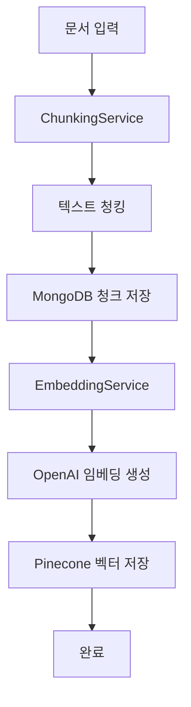
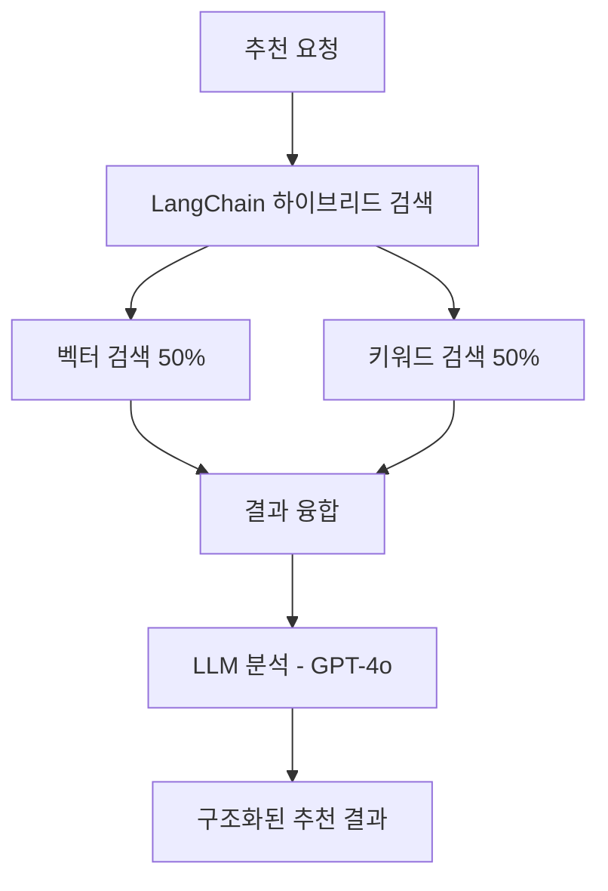
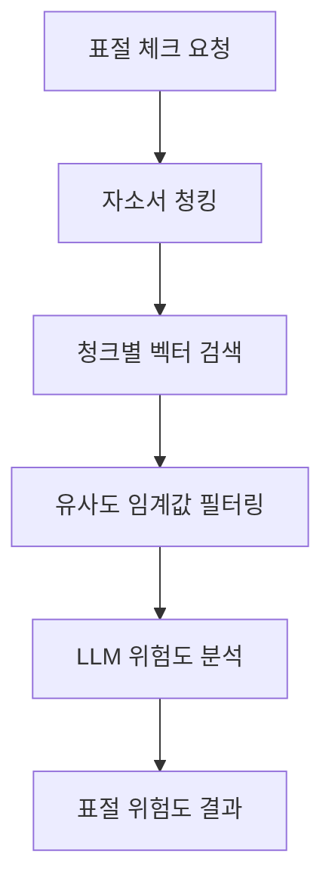

# 이력서 분석 시스템 (청킹 기반 RAG 적용)

MongoDB에 원본 데이터를 저장하고, 청킹된 벡터를 Pinecone에, 키워드 검색을 위해 Elasticsearch에 저장하는 하이브리드 시스템입니다.
**RAG (Retrieval-Augmented Generation) 기술**을 적용하여 **OpenAI GPT-4o**가 유사도 검색 결과를 자연어로 분석하고 설명합니다.

## 핵심 기능

### 1. 청킹 서비스 (ChunkingService) 🔥

이력서와 자소서를 의미 단위로 분할하여 정확한 유사도 검색을 가능하게 합니다.

**구현 위치:** `backend/modules/core/services/chunking_service.py`

**특징:**
- ✅ **이력서 청킹**: growthBackground, motivation, careerHistory를 개별 청크로 분할
- ✅ **자소서 청킹**: 내용을 의미 단위로 세밀하게 분할 (800자 청크, 50자 오버랩)
- ✅ **포트폴리오 청킹**: items 배열 구조를 개별 청크로 처리
- ✅ **MongoDB 저장**: 각 청크를 `resume_chunks`, `cover_letter_chunks` 컬렉션에 저장
- ✅ **메타데이터 관리**: 청크 타입, 인덱스, 원본 문서 연결 정보

**주요 메서드:**
```python
def chunk_document(self, document: Dict[str, Any], document_type: str = None) -> List[Dict[str, Any]]
def chunk_resume_text(self, resume: Dict[str, Any]) -> List[Dict[str, Any]]
def chunk_cover_letter(self, cover_letter: Dict[str, Any]) -> List[Dict[str, Any]]
def _create_extracted_text_chunks(self, document: Dict[str, Any], document_id: str, base_metadata: Dict[str, Any] = None) -> List[Dict[str, Any]]
def _create_cover_letter_specific_chunks(self, document: Dict[str, Any], document_id: str, base_metadata: Dict[str, Any]) -> List[Dict[str, Any]]
```

### 2. 임베딩 서비스 (EmbeddingService) 🔥

OpenAI 최신 모델을 사용하여 텍스트를 고품질 벡터로 변환합니다.

**구현 위치:** `backend/modules/core/services/embedding_service.py`

**특징:**
- ✅ **OpenAI text-embedding-3-small**: 1536차원 고품질 임베딩
- ✅ **폴백 지원**: OpenAI 실패 시 SentenceTransformer 자동 전환 (paraphrase-multilingual-MiniLM-L12-v2)
- ✅ **Pinecone 연동**: 벡터를 Pinecone 벡터 DB에 자동 저장
- ✅ **청크별 임베딩**: 각 청크마다 독립적인 벡터 생성
- ✅ **임베딩 타입**: QUERY와 DOCUMENT 타입별 전처리 지원

**주요 메서드:**
```python
async def create_embedding(self, text: str, embedding_type: EmbeddingType = EmbeddingType.DOCUMENT) -> Optional[List[float]]
async def create_query_embedding(self, text: str) -> Optional[List[float]]
async def create_document_embedding(self, text: str) -> Optional[List[float]]
def _preprocess_text(self, text: str, embedding_type: EmbeddingType) -> str
```

### 3. 유사인재 추천 시스템 🔥

기준 지원자와 유사한 인재를 하이브리드 검색으로 추천하고 LLM이 분석합니다.

**구현 위치:** 
- `backend/modules/core/services/similarity_service.py` (메인 로직)
- `backend/modules/ai/services/langchain_hybrid_service.py` (LangChain 통합)
- `backend/routers/applicants.py` (API 엔드포인트)

**특징:**
- ✅ **하이브리드 검색**: 벡터 검색(50%) + Elasticsearch 키워드 검색(50%)
- ✅ **LangChain 통합**: LangChain 하이브리드 검색 우선 사용, 실패 시 기존 방식 폴백
- ✅ **LLM 분석**: GPT-4o가 핵심 공통점, 주요 특징, 추천 이유, 유사성 요인 분석
- ✅ **구조화된 결과**: 이모지와 함께 읽기 쉬운 형태로 분석 결과 제공
- ✅ **청킹 기반**: 각 지원자의 청크별로 세밀한 유사도 계산

**API 엔드포인트:**
```
POST /api/applicants/{applicant_id}/recommendations
```

**주요 메서드:**
```python
async def find_similar_applicants_by_chunks(self, target_applicant_id: str, collection, limit: int = 10) -> Dict[str, Any]
async def search_similar_applicants_langchain(self, vector_query: str, keyword_query: str, applicants_collection, resumes_collection, target_applicant: Dict[str, Any], limit: int = 10) -> Dict[str, Any]
```

### 4. 자소서 표절 위험도 체크 🔥

자소서 간 유사도를 벡터 검색으로 분석하여 표절 위험도를 평가합니다.

**구현 위치:** 
- `backend/modules/core/services/similarity_service.py` (유사도 검색)
- `backend/main.py` (API 엔드포인트)
- `backend/modules/core/services/llm_service.py` (LLM 위험도 분석)

**특징:**
- ✅ **청킹 기반 표절 검사**: 자소서를 청크로 분할하여 세밀한 표절 검사
- ✅ **임계값 기반 필터링**: 0.8 이상 유사도만 표절 의심으로 분류
- ✅ **3단계 위험도**: HIGH(80%+), MEDIUM(60-80%), LOW(60% 미만)
- ✅ **LLM 위험도 분석**: GPT-4o가 1-2문장으로 간결한 위험도 분석 제공
- ✅ **메타데이터 기반 필터링**: document_id를 통한 정확한 자소서 매칭

**API 엔드포인트:**
```
POST /api/coverletter/similarity-check/{applicant_id}
```

**주요 메서드:**
```python
async def find_similar_documents_by_chunks(self, document_id: str, collection: Collection, document_type: str = "cover_letter", limit: int = 10) -> Dict[str, Any]
async def analyze_plagiarism_suspicion(self, suspicion_level: str, suspicion_score: float, similar_count: int = 0) -> Dict[str, Any]
```

## 설치 및 환경설정

### 1. 필수 패키지 설치
```bash
pip install -r requirements.txt
pip install langchain langchain-openai langchain-pinecone langchain-elasticsearch
```

### 2. 환경변수 설정 (.env)
```bash
# OpenAI (필수)
OPENAI_API_KEY=your_openai_api_key

# Pinecone (필수)
PINECONE_API_KEY=your_pinecone_api_key
PINECONE_INDEX_NAME=resume-vectors  # 1536차원으로 생성

# MongoDB
MONGODB_URI=mongodb://localhost:27017/hireme

# Elasticsearch
ELASTICSEARCH_HOST=localhost:9200
ELASTICSEARCH_INDEX=resume_search
```

### 3. 인프라 실행
```bash
# Docker Compose로 MongoDB & Elasticsearch 실행
docker-compose up -d

# Pinecone 인덱스 생성 (콘솔에서)
# - 이름: resume-vectors
# - 차원: 1536 (text-embedding-3-small 호환)
# - 메트릭: cosine
```

## 주요 API 엔드포인트

### 1. 유사인재 추천
```
POST /api/applicants/{applicant_id}/recommendations
```

**응답 예시:**
```json
{
  "status": "success",
  "applicant_id": "68a57b117f2938c87193b2b1",
  "recommendations": {
    "success": true,
    "data": {
      "results": [
        {
          "final_score": 0.812,
          "vector_score": 0.74,
          "keyword_score": 0.88,
          "applicant": {
            "_id": "68a7...",
            "name": "박영희",
            "position": "프론트엔드 개발자",
            "skills": ["React", "TypeScript", "JavaScript"]
          }
        }
      ],
      "llm_analysis": {
        "success": true,
        "analysis": "### 3. 각 유사 지원자별 상세 분석\\n\\n- **박영희**\\n  - 🔍 **핵심 공통점**: React 프론트엔드 개발 경험과 TypeScript 활용 능력\\n  - 💡 **주요 특징**: 3년차 개발자로 스타트업 경험 보유\\n  - ⭐ **추천 이유**: 기술 스택이 일치하며 성장 가능성이 높음\\n  - 🎯 **유사성 요인**: 동일한 기술 스택과 경력 수준"
      }
    }
  },
  "message": "유사 인재 추천 완료"
}
```

### 2. 자소서 표절체크
```
POST /api/coverletter/similarity-check/{applicant_id}
```

**응답 예시:**
```json
{
  "status": "success",
  "applicant_id": "68a57b117f2938c87193b2b1",
  "plagiarism_result": {
    "success": true,
    "document_type": "cover_letter",
    "analysis_type": "chunk_based_similarity",
    "data": {
      "original_cover_letter": {
        "id": "68a7222b5f5e9bcde8bd227f",
        "applicant_id": "app_001",
        "chunk_count": 3
      },
      "similar_cover_letters": [
        {
          "similarity_score": 0.8,
          "similarity_percentage": 80.0,
          "cover_letter": {
            "_id": "67890abc123def456789",
            "applicant_id": "app_002",
            "created_at": "2025-01-10T14:20:00Z"
          },
          "llm_analysis": {
            "success": true,
            "analysis": "유사도 80.0% / HIGH 등급. 유사한 자소서에서 표현 구조와 주제 흐름의 반복이 관측되어 즉시 검토가 필요합니다."
          }
        }
      ],
      "total": 1,
      "suspicion_analysis": {
        "success": true,
        "suspicion_level": "HIGH",
        "suspicion_score": 0.8,
        "suspicion_score_percent": 80,
        "analysis": "유사도 80.0% / HIGH 등급. 매우 높은 표절 의심도로 즉시 검토가 필요합니다.",
        "similar_count": 1,
        "analyzed_at": "2025-08-25T10:30:00.000Z"
      }
    }
  },
  "message": "자소서 표절체크 완료"
}
```

## 시스템 아키텍처

### 데이터 저장 구조

#### MongoDB 컬렉션
```javascript
// 1. resumes - 기본 이력서 정보
{
  "_id": ObjectId("..."),
  "name": "김민수",
  "position": "프론트엔드",
  "experience": "3-5년",
  "skills": ["React", "JavaScript", "TypeScript"],
  "growthBackground": "저는 어린 시절부터...",
  "motivation": "귀사의 혁신적인...",
  "careerHistory": "3년간 스타트업에서...",
  "analysisScore": 85,
  "created_at": ISODate("2025-08-25T10:30:00Z")
}

// 2. resume_chunks - 청킹된 이력서 텍스트
{
  "_id": ObjectId("..."),
  "resume_id": "689963...",
  "chunk_id": "growthBackground_chunk_000",
  "text": "저는 어린 시절부터 컴퓨터와 기술에 관심이 많았습니다...",
  "field_name": "growthBackground",
  "chunk_index": 0,
  "vector_id": "resume_689963_growthBackground_chunk_000",
  "metadata": {
    "applicant_name": "김민수",
    "position": "프론트엔드",
    "length": 500
  }
}

// 3. cover_letters - 자소서 원본
{
  "_id": ObjectId("..."),
  "applicant_id": "689963...",
  "content": "안녕하세요. 저는...",
  "extracted_text": "OCR 추출 텍스트...",
  "created_at": ISODate("2025-08-25T10:30:00Z")
}
```

#### Pinecone 벡터 구조
```python
# 이력서 청크 벡터
{
  "id": "resume_689963_growthBackground_chunk_000",
  "values": [0.1, 0.2, 0.3, ...],  # 1536차원
  "metadata": {
    "resume_id": "689963...",
    "chunk_id": "growthBackground_chunk_000",
    "field_name": "growthBackground",
    "applicant_name": "김민수",
    "chunk_type": "resume"
  }
}

# 자소서 청크 벡터
{
  "id": "cover_letter_68a722_chunk_000",
  "values": [0.4, 0.5, 0.6, ...],  # 1536차원
  "metadata": {
    "document_id": "68a722...",
    "chunk_id": "cover_letter_chunk_000",
    "chunk_type": "cover_letter",
    "applicant_id": "app_001"
  }
}
```

### 처리 플로우

#### 1. 청킹 기반 벡터 저장


#### 2. 유사인재 추천 플로우


#### 3. 자소서 표절 체크 플로우


## 핵심 기술 스택

### AI/ML
- **OpenAI GPT-4o**: LLM 분석 및 자연어 생성
- **OpenAI text-embedding-3-small**: 1536차원 고품질 임베딩
- **LangChain**: 하이브리드 검색 및 RAG 파이프라인

### 데이터베이스
- **MongoDB**: 원본 문서 및 청크 저장
- **Pinecone**: 벡터 검색 엔진 (1536차원)
- **Elasticsearch**: 키워드 검색 엔진 (BM25)

### 백엔드 서비스
- **FastAPI**: REST API 서버
- **Pydantic**: 데이터 검증 및 직렬화
- **Motor**: 비동기 MongoDB 드라이버

## 주요 특징

### ✅ 청킹 기반 정확도 향상
- 긴 문서를 의미 단위로 분할하여 정확한 유사도 계산
- 필드별 독립적 분석 (growthBackground, motivation, careerHistory)
- 청크 매칭으로 구체적인 유사 부분 식별

### ✅ 하이브리드 검색 시스템
- 벡터 검색과 키워드 검색의 장점 결합
- LangChain 기반 자동 최적화
- 실패 시 기존 방식으로 자동 폴백

### ✅ AI 기반 자연어 분석
- GPT-4o가 유사성과 표절 위험도를 자연어로 설명
- 이모지와 구조화된 형식으로 가독성 향상
- 1-2문장 간결한 분석으로 빠른 파악 가능

### ✅ 실시간 처리
- 문서 업로드 시 자동 청킹 및 벡터화
- 실시간 유사인재 추천 및 표절 검사
- MongoDB와 Pinecone 자동 동기화

## 성능 최적화

### 벡터 검색 최적화
- **청크 단위 검색**: 전체 문서 대신 관련 청크만 검색
- **메타데이터 필터링**: 문서 타입별 효율적 필터링
- **캐싱**: 임베딩 결과 캐싱으로 중복 계산 방지

### 하이브리드 검색 최적화
- **점수 정규화**: 벡터와 키워드 점수의 균형있는 융합
- **중복 제거**: 동일 결과의 효율적 중복 제거
- **배치 처리**: 다중 검색 요청의 배치 처리

### LLM 최적화
- **프롬프트 최적화**: 간결하고 정확한 분석을 위한 프롬프트
- **온도 조절**: 일관성 있는 분석을 위한 낮은 temperature (0.3)
- **토큰 제한**: 효율적인 토큰 사용으로 비용 최적화

## 확장 계획

### 🚀 단기 계획
- 포트폴리오 표절 검사 추가
- 다국어 지원 확장
- 실시간 알림 시스템

### 🎯 장기 계획
- 그래프 기반 관계 분석
- 시계열 유사도 변화 추적
- 개인화된 추천 알고리즘

---

**⚡ 이 시스템은 청킹 기반 RAG 기술과 하이브리드 검색을 결합하여 높은 정확도의 유사도 분석과 표절 검사를 제공합니다.**