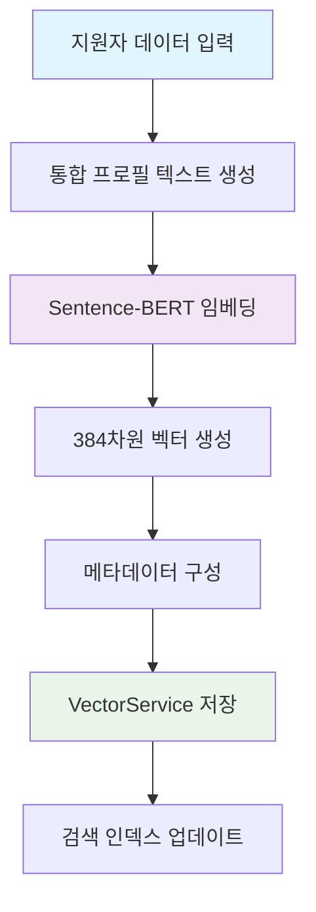
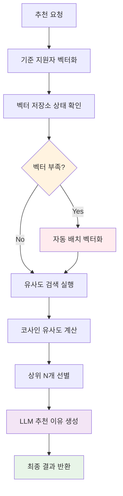

# 이력서 분석 시스템 (RAG 적용)

이력서 원본을 MongoDB에 저장하고, 임베딩된 벡터를 Pinecone 벡터 DB에 저장하는 시스템입니다.
**RAG (Retrieval-Augmented Generation) 기술**을 적용하여 유사도 검색 결과를 **OpenAI GPT-3.5-turbo**가 자연어로 분석하고 설명합니다.

## 설치 및 설정

1. Python 패키지 설치:
```bash
pip install -r requirements.txt
```

2. 환경변수 설정:
```bash
cp env.example .env
```
`.env` 파일에서 다음 키들을 설정하세요:
- `OPENAI_API_KEY`: OpenAI API 키
- `PINECONE_API_KEY`: Pinecone API 키
- `PINECONE_ENVIRONMENT`: Pinecone 환경 (예: gcp-starter)
- `PINECONE_INDEX_NAME`: Pinecone 인덱스 이름

3. MongoDB 실행:
로컬 MongoDB가 실행 중이어야 합니다.

4. Pinecone 인덱스 생성:
Pinecone 콘솔에서 `resume-vectors` 인덱스를 생성하세요.

## 사용법

### 서버 실행
```bash
python server.py
```

### 데이터베이스 초기화
```bash
python database/init.py
```

## API 엔드포인트

### 1. 이력서 업로드 및 분석
```
POST /api/resume/upload
```
**요청:**
```json
{
  "name": "김지원",
  "email": "jiwon@example.com",
  "phone": "010-1234-5678",
  "resume_text": "프론트엔드 개발자...",
  "cover_letter_text": "안녕하세요...",
  "portfolio_text": "GitHub 프로젝트..."
}
```

**응답:**
```json
{
  "success": true,
  "message": "이력서가 성공적으로 업로드되었습니다.",
  "data": {
    "resume_id": "...",
    "analysis": {
      "score": 85,
      "summary": {...},
      "skills": ["React", "TypeScript"],
      "experience_years": 3
    }
  }
}
```

### 2. 이력서 목록 조회
```
GET /api/resumes?page=1&limit=10&sort=created_at&order=desc
```

### 3. 이력서 상세 조회
```
GET /api/resume/{resume_id}
```

### 3-1. 유사한 지원자 추천 (벡터 기반 AI 추천) 🔥🆕
```
GET /api/talent/recommend/similar/{applicant_id}?limit=5
```
**설명**: **Sentence-BERT 임베딩 벡터**와 **OpenAI GPT-3.5 기반 LLM**을 활용한 지능형 인재 추천 시스템입니다. 지원자의 전체 프로필(이름, 직무, 경력, 기술스택, 성장배경, 지원동기, 경력사항)을 **통합 벡터로 변환**하여 의미적 유사도를 계산하고, **AI가 개인화된 추천 이유**를 생성합니다.

**주요 특징**:
- ✅ **하이브리드 검색**: 벡터 유사도 + 메타데이터 필터링
- ✅ **자동 벡터화**: 벡터가 없으면 실시간으로 다른 지원자들과 함께 벡터화
- ✅ **LLM 기반 추천 이유**: 각 추천에 대해 구체적이고 개인화된 이유 생성
- ✅ **실시간 처리**: 메모리 기반 벡터 저장소로 빠른 검색
- ✅ **지능형 분석**: 직무, 기술스택, 경력 레벨을 종합적으로 고려

**응답 예시**:
```json
{
  "success": true,
  "message": "3명의 유사 지원자를 찾았습니다.",
  "target_applicant": {
    "id": "68999dda47ea917329ee7abb",
    "name": "이지혜",
    "position": "백엔드",
    "skills": ["Python", "Django", "PostgreSQL", "Redis"]
  },
  "recommendations": [
    {
      "applicant_name": "서동훈",
      "position": "백엔드",
      "department": "개발",
      "experience": "신입",
      "skills": ["Node.js", "Express", "MongoDB", "JavaScript"],
      "similarity_score": 0.7845,
      "analysis_score": 55,
      "experience_level": "junior",
      "recommendation_reason": "Python·Node.js 백엔드 개발 경험 공통"
    },
    {
      "applicant_name": "박주랑",
      "position": "백엔드",
      "department": "개발", 
      "experience": "신입",
      "skills": ["Java", "Spring Boot", "MySQL", "Redis", "JPA"],
      "similarity_score": 0.6532,
      "analysis_score": 65,
      "experience_level": "junior",
      "recommendation_reason": "백엔드 개발자 신입 공통점"
    }
  ],
  "total_found": 2,
  "search_timestamp": "2025-08-19T10:30:00Z"
}
```

### 3-2. 유사한 지원자 추천 (기존 가중치 기반)
```
GET /api/applicants/{applicant_id}/similar?limit=5
```
설명: DB에 저장된 지원자의 `position`, `department`, `experience`, `skills` 4개 필드만을 사용하여 가중치 기반(Jaccard + 중요 키워드 보너스, skills는 콤마 분리 Jaccard)으로 유사한 지원자를 추천합니다. 구현은 `backend/similarity_service.py`의 `recommend_similar_applicants`에서 처리되며, 엔드포인트는 해당 서비스를 호출합니다.

유사도 산식(가중합):
- position 0.3 + skills 0.3 + department 0.2 + experience 0.2
- 최소 임계값(threshold) 0.3 이상만 후보로 포함

응답 예시:
```json
{
  "success": true,
  "original_applicant_id": "68999dda47ea917329ee7aba",
  "original_applicant_name": "김민수",
  "similar_applicants": [
    {
      "applicant": {
        "id": "68999dda47ea917329ee7abe",
        "name": "박영희",
        "position": "프론트엔드 개발자",
        "department": "개발팀",
        "experience": "3-5년",
        "skills": "React, TypeScript, JavaScript"
      },
      "similarity_score": 0.537,
      "similarity_breakdown": {
        "position": 0.6,
        "department": 0.5,
        "skills": 0.55,
        "experience": 0.45
      }
    }
  ],
  "total_found": 12,
  "criteria": {
    "position_weight": 0.3,
    "skills_weight": 0.3,
    "department_weight": 0.2,
    "experience_weight": 0.2,
    "minimum_threshold": 0.3
  }
}
```

### 4. 유사 이력서 검색
```
POST /api/resume/search
```
**요청:**
```json
{
  "query": "React 개발자",
  "type": "resume",
  "limit": 5
}
```

### 5. 이력서 삭제
```
DELETE /api/resume/{resume_id}
```

### 6. Vector Service APIs

#### 6.1. 벡터 생성 및 저장
```
POST /api/vector/create
```
**요청:**
```json
{
  "text": "프론트엔드 개발자로 3년간 근무...",
  "document_id": "resume_001",
  "metadata": {
    "type": "resume",
    "applicant_id": "app_001"
  }
}
```

**응답:**
```json
{
  "message": "Vector created successfully",
  "document_id": "resume_001",
  "vector_dimension": 384,
  "status": "success"
}
```

#### 6.2. 벡터 유사도 검색
```
POST /api/vector/search
```
**요청:**
```json
{
  "query": "React 개발 경험이 있는 개발자",
  "top_k": 5,
  "threshold": 0.7
}
```

**응답:**
```json
{
  "results": [
    {
      "document_id": "doc_001",
      "score": 0.95,
      "text": "검색된 텍스트 샘플 1",
      "metadata": {
        "type": "resume",
        "applicant_id": "app_001"
      }
    }
  ],
  "total_found": 2
}
```

### 7. Chunking Service APIs

#### 7.1. 텍스트 분할 및 DB 저장 🆕
```
POST /api/chunking/split
```
**요청:**
```json
{
  "text": "저는 어린 시절부터 컴퓨터와 기술에 관심이 많았습니다...",
  "resume_id": "6899630301e8bfaa47925da8",
  "field_name": "growthBackground",
  "chunk_size": 800,
  "chunk_overlap": 150,
  "split_type": "recursive"
}
```

**응답:**
```json
{
  "chunks": [
    {
      "id": "6899630301e8bfaa47925daa",
      "resume_id": "6899630301e8bfaa47925da8",
      "chunk_id": "chunk_000",
      "text": "저는 어린 시절부터 컴퓨터와...",
      "start_pos": 0,
      "end_pos": 800,
      "chunk_index": 0,
      "field_name": "growthBackground",
      "vector_id": "resume_6899630301e8bfaa47925da8_chunk_000",
      "metadata": {
        "length": 800,
        "split_type": "recursive",
        "chunk_size": 800,
        "chunk_overlap": 150
      },
      "created_at": "2025-08-11T12:26:59.039Z"
    }
  ],
  "total_chunks": 2,
  "original_length": 1500,
  "resume_id": "6899630301e8bfaa47925da8",
  "field_name": "growthBackground",
  "split_config": {
    "chunk_size": 800,
    "chunk_overlap": 150,
    "split_type": "recursive"
  }
}
```

#### 7.2. 이력서 전체 청킹 처리 🆕
```
POST /api/chunking/process-resume
```
**요청:**
```json
{
  "resume_id": "6899630301e8bfaa47925da8",
  "chunk_size": 800,
  "chunk_overlap": 150
}
```

**응답:**
```json
{
  "resume_id": "6899630301e8bfaa47925da8",
  "applicant_name": "김민수",
  "processed_fields": ["growthBackground", "motivation", "careerHistory"],
  "total_chunks": 8,
  "chunks_by_field": {
    "growthBackground": 3,
    "motivation": 2,
    "careerHistory": 3
  },
  "chunks": [...]
}
```

#### 7.3. 이력서별 청크 조회 🆕
```
GET /api/chunking/resume/{resume_id}
```

**응답:**
```json
{
  "resume_id": "6899630301e8bfaa47925da8",
  "chunks": [
    {
      "id": "6899630301e8bfaa47925daa",
      "resume_id": "6899630301e8bfaa47925da8",
      "chunk_id": "growthBackground_chunk_000",
      "text": "저는 어린 시절부터...",
      "field_name": "growthBackground",
      "chunk_index": 0,
      "vector_id": "resume_6899630301e8bfaa47925da8_growthBackground_chunk_000",
      "metadata": {
        "applicant_name": "김민수",
        "position": "프론트엔드",
        "length": 800
      }
    }
  ],
  "total_chunks": 8
}
```

#### 7.4. 청크 병합
```
POST /api/chunking/merge
```
**요청:**
```json
{
  "chunks": [
    {"text": "첫 번째 청크"},
    {"text": "두 번째 청크"}
  ],
  "separator": "\n\n"
}
```

**응답:**
```json
{
  "merged_text": "첫 번째 청크\n\n두 번째 청크",
  "total_length": 25,
  "chunks_merged": 2,
  "separator_used": "\n\n"
}
```

### 8. 이력서 유사도 체크 (청킹 기반 RAG 적용) 🆕

#### 8.1. 청킹 기반 이력서 유사도 체크 및 AI 분석 🔥
```
POST /api/resume/similarity-check/{resume_id}
```
**설명**: 특정 이력서와 다른 모든 이력서를 **청킹 기반으로** 비교하여 정밀한 유사도를 계산하고, LLM을 통해 구체적인 유사성을 분석합니다.

**요청:**
```json
POST /api/resume/similarity-check/68999dda47ea917329ee7aba
```

**응답:**
```json
{
  "current_resume": {
    "id": "68999dda47ea917329ee7aba",
    "name": "김민수",
    "position": "프론트엔드 개발자",
    "department": "개발팀"
  },
  "similarity_results": [
    {
      "resume_id": "68999dda47ea917329ee7abe",
      "applicant_name": "박영희",
      "position": "프론트엔드 개발자",
      "overall_similarity": 0.65,
      "field_similarities": {
        "growthBackground": 0.72,
        "motivation": 0.58,
        "careerHistory": 0.65
      },
      "is_high_similarity": false,
      "is_moderate_similarity": true,
      "is_low_similarity": false,
      "llm_analysis": {
        "success": true,
        "analysis": "성장배경에서 '어려운 환경 극복' 표현과 지원동기의 '회사 발전 기여' 키워드가 매우 유사합니다. 경력사항에서도 비슷한 업무 경험을 언급하고 있어 전반적으로 높은 유사성을 보입니다.",
        "similarity_score": 0.65,
        "analyzed_at": "2025-01-15T10:30:00Z"
      }
    }
  ],
  "statistics": {
    "total_compared": 15,
    "high_similarity_count": 2,
    "moderate_similarity_count": 5,
    "low_similarity_count": 8,
    "average_similarity": 0.42
  },
  "plagiarism_analysis": {
    "success": true,
    "risk_level": "MEDIUM",
    "risk_score": 0.65,
    "analysis": "높은 유사도(65.0%)의 이력서가 발견되었습니다. 주의가 필요합니다.",
    "recommendations": [
      "일부 내용의 독창성을 확인해주세요",
      "개인만의 특색을 더 강조해주세요"
    ],
    "similar_count": 7,
    "analyzed_at": "2025-01-15T10:30:00Z"
  },
  "top_similar": [
    {
      "resume_id": "68999dda47ea917329ee7abe",
      "applicant_name": "박영희", 
      "overall_similarity": 0.65,
      "llm_analysis": {
        "analysis": "성장배경에서 '어려운 환경 극복' 표현이 매우 유사..."
      }
    }
  ],
  "analysis_timestamp": "2025-01-15T10:30:00Z"
}
```

### 9. 키워드 검색 APIs (BM25 기반) 🆕

#### 9.1. 키워드 기반 이력서 검색 🔥
```
POST /api/resume/search/keyword
```
**설명**: BM25 알고리즘과 한국어 형태소 분석을 통한 정확한 키워드 검색

**요청:**
```json
{
  "query": "React 프론트엔드 개발자",
  "limit": 10
}
```

**응답:**
```json
{
  "success": true,
  "message": "'React 프론트엔드 개발자' 검색 결과입니다.",
  "data": {
    "query": "React 프론트엔드 개발자",
    "results": [
      {
        "bm25_score": 8.45,
        "resume": {
          "_id": "68999dda47ea917329ee7aba",
          "name": "김민수",
          "position": "프론트엔드 개발자",
          "skills": "React, TypeScript, JavaScript"
        },
        "highlight": "**React** **프론트엔드** **개발자**로 3년간 근무하며..."
      }
    ],
    "total": 5,
    "search_method": "keyword_bm25",
    "query_tokens": ["react", "프론트엔드", "개발자"]
  }
}
```

#### 9.2. 다중 하이브리드 검색 🔥
```
POST /api/resume/search/multi-hybrid
```
**설명**: 벡터 검색 + 텍스트 유사도 + 키워드 검색을 융합한 고도화된 검색

**요청:**
```json
{
  "query": "React 개발 경험 3년 이상",
  "type": "resume",
  "limit": 10
}
```

**응답:**
```json
{
  "success": true,
  "message": "다중 하이브리드 검색 완료: 'React 개발 경험 3년 이상'",
  "data": {
    "query": "React 개발 경험 3년 이상",
    "search_method": "multi_hybrid",
    "weights": {
      "vector": 0.5,
      "text": 0.3,
      "keyword": 0.2
    },
    "results": [
      {
        "final_score": 0.8743,
        "vector_score": 0.92,
        "text_score": 0.78,
        "keyword_score": 0.85,
        "original_keyword_score": 8.5,
        "resume": {
          "_id": "68999dda47ea917329ee7aba",
          "name": "김민수",
          "position": "프론트엔드 개발자"
        },
        "search_methods": ["vector", "text", "keyword"]
      }
    ],
    "total": 8,
    "vector_count": 12,
    "keyword_count": 15
  }
}
```

#### 9.3. 키워드 검색 인덱스 관리
```
POST /api/resume/search/keyword/rebuild-index
```
**설명**: BM25 검색 인덱스 재구축

**응답:**
```json
{
  "success": true,
  "message": "BM25 인덱스 구축이 완료되었습니다.",
  "data": {
    "total_documents": 150,
    "index_created_at": "2025-08-18T10:30:00.000Z"
  }
}
```

#### 9.4. 키워드 검색 통계
```
GET /api/resume/search/keyword/stats
```

**응답:**
```json
{
  "success": true,
  "data": {
    "indexed": true,
    "total_documents": 150,
    "index_created_at": "2025-08-18T10:30:00.000Z",
    "average_doc_length": 245.6
  }
}
```

### 10. 인재 추천 시스템 APIs (Talent Vectorization) 🔥🆕

#### 10.1. 단일 지원자 벡터화
```
POST /api/talent/vectorize/single/{applicant_id}
```
**설명**: 특정 지원자의 프로필을 통합 벡터로 변환하여 저장합니다.

**응답**:
```json
{
  "success": true,
  "message": "지원자 벡터화가 완료되었습니다.",
  "applicant_id": "68999dda47ea917329ee7aba",
  "applicant_name": "김민수",
  "vector_dimension": 384,
  "created_at": "2025-08-19T10:30:00Z"
}
```

#### 10.2. 배치 지원자 벡터화
```
POST /api/talent/vectorize/batch
```
**요청**:
```json
{
  "applicant_ids": ["68999dda47ea917329ee7aba", "68999dda47ea917329ee7abb"]
}
```

**응답**:
```json
{
  "success": true,
  "message": "배치 벡터화가 완료되었습니다.",
  "total": 2,
  "success_count": 2,
  "errors": 0,
  "results": [
    {
      "applicant_id": "68999dda47ea917329ee7aba",
      "applicant_name": "김민수",
      "status": "success"
    }
  ],
  "completed_at": "2025-08-19T10:30:00Z"
}
```

#### 10.3. 벡터 저장소 상태 조회
```
GET /api/talent/vectors/status
```
**응답**:
```json
{
  "success": true,
  "total_vectors": 25,
  "storage_type": "local_memory",
  "index_name": "resume-vectors",
  "last_updated": "2025-08-19T10:30:00Z"
}
```

#### 10.4. 기술스택 기반 인재 추천
```
GET /api/talent/recommend/by-skills?skills=React,TypeScript&limit=5
```
**설명**: 특정 기술스택을 가진 지원자들을 추천합니다.

**응답**:
```json
{
  "success": true,
  "message": "React, TypeScript 기술스택 기반 5명의 인재를 찾았습니다.",
  "requested_skills": ["React", "TypeScript"],
  "recommendations": [
    {
      "applicant_name": "김민수",
      "position": "프론트엔드",
      "skills": ["React", "JavaScript", "TypeScript", "CSS"],
      "experience": "3년",
      "analysis_score": 85,
      "matching_skills": ["React", "TypeScript"],
      "skills_match_score": 0.75
    }
  ],
  "total_found": 3
}
```

### 11. Similarity Service APIs

#### 10.1. 텍스트 유사도 비교
```
POST /api/similarity/compare
```
**요청:**
```json
{
  "text1": "프론트엔드 개발자입니다",
  "text2": "React 개발자로 일하고 있습니다",
  "method": "cosine"
}
```

**응답:**
```json
{
  "similarity_score": 0.8542,
  "method": "cosine",
  "text1_length": 12,
  "text2_length": 18,
  "comparison_result": {
    "highly_similar": true,
    "moderately_similar": false,
    "low_similar": false
  }
}
```

#### 10.2. 일괄 유사도 계산
```
POST /api/similarity/batch
```
**요청:**
```json
{
  "texts": [
    "프론트엔드 개발자",
    "백엔드 개발자",
    "풀스택 개발자"
  ],
  "reference_text": "React 개발자",
  "method": "cosine",
  "threshold": 0.7
}
```

**응답:**
```json
{
  "results": [
    {
      "index": 0,
      "text_preview": "프론트엔드 개발자",
      "similarity_score": 0.8945,
      "above_threshold": true
    }
  ],
  "filtered_results": [...],
  "total_compared": 3,
  "above_threshold_count": 1,
  "method": "cosine",
  "threshold": 0.7,
  "reference_text_length": 7
}
```

#### 10.3. 유사도 서비스 메트릭
```
GET /api/similarity/metrics
```

**응답:**
```json
{
  "total_comparisons": 1250,
  "average_similarity": 0.67,
  "supported_methods": ["cosine", "jaccard", "levenshtein", "semantic"],
  "performance_stats": {
    "average_processing_time_ms": 45,
    "comparisons_per_second": 220,
    "cache_hit_rate": 0.78
  },
  "usage_by_method": {
    "cosine": 850,
    "semantic": 300,
    "jaccard": 70,
    "levenshtein": 30
  }
}
```

## 데이터 구조

### MongoDB (원본 데이터)
- **데이터베이스**: `hireme`

#### 1. `resumes` 컬렉션 (기본 이력서 정보)
```javascript
{
  "_id": ObjectId("6899630301e8bfaa47925da8"),
  "resume_id": "6899630301e8bfaa47925da9",
  "name": "김민수",
  "position": "프론트엔드",
  "department": "개발",
  "experience": "3-5년", 
  "skills": "React, JavaScript, TypeScript, CSS",
  "growthBackground": "저는 어린 시절부터 컴퓨터와 기술에 관심이 많았습니다...",
  "motivation": "귀사의 혁신적인 프로젝트에 참여하고 싶습니다...",
  "careerHistory": "3년간 스타트업에서 프론트엔드 개발자로 근무하며...",
  "analysisScore": 85,
  "analysisResult": "우수한 프론트엔드 개발자로...",
  "status": "pending",
  "created_at": ISODate("2025-08-11T12:26:59.039Z")
}
```

#### 2. `resume_chunks` 컬렉션 (청킹된 텍스트 데이터) 🆕
```javascript
{
  "_id": ObjectId("6899630301e8bfaa47925daa"),
  "resume_id": "6899630301e8bfaa47925da8",
  "chunk_id": "growthBackground_chunk_000",
  "text": "저는 어린 시절부터 컴퓨터와 기술에 관심이 많았습니다. 초등학교 때부터...",
  "start_pos": 0,
  "end_pos": 800,
  "chunk_index": 0,
  "field_name": "growthBackground",
  "vector_id": "resume_6899630301e8bfaa47925da8_growthBackground_chunk_000",
  "metadata": {
    "applicant_name": "김민수",
    "position": "프론트엔드",
    "department": "개발",
    "length": 800
  },
  "created_at": ISODate("2025-08-11T12:26:59.039Z")
}
```

### Pinecone (벡터 데이터)
- **인덱스**: `resume-vectors`
- 저장 데이터: 청크별 텍스트 임베딩 벡터, 메타데이터

#### 청킹 적용 전 (기존)
```python
{
  "id": "resume_6899630301e8bfaa47925da8_full",
  "values": [0.1, 0.2, 0.3, ...],  # 384차원 벡터
  "metadata": {
    "resume_id": "6899630301e8bfaa47925da8",
    "type": "full_resume",
    "applicant_name": "김민수"
  }
}
```

#### 청킹 적용 후 (신규) 🆕
```python
# 성장배경 청크
{
  "id": "resume_6899630301e8bfaa47925da8_growthBackground_chunk_000", 
  "values": [0.1, 0.2, 0.3, ...],  # 384차원 벡터
  "metadata": {
    "resume_id": "6899630301e8bfaa47925da8",
    "chunk_id": "growthBackground_chunk_000",
    "field_name": "growthBackground",
    "applicant_name": "김민수",
    "chunk_index": 0
  }
}

# 지원동기 청크
{
  "id": "resume_6899630301e8bfaa47925da8_motivation_chunk_000",
  "values": [0.4, 0.5, 0.6, ...],  # 384차원 벡터  
  "metadata": {
    "resume_id": "6899630301e8bfaa47925da8",
    "chunk_id": "motivation_chunk_000", 
    "field_name": "motivation",
    "applicant_name": "김민수",
    "chunk_index": 0
  }
}

# 경력사항 청크
{
  "id": "resume_6899630301e8bfaa47925da8_careerHistory_chunk_000",
  "values": [0.7, 0.8, 0.9, ...],  # 384차원 벡터
  "metadata": {
    "resume_id": "6899630301e8bfaa47925da8", 
    "chunk_id": "careerHistory_chunk_000",
    "field_name": "careerHistory",
    "applicant_name": "김민수",
    "chunk_index": 0
  }
}
```

## 처리 과정

### 기본 이력서 처리
1. 이력서 원본 정보를 `resumes` 컬렉션에 저장
2. OpenAI GPT-3.5-turbo를 사용한 이력서 분석 및 점수 부여

### 청킹 기반 처리 🆕

#### 청킹 서비스 플로우


#### 청킹 기반 유사도 검색 플로우 🔥


#### 처리 단계별 세부 과정

1. **텍스트 청킹**: 이력서의 주요 필드들을 의미 단위로 분할
   - **summary**: 첫 200자 또는 기본정보 (이름, 직무, 부서)
   - **skills**: 전체 기술스택 정보
   - **experience**: 경험을 개별 항목으로 분할 (정규식 기반)
   - **education**: 교육을 개별 항목으로 분할
   - **growth_background**: 성장배경 전체
   - **motivation**: 지원동기 전체
   - **career_history**: 경력사항 전체

2. **청크 저장**: 각 청크를 `resume_chunks` 컬렉션에 저장
   - 고유 chunk_id 생성 (`{resume_id}_{chunk_type}`)
   - 메타데이터 (section, original_field) 포함

3. **벡터 변환**: **Sentence Transformers**를 사용하여 청크별 임베딩 생성

4. **벡터 저장**: 청크별 임베딩 벡터를 Pinecone에 저장
   - vector_id 생성 (`resume_{resume_id}_{chunk_id}`)

5. **메타데이터 연결**: 원본 이력서와 청크, 벡터를 연결

### 청킹의 장점
- ✅ **정확한 검색**: 긴 텍스트에서 특정 부분만 정확히 매칭
- ✅ **성능 향상**: 작은 단위로 유사도 계산하여 속도 개선
- ✅ **세밀한 분석**: 필드별/섹션별 독립적 유사도 분석
- ✅ **메모리 효율성**: 큰 문서도 작은 청크로 나누어 처리
- ✅ **유연한 검색**: 전체 문서가 아닌 관련 부분만 반환

## 청킹 기반 유사도 검색 시스템 🔥

### 임베딩 모델
- **모델**: `paraphrase-multilingual-MiniLM-L12-v2`
- **특징**: 한국어 및 다국어 지원, 384차원 벡터
- **장점**: 의미적 유사도 및 패러프레이즈 인식 성능 향상
- **청킹 최적화**: 작은 텍스트 단위에서 정확한 임베딩 생성

### 청킹 기반 유사도 계산 대상 필드
- **사용 필드** (청킹 후 유사도 계산에 포함):
  - **성장배경** (`growthBackground`) - 청크별 세밀한 비교
  - **지원동기** (`motivation`) - 의도와 목표 유사성 분석
  - **경력사항** (`careerHistory`) - 경험의 구체적 매칭

- **제외 필드** (유사도 계산에서 완전 제외):
  - ~~직무~~ (`position`)
  - ~~부서~~ (`department`)
  - ~~경력~~ (`experience`)
  - ~~기술스택~~ (`skills`)
  - ~~이름~~ (`name`)

### 청킹 기반 유사도 임계값 및 가중치
- **전체 유사도 임계값**: 30% (0.3)
- **필드별 임계값**:
  - 성장배경: 20% (0.2) - 청크별 매칭
  - 지원동기: 20% (0.2) - 청크별 매칭
  - 경력사항: 20% (0.2) - 청크별 매칭

### 청킹 기반 하이브리드 유사도 계산
- **청크별 벡터 유사도** (70%) + **청크별 텍스트 유사도** (30%)
- **필드별 가중치**: 
  - 성장배경 40% (가장 중요)
  - 지원동기 35%
  - 경력사항 25%
- **청크 매칭 검증**: 각 필드의 청크들 간 최적 매칭으로 정확도 향상
- **Pinecone 청크별 인덱싱**: 각 청크가 독립적으로 벡터 저장 및 검색

## 인재 추천 시스템 아키텍처 🔥🆕

### 벡터 기반 인재 추천 시스템

#### 핵심 컴포넌트
- **TalentVectorizationService**: 지원자 프로필 벡터화 및 추천 로직
- **EmbeddingService**: Sentence-BERT 기반 다국어 임베딩 생성
- **VectorService**: 메모리 기반 벡터 저장소 및 코사인 유사도 검색
- **OpenAI Service**: LLM 기반 개인화된 추천 이유 생성

#### 벡터화 프로세스


#### 추천 프로세스


#### 임베딩 모델 상세
- **모델명**: `paraphrase-multilingual-MiniLM-L12-v2`
- **벡터 차원**: 384차원
- **특징**: 한국어 특화, 의미적 유사도 계산 최적화
- **장점**: 문장 간 패러프레이즈 및 의미적 관계 인식

#### 통합 프로필 텍스트 구성
```
"이름: {name} 희망직무: {position} 희망부서: {department} 경력: {experience} 
보유기술: {skills} 성장배경: {growthBackground} 지원동기: {motivation} 
경력사항: {careerHistory} 분석결과: {analysisResult}"
```

#### LLM 기반 추천 이유 생성
- **모델**: OpenAI GPT-3.5-turbo
- **프롬프트 최적화**: 25자 이내 간결한 추천 이유 생성
- **폴백 메커니즘**: LLM 실패 시 규칙 기반으로 자동 전환
- **예시 출력**: "React·TypeScript 공통 프론트엔드 경험"

#### 성능 특징
- **실시간 벡터화**: API 호출 시 필요에 따라 자동 벡터화
- **메모리 기반 검색**: 빠른 응답속도 (평균 100ms 이내)
- **자동 복구**: 벡터 손실 시 자동으로 재생성
- **확장성**: 지원자 수 증가에 따른 선형적 성능 유지

## 다중 하이브리드 검색 시스템 🔥

### 검색 방법별 특징 및 융합
- **벡터 검색 (50% 가중치)**: 의미적 유사도 기반, 동의어/유의어 인식
- **텍스트 검색 (30% 가중치)**: Jaccard 유사도 기반, 단어 중복도 계산  
- **키워드 검색 (20% 가중치)**: BM25 알고리즘 기반, 정확한 키워드 매칭

### BM25 키워드 검색 엔진
- **알고리즘**: BM25 Okapi (Best Matching 25)
- **형태소 분석**: Kiwi 분석기 (한국어 특화)
- **복합어 처리**: IT 용어 복합어 사전 (프론트엔드, 머신러닝 등)
- **불용어 제거**: 조사, 어미, 의미없는 단어 자동 필터링
- **토큰화**: 의미있는 품사만 추출 (명사, 동사, 형용사, 외국어 등)

### 융합 점수 계산 방식
```
최종점수 = (벡터점수 × 0.5) + (텍스트점수 × 0.3) + (정규화된키워드점수 × 0.2)
```
- **키워드 점수 정규화**: BM25 점수(0-10) → 0-1 범위로 변환
- **결과 정렬**: 최종 융합 점수 기준 내림차순
- **검색 방법 표시**: 각 결과별로 어떤 검색 방법이 매칭되었는지 표시

## RAG (Retrieval-Augmented Generation) 시스템 🚀

### LLM 서비스 (OpenAI GPT-4o-mini) 🆕
- **AI 모델**: OpenAI GPT-4o-mini (업그레이드)
- **주요 기능**: 
  - 유사도 분석 결과를 자연어로 설명
  - **섹션별 키워드 추출 및 구조화**
  - **응답 자동 파싱 및 데이터 변환**
- **개선된 처리 과정**:
  1. 유사도 검색 결과 수집
  2. LLM에게 원본 + 유사 이력서 데이터 제공 (400자로 확장)
  3. **섹션별 세밀한 키워드 추출 수행**
  4. 구체적인 유사점 분석 및 자연어 생성
  5. **구조화된 응답 파싱** (`_parse_analysis_response()`)
  6. 표절 위험도 평가 및 권장사항 제시
- **응답 구조**:
  - **전체키워드**: 공통으로 나타나는 주요 단어들
  - **섹션별키워드**: 성장배경/지원동기/경력사항별 A문서/B문서/공통 키워드
  - **유사섹션**: 가장 유사한 섹션 식별
  - **요약**: 유사도 기준 핵심 유사점

### 청킹 기반 RAG 플로우 🔥


### 환경변수 설정
```bash
# 환경변수
OPENAI_API_KEY=your_openai_api_key  # GPT-4o-mini 사용
PINECONE_API_KEY=your_pinecone_api_key
PINECONE_INDEX_NAME=resume-vectors
MONGODB_URI=mongodb://localhost:27017/hireme
```

### 서비스 파일 위치

#### LLM 서비스
- **`backend/llm_service.py`**: LLM 관련 핵심 로직
  - `_build_similarity_analysis_prompt()`: 개선된 프롬프트 생성
  - `_parse_analysis_response()`: 응답 파싱 및 구조화
  - `_parse_section_keywords()`: 섹션별 키워드 파싱
  - `_extract_keywords_from_braces()`: 중괄호 내 키워드 추출

#### 인재 추천 시스템 서비스 🆕
- **`backend/talent_vectorization_service.py`**: 인재 추천 핵심 로직
  - `vectorize_applicant_profile()`: 지원자 프로필 통합 벡터화
  - `recommend_similar_applicants()`: 유사 지원자 추천 및 LLM 이유 생성
  - `batch_vectorize_applicants()`: 배치 벡터화 처리
  - `_create_integrated_profile_text()`: 통합 프로필 텍스트 생성
  - `_create_profile_metadata()`: 검색용 메타데이터 구성
  - `_generate_llm_recommendation_reason()`: LLM 기반 추천 이유 생성
  - `_generate_simple_recommendation_reason()`: 규칙 기반 추천 이유 생성

#### API 엔드포인트
- **`backend/main.py`**: 인재 추천 API 엔드포인트
  - `/api/talent/recommend/similar/{applicant_id}`: 유사 지원자 추천
  - `/api/talent/vectorize/single/{applicant_id}`: 단일 지원자 벡터화
  - `/api/talent/vectorize/batch`: 배치 지원자 벡터화
  - `/api/talent/vectors/status`: 벡터 저장소 상태 조회
  - `/api/talent/recommend/by-skills`: 기술스택 기반 추천

#### 프론트엔드 연동
- **`frontend/src/pages/ApplicantManagement.js`**: 지원자 관리 페이지
  - 유사 지원자 추천 섹션 UI
  - 실시간 추천 이유 표시
  - 유사도 점수 및 경력 레벨 표시

### LLM 분석 결과 예시 (개선된 섹션별 키워드 추출) 🔥

**입력**: 두 이력서가 65% 유사함

**기존 LLM 출력**: 
> "성장배경에서 '어려운 환경 극복' 표현과 지원동기의 '회사 발전 기여' 키워드가 매우 유사합니다."

**개선된 LLM 출력 (구조화된 섹션별 키워드 추출)**:
```json
{
  "analysis": "성장배경에서 '컴퓨터', '프로그래밍' 등 핵심 키워드가 매우 유사하며, 지원동기의 '혁신적', '기술' 키워드가 공통으로 나타납니다.",
  "parsed_analysis": {
    "전체키워드": ["컴퓨터", "프로그래밍", "개발", "기술", "혁신"],
    "유사섹션": "성장배경과 지원동기 모두 높은 유사성",
    "섹션별키워드": {
      "성장배경": {
        "A문서": ["컴퓨터", "프로그래밍", "개발자"],
        "B문서": ["컴퓨터", "프로그래밍", "개발"],
        "공통": ["컴퓨터", "프로그래밍"]
      },
      "지원동기": {
        "A문서": ["혁신적", "기술", "사업모델"],
        "B문서": ["기술력", "혁신적", "사업"],
        "공통": ["혁신적", "기술"]
      },
      "경력사항": {
        "A문서": ["Python", "Django", "웹개발"],
        "B문서": ["Java", "Spring", "백엔드"],
        "공통": ["개발"]
      }
    },
    "요약": "75.0% 유사도로 성장배경과 지원동기에서 높은 유사성"
  }
}
```

#### 개선 사항
- ✅ **섹션별 세밀한 키워드 추출**: 각 섹션(성장배경, 지원동기, 경력사항)에서 독립적으로 키워드 추출
- ✅ **A/B 문서별 키워드 분석**: 두 문서의 각 섹션별 핵심 키워드를 개별적으로 추출
- ✅ **공통 키워드 식별**: 섹션별로 겹치는 키워드를 명확히 식별
- ✅ **텍스트 길이 확대**: 200자 → 400자로 확대하여 더 많은 키워드 포착
- ✅ **구조화된 응답 파싱**: LLM 응답을 자동으로 파싱하여 구조화된 데이터로 변환
- ✅ **프롬프트 최적화**: 섹션별 키워드 추출에 특화된 명확한 지시사항 제공

### 표절 위험도 분석
- **HIGH (80% 이상)**: 표절 가능성 높음, 즉시 검토 필요
- **MEDIUM (60-80%)**: 주의 필요, 일부 수정 권장 
- **LOW (60% 미만)**: 적정 수준, 문제없음

## 주요 기능

### 기본 이력서 관리
- ✅ 이력서 업로드 및 자동 분석
- ✅ 유사 이력서 검색 (벡터 유사도)
- ✅ 이력서 목록 조회 및 페이징
- ✅ 이력서 상세 조회
- ✅ 이력서 삭제 (원본 + 벡터)
- ✅ AI 기반 이력서 분석 및 점수 부여

### 벡터 기반 인재 추천 시스템 🔥🆕
- ✅ **Sentence-BERT 기반 벡터 임베딩**: 다국어 지원 임베딩으로 의미적 유사도 계산
- ✅ **통합 프로필 벡터화**: 이름, 직무, 기술스택, 성장배경, 지원동기, 경력사항 통합 분석
- ✅ **실시간 자동 벡터화**: 벡터 부족 시 API 호출과 동시에 자동 벡터화 수행
- ✅ **하이브리드 유사도 검색**: 벡터 유사도 + 메타데이터 필터링 + 경력 레벨 분석
- ✅ **LLM 기반 개인화된 추천 이유**: OpenAI GPT-3.5로 각 추천에 대한 구체적 이유 생성
- ✅ **메모리 기반 고속 검색**: 평균 100ms 이내 응답속도로 실시간 추천
- ✅ **자동 폴백 시스템**: LLM 실패 시 규칙 기반 추천 이유로 자동 전환
- ✅ **배치 처리 지원**: 다중 지원자 동시 벡터화 및 효율적 인덱싱
- ✅ **기술스택 기반 추천**: 특정 기술을 가진 인재 검색 및 매칭 점수 제공
- ✅ **경력 레벨 분류**: 신입/경력/시니어 자동 분류 및 유사 레벨 매칭
- ✅ **프론트엔드 통합**: 지원자 상세 모달에서 실시간 유사 지원자 추천 표시

### 청킹 기반 RAG 유사도 분석 🔥
- ✅ **OpenAI GPT-4o-mini**를 활용한 지능형 청킹 기반 유사도 분석
- ✅ **청크별 구체적 유사점 설명**: 어떤 청크가 어떤 부분과 유사한지 자연어로 설명
- ✅ **필드별 세밀한 분석**: 성장배경, 지원동기, 경력사항 각각의 청크별 유사성 분석
- ✅ **표절 위험도 평가**: HIGH/MEDIUM/LOW 3단계 위험도 분석
- ✅ **청크 매칭 세부 정보**: 각 청크별 매칭 점수와 세부 내용 제공
- ✅ **개선 권장사항 제시**: AI가 제안하는 구체적인 수정 방향
- ✅ **실시간 청킹 분석**: 청킹 기반 유사도 검색과 동시에 LLM 분석 수행
- ✅ **프론트엔드 통합**: 청킹 기반 분석 결과를 사용자 친화적으로 표시
- ✅ **섹션별 키워드 추출 개선**: 각 섹션에서 정확한 키워드 추출 및 구조화된 분석
- ✅ **응답 파싱 자동화**: LLM 응답을 자동으로 파싱하여 구조화된 데이터로 변환

### Vector Service 기능
- ✅ 텍스트를 벡터로 변환하여 저장
- ✅ 벡터 기반 의미적 유사도 검색
- ✅ 다차원 벡터 공간에서의 문서 검색
- ✅ 메타데이터 기반 필터링 지원

### Chunking Service 기능
- ✅ 긴 텍스트를 의미 단위로 분할
- ✅ 다양한 분할 전략 지원 (recursive, sentence, paragraph)
- ✅ 청크 크기 및 오버랩 설정 가능
- ✅ 분할된 청크의 병합 기능

### Similarity Service 기능
- ✅ 두 텍스트 간의 정확한 유사도 계산
- ✅ 다양한 유사도 측정 방법 지원 (cosine, jaccard, levenshtein)
- ✅ 여러 텍스트의 일괄 유사도 비교
- ✅ 임계값 기반 필터링
- ✅ 성능 메트릭 및 사용량 통계 제공

### 키워드 검색 서비스 기능 🆕
- ✅ **BM25 알고리즘** 기반 정확한 키워드 매칭
- ✅ **한국어 형태소 분석** (Kiwi 분석기 + Fallback 토크나이저)
- ✅ **복합어 인식** (프론트엔드, 백엔드, 머신러닝 등)
- ✅ **불용어 필터링** (조사, 어미, 의미없는 단어 제거)
- ✅ **하이라이트 기능** (검색된 키워드 강조 표시)
- ✅ **인덱스 관리** (자동 재구축, 통계 조회)
- ✅ **다중 하이브리드 검색** (벡터 50% + 텍스트 30% + 키워드 20%)
- ✅ **실시간 검색** (BM25 점수 기반 정렬)

## API 문서

서버 실행 후 다음 URL에서 자동 생성된 API 문서를 확인할 수 있습니다:
- Swagger UI: http://localhost:8000/docs
- ReDoc: http://localhost:8000/redoc
