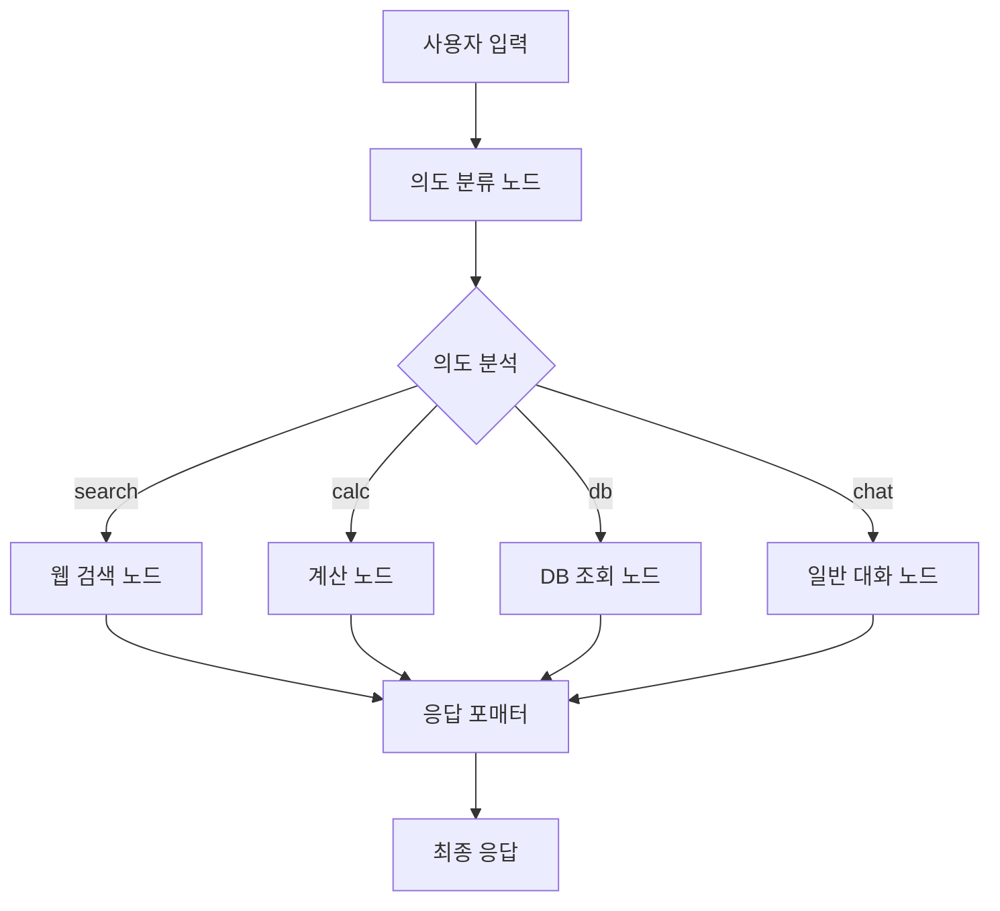
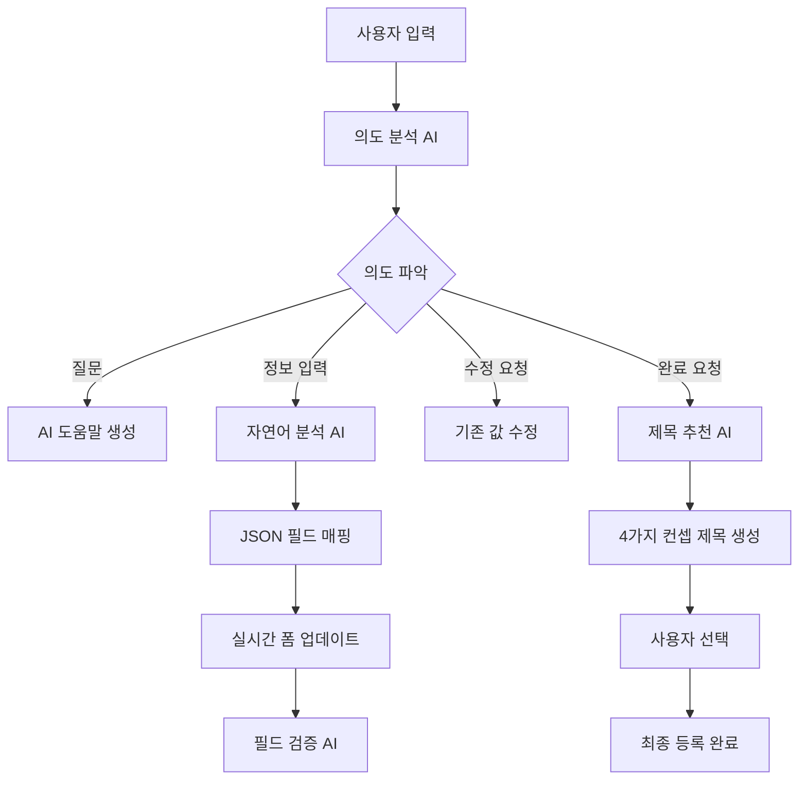

# 🤖 AI 채용 관리 시스템

## 📋 프로젝트 개요

AI 기반 채용 관리 시스템으로, 지능형 채팅봇을 통한 자연어 입력으로 채용공고 작성, 이력서 분석, 포트폴리오 분석 등을 지원합니다. **Gemini AI**, **Agent 시스템**, **FastAPI**, **React**를 기반으로 구축된 현대적인 웹 애플리케이션입니다.

## 🚀 주요 기능

### 🎯 1. AI 채용공고 등록 도우미
- **개별모드**: AI가 단계별로 질문하며 자동 입력
- **랭그래프모드**: 자유로운 대화를 통한 정보 추출 및 자동 적용
- **자율모드**: 사용자가 자유롭게 입력하면 AI가 분석하여 필드 매핑
- **이미지 기반 등록**: AI가 생성한 이미지와 함께 채용공고 작성
- **🧪 테스트 자동입력**: 개발 및 테스트용 샘플 데이터 원클릭 입력

### 🧪 2. Agent 기반 시스템 (테스트중 모드)
- **의도 자동 분류**: 사용자 요청을 "search", "calc", "db", "chat" 중 하나로 자동 분류
- **도구 자동 선택**: 의도에 따라 적절한 도구(검색, 계산, DB 조회, 대화) 자동 선택
- **모듈화된 노드**: 각 도구가 독립적인 노드로 구성되어 확장성과 유지보수성 향상
- **조건부 분기**: Agent 시스템의 조건부 분기를 통한 지능적인 워크플로우 관리

### 🏷️ 3. AI 제목 추천 시스템
- **4가지 컨셉**: 신입친화형, 전문가형, 일반형, 일반형 변형
- **매번 다른 추천**: 랜덤 시드와 창의성 설정으로 다양한 제목 생성
- **Gemini AI 기반**: 고도화된 자연어 처리로 매력적인 제목 생성

### 💬 4. 지능형 대화 관리
- **대화 흐름 제어**: 순서가 꼬여도 🔄 처음부터 버튼으로 재시작 가능
- **세션 기반 히스토리**: 24시간 내 대화 기록 자동 복원
- **실시간 필드 업데이트**: 입력과 동시에 폼 필드 자동 반영

### 📝 5. 범용적인 JSON 매핑 시스템
- 채팅 응답을 JSON으로 처리하여 UI 필드에 자동 매핑
- 페이지별 필드 매핑 설정 지원
- 다양한 응답 형식 지원 (extracted_data, field/value, content 내 JSON)

## 🆕 AI 채용공고등록도우미 시스템 상세 가이드

### 🎯 개별모드 vs 랭그래프모드

#### 개별모드 (Individual Mode)
**기존의 단계별 입력 방식:**
- **5단계 등록 프로세스**:
  1. 구인 부서 및 경력 선택
  2. 구인 정보 (인원수, 주요 업무)
  3. 근무 조건 (시간, 위치, 연봉)
  4. 전형 절차
  5. 지원 방법 (이메일, 마감일)

- **AI 어시스턴트 기능**:
  - 단계별 질문을 통한 체계적 정보 수집
  - 실시간 필드 검증 및 피드백
  - 자동 완성 및 추천 기능

#### 랭그래프모드 (LangGraph Mode) 🆕
**새로운 AI 기반 자유 대화 방식:**

- **자유로운 대화형 입력**:
  - 사용자가 자연어로 채용공고 정보를 자유롭게 입력
  - AI가 대화 내용에서 관련 정보를 자동 추출
  - 추출된 정보를 채용공고등록도우미에 자동 적용

- **AI 정보 추출 기능**:
  - 부서 정보 자동 인식 (개발팀, 마케팅팀, 영업팀 등)
  - 직무 정보 추출 (개발자, 프로그래머, 엔지니어 등)
  - 인원수, 경력요건, 급여 정보 자동 파싱
  - 근무 조건 및 위치 정보 인식

- **실시간 폼 업데이트**:
  - AI가 추출한 정보가 실시간으로 폼에 반영
  - 사용자가 수동으로 정보 수정 가능
  - 토스트 메시지로 진행 상황 알림

- **LangGraph 기반 Agent 시스템**:
  - 다양한 도구를 자동으로 선택하여 답변
  - 검색, 계산, DB 조회, 일반 대화 기능
  - 지능형 대화 관리 및 컨텍스트 유지

#### 공통 기능
- **우측 채팅창**: 두 모드 모두에서 공통으로 사용되는 AI 어시스턴트
- **모드 전환**: 개별모드 ↔ 랭그래프모드 간 자유로운 전환
- **세션 관리**: 대화 내용 자동 저장 및 복원
- **실시간 피드백**: 입력 내용에 대한 즉시적인 AI 피드백

## 🧪 Agent 기반 시스템 상세 가이드

### 📋 Agent 시스템 개요

Agent 시스템을 활용한 지능형 시스템으로, 사용자의 요청을 분석하고 적절한 도구를 자동으로 선택하여 처리합니다.

#### 🎯 주요 특징
- **의도 자동 분류**: Gemini AI를 활용한 사용자 요청 의도 분석
- **도구 자동 선택**: 의도에 따른 적절한 도구 자동 선택
- **모듈화된 구조**: 각 도구가 독립적인 노드로 구성
- **확장 가능**: 새로운 도구를 쉽게 추가 가능
- **오류 처리**: 각 단계별 예외 처리 및 폴백

## 🧠 유연한 맥락 분류 시스템 (Flexible Context Classification)

### 📋 맥락 분류 시스템 개요

일반 대화와 채용 관련 문장을 정확하게 구분하는 지능형 맥락 분류 시스템입니다. 고정된 키워드 매칭이 아닌 **의미적 유사성**, **문맥 패턴**, **복잡성 분석**을 기반으로 한 유연한 분류 방식을 제공합니다.

#### 🎯 주요 특징
- **의미적 유사성 기반**: 단순 키워드 매칭이 아닌 의미적 분석
- **문맥 패턴 인식**: 정규표현식을 통한 구조적 패턴 매칭
- **복잡성 보너스**: 문장 길이, 문장 수, 상세성에 따른 점수 조정
- **조합 가중치**: 여러 카테고리가 함께 나타날 때 보너스 점수
- **신뢰도 계산**: 분류 결과의 신뢰도를 수치화하여 제공
- **확장 가능**: 새로운 키워드와 패턴을 쉽게 추가 가능

### 🏗️ 맥락 분류 시스템 아키텍처

#### 📊 핵심 개념 그룹 (Concept Groups)

```python
concept_groups = {
    "recruitment_intent": {
        "primary": ["지원", "모집", "채용", "구인", "환영", "참여", "공고", "뽑다", "선발", "찾고", "모집합니다", "찾고 있습니다"],
        "secondary": ["구하다", "찾다", "모시다", "초대", "제안", "권유", "전문가를", "담당자를", "개발자를", "디자이너를", "마케터를", "기획자를", "운영자를", "분석가를", "보안을", "영업을", "인사를", "품질을"],
        "weight": 3.0
    },
    "application_process": {
        "primary": ["이력서", "자기소개서", "포트폴리오", "제출", "서류", "면접", "접수", "지원서"],
        "secondary": ["제출하다", "접수하다", "보내다", "올리다", "첨부", "첨부파일", "필수", "필수 조건", "우대", "경험이 있으시면", "능력이 필요", "자격증", "보유자"],
        "weight": 2.0
    },
    "qualification_requirements": {
        "primary": ["경험", "자격증", "학위", "경력", "신입", "능력", "기술", "역량"],
        "secondary": ["필요하다", "요구하다", "가져야", "갖춰야", "중요하다"],
        "weight": 1.0
    },
    "work_conditions": {
        "primary": ["연봉", "월급", "시급", "급여", "근무지", "복리후생", "재택", "출근"],
        "secondary": ["지급", "제공", "지원", "환경", "조건", "혜택"],
        "weight": 1.0
    },
    "attitude_qualities": {
        "primary": ["책임감", "성실", "배우려는", "긍정적", "적극적", "열정", "도전"],
        "secondary": ["마인드", "자세", "태도", "정신", "의지", "열의"],
        "weight": 1.0
    },
    "computer_skills": {
        "primary": ["컴퓨터", "PC", "프로그램", "소프트웨어", "기술", "스킬"],
        "secondary": ["활용", "사용", "조작", "다룰", "할 수", "능숙"],
        "weight": 1.0
    }
}
```

#### 🔍 문맥 패턴 (Context Patterns)

```python
context_patterns = {
    "recruitment_structure": [
        r"([가-힣]+)\s*(지원자|모집|채용|구인)",
        r"([가-힣]+)\s*(환영합니다|모십니다|찾고 있습니다)",
        r"([가-힣]+)\s*(전문가|담당자)\s*(을|를)\s*(찾고|모집)",
        r"(제출\s*서류|지원\s*방법|접수\s*기간)",
        r"(연봉|급여|근무조건)\s*(은|는)\s*([가-힣]+)",
        r"(근무지|근무장소)\s*(은|는)\s*([가-힣]+)"
    ],
    "qualification_structure": [
        r"([가-힣]+)\s*(능력|기술|경험|자격)\s*(을|를)\s*([가-힣]+)",
        r"([가-힣]+)\s*(필요|요구|중요|우대)",
        r"([가-힣]+)\s*(경험이|능력이)\s*(필요|우대)",
        r"(신입|경력)\s*(지원자|사원|직원)",
        r"([가-힣]+)\s*(등|및)\s*([가-힣]+)\s*(활용|사용)\s*(경험이|능력이)"
    ]
}
```

### 🧮 점수 계산 시스템

#### 📈 기본 점수 계산

1. **1차 키워드 매칭**: 각 키워드당 1.0점
2. **2차 키워드 매칭**: 각 키워드당 0.5점
3. **연속 키워드 보너스**: 2개 이상 매칭 시 0.3점 추가
4. **문맥 패턴 보너스**: 정규표현식 매칭 시 0.3~0.5점 추가

#### 🎯 조합 가중치 (Combination Bonus)

```python
def _calculate_combination_bonus(self, category_scores):
    bonus = 0.0
    
    # 지원 의도 + 제출 절차 조합 (강한 채용 신호)
    if (category_scores.get("recruitment_intent", 0) > 0 and 
        category_scores.get("application_process", 0) > 0):
        bonus += 2.0
    
    # 지원 의도 + 자격 요건 조합
    if (category_scores.get("recruitment_intent", 0) > 0 and 
        category_scores.get("qualification_requirements", 0) > 0):
        bonus += 1.0
    
    # 지원 의도 + 근무 조건 조합
    if (category_scores.get("recruitment_intent", 0) > 0 and 
        category_scores.get("work_conditions", 0) > 0):
        bonus += 1.0
    
    # 지원 의도가 없으면 페널티
    if category_scores.get("recruitment_intent", 0) == 0:
        bonus -= 2.0
    
    return bonus
```

#### 📊 복잡성 보너스 (Complexity Bonus)

```python
def calculate_complexity_bonus(self, text):
    bonus = 0.0
    
    # 길이 보너스 (50자 이상)
    if len(text) >= 50:
        bonus += 0.5
    
    # 문장 수 보너스 (2문장 이상)
    sentence_count = len(re.split(r'[.!?]+', text))
    if sentence_count >= 2:
        bonus += 0.3
    
    # 상세한 설명 보너스
    detail_indicators = ["구체적으로", "상세히", "자세히", "예를 들어", "특히", "또한", "그리고"]
    detail_count = sum(1 for indicator in detail_indicators if indicator in text)
    bonus += detail_count * 0.2
    
    return bonus
```

### 🎯 판정 기준

#### 📋 채용 여부 판정
- **총점 5.0점 이상**: 채용 관련 문장으로 판정
- **총점 5.0점 미만**: 일반 대화로 판정

#### 🔍 신뢰도 계산
```python
def _calculate_confidence(self, category_scores, text):
    confidence = 0.5  # 기본 신뢰도
    
    # 점수 기반 신뢰도
    total_score = sum(category_scores.values())
    if total_score >= 8.0:
        confidence += 0.3
    elif total_score >= 5.0:
        confidence += 0.2
    elif total_score >= 3.0:
        confidence += 0.1
    
    # 문장 길이 기반 신뢰도
    if len(text) >= 100:
        confidence += 0.1
    elif len(text) >= 50:
        confidence += 0.05
    
    # 키워드 다양성 기반 신뢰도
    non_zero_categories = sum(1 for score in category_scores.values() if score > 0)
    if non_zero_categories >= 3:
        confidence += 0.1
    elif non_zero_categories >= 2:
        confidence += 0.05
    
    return min(confidence, 1.0)
```

### 🧪 테스트 결과

#### 📊 다양한 채용공고 문장 테스트 결과

**테스트 케이스**: 10가지 다양한 직무의 채용공고 문장
- 개발자, UI/UX 디자이너, 디지털 마케터, PM, 서비스 운영자
- 데이터 분석가, 보안 전문가, B2B 영업 담당자, 인사 담당자, QA 전문가

**결과**:
- ✅ **정확도**: 10/10 (100%)
- ✅ **평균 점수**: 15.0점 (모든 케이스가 높은 점수)
- ✅ **신뢰도**: 1.0 (모든 케이스가 최고 신뢰도)

#### 📈 카테고리별 평균 점수
- **recruitment_intent**: 15.99점 (활성화: 10/10)
- **application_process**: 3.00점 (활성화: 10/10)
- **qualification_requirements**: 2.73점 (활성화: 10/10)
- **work_conditions**: 0.75점 (활성화: 4/10)
- **attitude_qualities**: 1.50점 (활성화: 1/10)
- **computer_skills**: 1.05점 (활성화: 10/10)
- **complexity_bonus**: 0.80점 (활성화: 10/10)
- **combination_bonus**: 3.40점 (활성화: 10/10)

### 🔧 사용 방법

#### 📝 기본 사용법

```python
from chatbot.core.context_classifier import classify_context, is_recruitment_text

# 맥락 분류 실행
result = classify_context("저희 팀은 개발자를 찾고 있습니다. React 경험이 필요합니다.")

print(f"총점: {result.total_score:.2f}")
print(f"채용 여부: {result.is_recruitment}")
print(f"신뢰도: {result.confidence:.2f}")
print(f"카테고리별 점수: {result.category_scores}")
```

#### 🎯 간단한 인터페이스

```python
# 간단한 채용 여부 판별
is_recruitment, score, details = is_recruitment_text("개발자를 모집합니다")
print(f"채용 관련: {is_recruitment}, 점수: {score}")
```

### 🚀 랭그래프 모드에서의 활용

#### 🎯 강력 키워드 제어

랭그래프 모드에서는 "제출", "등록" 등의 강력 키워드가 페이지 이동을 트리거하지 않고 일반 대화로 처리됩니다.

```python
# 랭그래프 모드에서 강력 키워드 처리
if mode == "langgraph":
    completion_keywords = ['작성해줘', '만들어줘', '등록해줘', '완료', '끝', '제출', '등록']
    is_completion_request = any(keyword in user_input for keyword in completion_keywords)
    
    if is_completion_request:
        # 강력 키워드가 있어도 일반 대화로 처리
        print(f"랭그래프 모드에서는 강력 키워드를 일반 대화로 처리합니다.")
```

#### 🔍 의도 분류 개선

```python
# 새로운 맥락 분류기 사용
context_result = classify_context(user_input)

# 채용 관련 내용이 확실한 경우
if context_result.is_recruitment and context_result.confidence >= 0.7:
    return "recruit"

# 맥락 분류기 결과가 채용이지만 신뢰도가 낮은 경우
if context_result.is_recruitment:
    return "recruit"
```

### 📁 파일 구조

```
backend/
├── chatbot/
│   └── core/
│       ├── context_classifier.py      # 맥락 분류 시스템
│       ├── agent_system.py           # Agent 시스템 (통합됨)
│       └── ...
├── test_various_recruitment_texts.py  # 다양한 채용공고 테스트
├── analyze_failed_cases.py           # 실패 케이스 분석
└── test_context_classifier.py        # 기본 테스트
```

### 🔄 개선 과정

#### 📊 초기 성능
- **정확도**: 80% (8/10)
- **실패 케이스**: 디지털 마케터, 보안 전문가

#### 🛠️ 개선 사항
1. **채용 의도 키워드 확장**: "찾고 있습니다", "모집합니다" 등 추가
2. **제출 절차 키워드 강화**: "필수", "우대", "경험이 있으시면" 등 추가
3. **문맥 패턴 개선**: 정규표현식을 통한 더 정확한 패턴 매칭
4. **조합 가중치 시스템**: 여러 카테고리가 함께 나타날 때 보너스 점수

#### ✅ 최종 성능
- **정확도**: 100% (10/10)
- **평균 점수**: 15.0점
- **신뢰도**: 1.0

### 🎯 시스템의 장점

1. **유연성**: 고정된 키워드가 아닌 의미적 유사성 기반
2. **정확성**: 다양한 직무별 채용공고를 정확히 인식
3. **신뢰성**: 높은 신뢰도로 안정적인 분류
4. **확장성**: 새로운 키워드나 패턴을 쉽게 추가 가능
5. **성능**: 빠른 처리 속도와 높은 정확도
6. **통합성**: 기존 Agent 시스템과 완벽하게 통합

### 🏗️ Agent 시스템 아키텍처



### 🔧 Agent 노드 상세 설명

#### 1️⃣ **IntentDetectionNode (의도 분류 노드)**
```python
class IntentDetectionNode:
    """사용자 의도를 파악하는 노드"""
    
    def detect_intent(self, user_input: str) -> str:
        # Gemini AI를 사용하여 사용자 요청을 4가지 카테고리로 분류:
        # - "search": 정보 검색, 조사, 찾기 관련 요청
        # - "calc": 계산, 수식, 수치 처리 관련 요청  
        # - "db": 데이터베이스 조회, 저장된 정보 검색
        # - "chat": 일반적인 대화, 질문, 도움 요청
```

**분류 예시:**
- "최신 개발 트렌드 알려줘" → `search`
- "연봉 4000만원의 월급" → `calc`
- "저장된 채용공고 보여줘" → `db`
- "안녕하세요" → `chat`

#### 2️⃣ **WebSearchNode (웹 검색 도구 노드)**
```python
class WebSearchNode:
    """웹 검색 도구 노드"""
    
    def process_search(self, search_query: str) -> str:
        # 시뮬레이션된 검색 결과 제공
        # 실제 구현 시 Google Custom Search API, Bing Search API 등 연동 가능
        
        if "개발" in search_query:
            result = "🔍 최신 개발 트렌드:\n• React 18의 새로운 기능\n• TypeScript 5.0 업데이트\n• AI 기반 코드 생성 도구"
        elif "채용" in search_query:
            result = "💼 채용 관련 정보:\n• 2024년 IT 업계 채용 동향\n• 개발자 평균 연봉 정보"
```

#### 3️⃣ **CalculatorNode (계산 도구 노드)**
```python
class CalculatorNode:
    """계산 도구 노드"""
    
    def process_calculation(self, user_input: str) -> str:
        # 수식 계산 및 텍스트 기반 계산 지원
        
        # 수식 계산: "2+2" → "🧮 계산 결과: 2+2 = 4"
        # 연봉 변환: "연봉 4000만원의 월급" → "💰 연봉 4,000만원의 월급은 약 333만원입니다."
```

#### 4️⃣ **DatabaseQueryNode (DB 조회 도구 노드)**
```python
class DatabaseQueryNode:
    """데이터베이스 조회 도구 노드"""
    
    def process_db_query(self, user_input: str) -> str:
        # 시뮬레이션된 DB 조회 결과 제공
        
        if "채용공고" in user_input:
            result = """📋 저장된 채용공고 목록:
            1. 🏢 ABC테크 - 프론트엔드 개발자
            2. 🏢 XYZ소프트 - 백엔드 개발자
            3. 🏢 DEF시스템 - 풀스택 개발자"""
```

#### 5️⃣ **FallbackNode (일반 대화 처리 노드)**
```python
class FallbackNode:
    """일반 대화 처리 노드"""
    
    def process_chat(self, user_input: str) -> str:
        # Gemini AI를 사용한 일반적인 대화 처리
        # 채용 관련 질문이면 전문적인 조언 제공
        # 일반적인 질문이면 친근하게 답변
```

#### 6️⃣ **ResponseFormatterNode (응답 포매터 노드)**
```python
class ResponseFormatterNode:
    """응답 포매터 노드"""
    
    def format_response(self, tool_result: str, intent: str, error: str = "") -> str:
        # 도구 결과를 사용자 친화적으로 포맷팅
        # 오류 처리 및 최종 응답 생성
```

### 🔄 Agent 시스템 워크플로우

#### 1단계: 의도 분류
```python
# 사용자 입력: "최신 개발 트렌드 알려줘"
# IntentDetectionNode가 "search"로 분류
```

#### 2단계: 도구 선택
```python
# 조건부 분기에 따라 WebSearchNode로 분기
if intent == "search":
    tool_result = self.web_search.process_search(user_input)
elif intent == "calc":
    tool_result = self.calculator.process_calculation(user_input)
elif intent == "db":
    tool_result = self.db_query.process_db_query(user_input)
else:  # chat
    tool_result = self.fallback.process_chat(user_input)
```

#### 3단계: 도구 실행
```python
# WebSearchNode에서 검색 결과 생성
tool_result = "🔍 최신 개발 트렌드:\n• React 18의 새로운 기능\n• TypeScript 5.0 업데이트"
```

#### 4단계: 응답 포맷팅
```python
# ResponseFormatterNode에서 최종 응답 생성
final_response = f"{tool_result}\n\n💡 추가 질문이 있으시면 언제든 말씀해주세요!"
```

### 🛠️ Agent 시스템 구현 코드

#### 백엔드 구현 (agent_system.py)
```python
class AgentSystem:
    """기본 Agent 시스템"""
    
    def __init__(self):
        self.intent_detector = IntentDetectionNode()
        self.web_search = WebSearchNode()
        self.calculator = CalculatorNode()
        self.db_query = DatabaseQueryNode()
        self.fallback = FallbackNode()
        self.formatter = ResponseFormatterNode()
        
    def process_request(self, user_input: str, conversation_history: List[Dict[str, str]] = None) -> Dict[str, Any]:
        """사용자 요청을 처리하고 결과를 반환합니다."""
        try:
            # 1단계: 의도 분류
            intent = self.intent_detector.detect_intent(user_input)
            
            # 2단계: 도구 선택 및 실행
            if intent == "search":
                tool_result = self.web_search.process_search(user_input)
            elif intent == "calc":
                tool_result = self.calculator.process_calculation(user_input)
            elif intent == "db":
                tool_result = self.db_query.process_db_query(user_input)
            else:  # chat
                tool_result = self.fallback.process_chat(user_input)
            
            # 3단계: 응답 포맷팅
            final_response = self.formatter.format_response(tool_result, intent)
            
            return {
                "success": True,
                "response": final_response,
                "intent": intent
            }
            
        except Exception as e:
            return {
                "success": False,
                "response": f"죄송합니다. 요청 처리 중 오류가 발생했습니다: {str(e)}",
                "intent": "error"
            }
```

#### API 엔드포인트 (chatbot_router.py)
```python
@router.post("/test-mode-chat")
async def test_mode_chat(request: ChatbotRequest):
    """테스트중 모드 채팅 처리"""
    try:
        # Agent 시스템을 사용하여 요청 처리
        result = agent_system.process_request(
            user_input=request.user_input,
            conversation_history=request.conversation_history
        )
        
        if result["success"]:
            response = ChatbotResponse(
                message=result["response"],
                confidence=0.9
            )
        else:
            response = ChatbotResponse(
                message="죄송합니다. 테스트중 모드에서 오류가 발생했습니다.",
                confidence=0.5
            )
        
        return response
        
    except Exception as e:
        raise HTTPException(status_code=500, detail=f"테스트중 모드 처리 중 오류: {str(e)}")
```

#### 프론트엔드 구현 상세

##### 1. 테스트중 버튼 UI 구현 (AIModeSelector.js)
```javascript
// 위치: frontend/src/components/AIModeSelector.js
// 테스트중 버튼이 자율모드 버튼 아래에 추가됨

{/* 테스트중 버튼 추가 */}
<div style={{
  marginTop: '16px',
  display: 'flex',
  justifyContent: 'center'
}}>
  <div
    onClick={onTestModeClick}
    style={{
      padding: '8px 16px',
      backgroundColor: '#fef3c7',        // 연한 노란색 배경
      color: '#92400e',                  // 진한 주황색 텍스트
      borderRadius: '20px',              // 둥근 모서리
      border: '2px solid #f59e0b',       // 주황색 테두리
      cursor: 'pointer',
      transition: 'all 0.3s ease',       // 부드러운 애니메이션
      boxShadow: '0 1px 4px rgba(0, 0, 0, 0.1)',
      fontSize: '12px',
      fontWeight: '600',
      display: 'flex',
      alignItems: 'center',
      gap: '6px'
    }}
    onMouseEnter={(e) => {
      e.target.style.transform = 'translateY(-1px)';
      e.target.style.boxShadow = '0 2px 8px rgba(0, 0, 0, 0.15)';
    }}
    onMouseLeave={(e) => {
      e.target.style.transform = 'translateY(0)';
      e.target.style.boxShadow = '0 1px 4px rgba(0, 0, 0, 0.1)';
    }}
  >
    <span style={{ fontSize: '14px' }}>🧪</span>
    테스트중
  </div>
</div>
```

**버튼 위치 및 스타일 특징:**
- **위치**: AI 어시스턴트 모달 내 자율모드 버튼 바로 아래
- **색상**: 노란색 배경 (#fef3c7) + 주황색 테두리 (#f59e0b)
- **아이콘**: 🧪 (실험관 이모지)
- **호버 효과**: 마우스 오버 시 위로 살짝 올라가는 애니메이션
- **크기**: 기존 모드 버튼들과 동일한 크기와 폰트

##### 2. 테스트중 모드 핸들러 (EnhancedModalChatbot.js)
```javascript
// 위치: frontend/src/components/EnhancedModalChatbot.js

// 테스트중 모드 클릭 핸들러
const handleTestModeClick = () => {
  setSelectedAIMode('test_mode');
  setShowModeSelector(false);
  
  const testModeMessage = {
    type: 'bot',
    content: '🧪 테스트중 모드를 시작합니다!\n\nAgent 기반 시스템으로 다양한 도구를 자동으로 선택하여 답변합니다.\n\n다음과 같은 요청을 해보세요:\n• "최신 개발 트렌드 알려줘" (검색)\n• "연봉 4000만원의 월급" (계산)\n• "저장된 채용공고 보여줘" (DB 조회)\n• "안녕하세요" (일반 대화)',
    timestamp: new Date(),
    id: `mode-test_mode-${Date.now()}-${Math.random().toString(36).substr(2, 9)}`
  };
  
  setMessages([testModeMessage]);
};

// 테스트중 모드 API 호출
if (selectedAIMode === 'test_mode') {
  const testResponse = await fetch('/api/chatbot/test-mode-chat', {
    method: 'POST',
    headers: {
      'Content-Type': 'application/json',
    },
    body: JSON.stringify({
      user_input: userInput,
      conversation_history: messagesRef.current.map(msg => ({
        role: msg.type === 'user' ? 'user' : 'assistant',
        content: msg.content
      }))
    })
  });

  const testData = await testResponse.json();
  data = testData; // 기존 data 변수를 테스트중 모드 응답으로 덮어쓰기
}
```

##### 3. 컴포넌트 연결 구조
```javascript
// EnhancedModalChatbot.js에서 AIModeSelector에 props 전달
<AIModeSelector
  onIndividualModeClick={handleIndividualModeClick}
  onAutonomousModeClick={handleAutonomousModeClick}
  onAIAssistantModeClick={handleAIAssistantModeClick}
  onTestModeClick={handleTestModeClick}  // 새로 추가된 prop
/>
```

### 🎯 테스트중 모드 사용 방법

#### 1. 모드 선택
- **위치**: AI 어시스턴트 모달 내 자율모드 버튼 바로 아래
- **버튼 스타일**: 🧪 테스트중 (노란색 배경, 주황색 테두리)
- **클릭 시**: Agent 기반 시스템 활성화
- **시각적 피드백**: 호버 시 위로 살짝 올라가는 애니메이션 효과

#### 2. 테스트 요청 예시

**🔍 검색 요청:**
```
사용자: "최신 개발 트렌드 알려줘"
Agent: "🔍 최신 개발 트렌드:

📱 프론트엔드:
• React 18의 새로운 기능 (Concurrent Features, Suspense)
• TypeScript 5.0 업데이트 및 개선사항
• Next.js 14의 App Router와 Server Components
• Vue 3의 Composition API 활용

⚙️ 백엔드:
• Node.js 20의 새로운 기능
• Python 3.12의 성능 개선
• Go 1.21의 병렬 처리 개선
• Rust의 메모리 안전성

🤖 AI/ML:
• AI 기반 코드 생성 도구 (GitHub Copilot, Cursor)
• 머신러닝 모델 최적화 기술
• 자연어 처리 발전

💡 더 구체적인 정보가 필요하시면 말씀해주세요!"
```

**🧮 계산 요청:**
```
사용자: "연봉 4000만원의 월급"
Agent: "💰 연봉 4,000만원의 월급 계산:

📊 기본 정보:
• 연봉: 4,000만원
• 월급: 333만원

💸 공제 후 실수령액:
• 4대보험 공제 (약 10%): 33만원
• 실수령액: 300만원

💡 참고사항:
• 정확한 공제액은 개인 상황에 따라 다를 수 있습니다
• 퇴직연금, 각종 수당 등이 추가될 수 있습니다
• 세금 계산은 연말정산 시 정확히 계산됩니다

🧮 다른 계산이 필요하시면 언제든 말씀해주세요!"
```

**📋 DB 조회 요청:**
```
사용자: "저장된 채용공고 보여줘"
Agent: "📋 저장된 채용공고 목록:

1. 🏢 ABC테크 - 프론트엔드 개발자
   • 위치: 서울 강남구
   • 연봉: 4,000만원 ~ 6,000만원
   • 경력: 2년 이상
   • 상태: 모집중
   • 등록일: 2024-08-01

2. 🏢 XYZ소프트 - 백엔드 개발자  
   • 위치: 인천 연수구
   • 연봉: 3,500만원 ~ 5,500만원
   • 경력: 1년 이상
   • 상태: 모집중
   • 등록일: 2024-07-28

📊 통계:
• 총 등록 공고: 5개
• 평균 연봉: 4,220만원
• 가장 인기 지역: 서울 (2개)
• 가장 인기 직종: 개발자 (3개)

📋 다른 데이터 조회가 필요하시면 말씀해주세요!"
```

**💬 일반 대화:**
```
사용자: "안녕하세요"
Agent: "안녕하세요! 👋 무엇을 도와드릴까요? 채용 관련 질문이나 일반적인 대화 모두 환영합니다! 😊

💬 추가 질문이 있으시면 언제든 말씀해주세요!"
```

### 🔧 Agent 시스템 확장 방법

#### 새로운 도구 추가

1. **새로운 노드 클래스 생성**
```python
class NewToolNode:
    """새로운 도구 노드"""
    
    def process_new_tool(self, user_input: str) -> str:
        try:
            # 새로운 도구 로직 구현
            result = self.process_request(user_input)
            return result
        except Exception as e:
            return f"새로운 도구 처리 중 오류: {str(e)}"
    
    def process_request(self, user_input: str) -> str:
        # 실제 도구 로직 구현
        return f"새로운 도구 결과: {user_input}"
```

2. **의도 분류에 새로운 카테고리 추가**
```python
# IntentDetectionNode의 system_prompt 수정
self.system_prompt = """
다음 카테고리 중 하나로 분류해주세요:

1. "search" - 정보 검색, 조사, 찾기 관련 요청
2. "calc" - 계산, 수식, 수치 처리 관련 요청
3. "db" - 데이터베이스 조회, 저장된 정보 검색
4. "new_tool" - 새로운 도구 관련 요청  # 추가
5. "chat" - 일반적인 대화, 질문, 도움 요청

분류 결과만 반환해주세요 (예: "search", "calc", "db", "new_tool", "chat")
"""
```

3. **Agent 시스템에 새로운 도구 추가**
```python
class AgentSystem:
    def __init__(self):
        # 기존 노드들...
        self.new_tool = NewToolNode()
        
    def process_request(self, user_input: str, conversation_history: List[Dict[str, str]] = None) -> Dict[str, Any]:
        try:
            intent = self.intent_detector.detect_intent(user_input)
            
            if intent == "search":
                tool_result = self.web_search.process_search(user_input)
            elif intent == "calc":
                tool_result = self.calculator.process_calculation(user_input)
            elif intent == "db":
                tool_result = self.db_query.process_db_query(user_input)
            elif intent == "new_tool":  # 추가
                tool_result = self.new_tool.process_new_tool(user_input)
            else:  # chat
                tool_result = self.fallback.process_chat(user_input)
```

### 🎯 Agent 시스템의 장점

1. **🧠 지능적 의도 분류**: Gemini AI를 활용한 정확한 의도 분석
2. **🔧 모듈화된 구조**: 각 도구가 독립적인 노드로 구성되어 유지보수 용이
3. **📈 확장성**: 새로운 도구를 쉽게 추가 가능
4. **🔄 조건부 분기**: Agent 시스템의 강력한 워크플로우 관리
5. **🛡️ 오류 처리**: 각 단계별 예외 처리 및 폴백
6. **⚡ 실시간 처리**: 사용자 요청에 대한 즉시 응답
7. **🎨 사용자 친화적**: 도구 결과를 사용자가 이해하기 쉽게 포맷팅

### 🔮 향후 발전 방향

1. **실제 API 연동**: Google Custom Search API, 실제 DB 연동
2. **더 많은 도구**: 파일 처리, 이미지 분석, 코드 생성 등
3. **학습 기능**: 사용자 패턴 학습을 통한 개인화
4. **멀티모달 지원**: 이미지, 음성 입력 처리
5. **병렬 처리**: 여러 도구 동시 실행 지원

## 🤖 채용공고 페이지 AI 기능 완전 가이드

### 📋 적용된 AI 기능 목록

| 번호 | AI 기능 | 적용 위치 | 설명 |
|------|---------|----------|------|
| **1** | **AI 단계별 질문** | TextBasedRegistration | AI가 순차적으로 질문하며 폼 자동 완성 |
| **2** | **자연어 분석 및 매핑** | EnhancedModalChatbot | 사용자 입력을 분석해 적절한 폼 필드에 자동 입력 |
| **3** | **AI 제목 추천** | TitleRecommendationModal | 4가지 컨셉으로 창의적인 채용공고 제목 생성 |
| **4** | **AI 이미지 생성** | ImageBasedRegistration | 채용공고 내용 기반 맞춤형 이미지 자동 생성 |
| **5** | **대화 컨텍스트 관리** | EnhancedModalChatbot | 대화 흐름과 컨텍스트를 AI가 지속적으로 관리 |
| **6** | **실시간 필드 검증** | 전체 폼 | AI가 입력 값의 유효성을 실시간으로 검증 |
| **7** | **자동 완성 제안** | 전체 폼 | 사용자 입력에 따른 AI 기반 자동완성 제안 |
| **8** | **의도 분석** | EnhancedModalChatbot | 사용자 메시지의 의도를 파악해 적절한 응답 생성 |

### 🔧 각 AI 기능 적용 방식

#### 1️⃣ **AI 단계별 질문 시스템**
```javascript
// 위치: TextBasedRegistration.js
// 적용 방식: AI가 정해진 순서로 질문하며 대화 진행

const FIELD_ORDER = [
  'department',    // 1단계: 구인 부서
  'experience',    // 2단계: 경력 요건  
  'headcount',     // 3단계: 채용 인원
  'mainDuties',    // 4단계: 주요 업무
  'workHours',     // 5단계: 근무 시간
  'workDays',      // 6단계: 근무 요일
  'locationCity',  // 7단계: 근무 위치
  'salary',        // 8단계: 급여 조건
  'contactEmail',  // 9단계: 담당자 이메일
  'deadline'       // 10단계: 마감일
];

// AI가 단계별로 질문을 생성하고 사용자 답변을 해당 필드에 매핑
```

#### 2️⃣ **자연어 분석 및 매핑**
```python
# 위치: chatbot_router.py - generate_ai_assistant_response()
# 적용 방식: Gemini AI로 사용자 입력을 분석하여 JSON 추출

async def generate_ai_assistant_response(user_input: str, field: Dict[str, Any], session: Dict[str, Any]):
    # 1. 사용자 입력을 Gemini AI로 분석
    # 2. 적절한 필드와 값을 JSON 형태로 추출
    # 3. 프론트엔드에서 자동으로 폼 필드에 입력
    
    # 예: "개발팀에서 3명 채용해요" 
    # → {"department": "개발팀", "headcount": "3명"}
```

#### 3️⃣ **AI 제목 추천 시스템**
```python
# 위치: chatbot_router.py - generate_title_recommendations()
# 적용 방식: 4가지 컨셉으로 창의적 제목 생성

generation_config = {
    'temperature': 0.9,    # 높은 창의성
    'top_p': 0.95,         # 다양한 토큰 선택
    'top_k': 40,           # 상위 40개 토큰에서 선택
}

# 매번 다른 랜덤 키워드 조합으로 4가지 컨셉 제목 생성:
# 1. 신입친화형: "함께 성장할 개발 신입을 찾아요"
# 2. 전문가형: "혁신을 선도할 시니어 개발자 모집"  
# 3. 일반형: "개발팀 정규직 채용"
# 4. 일반형 변형: "개발 인력 구인공고"
```

#### 4️⃣ **AI 이미지 생성**
```javascript
// 위치: ImageBasedRegistration.js - handleGenerateImages()
// 적용 방식: 채용공고 데이터를 기반으로 맞춤형 이미지 생성

const handleGenerateImages = async () => {
  // 1. 폼 데이터(부서, 업무, 분위기 등)를 이미지 생성 프롬프트로 변환
  // 2. AI 이미지 생성 API 호출
  // 3. 여러 스타일의 이미지 옵션 제공
  // 4. 사용자가 선택한 이미지를 채용공고에 적용
};
```

#### 5️⃣ **대화 컨텍스트 관리**
```javascript
// 위치: EnhancedModalChatbot.js
// 적용 방식: 대화 히스토리와 현재 상태를 AI가 지속 관리

const [conversationOrder, setConversationOrder] = useState({
  currentStep: 1,
  totalSteps: FIELD_ORDER.length,
  completedFields: [],
  isOrderBroken: false
});

// AI가 현재 대화 단계를 추적하고 적절한 다음 질문 생성
// 사용자가 순서를 벗어나면 자동으로 감지하고 대응
```

#### 6️⃣ **실시간 필드 검증**
```javascript
// 위치: 전체 폼 컴포넌트
// 적용 방식: 입력 값을 AI가 실시간으로 검증하고 피드백 제공

const validateField = async (fieldName, value) => {
  // 1. AI가 입력 값의 적절성 검사
  // 2. 형식 오류나 누락된 정보 감지
  // 3. 실시간으로 사용자에게 피드백 제공
  // 4. 개선 제안사항 자동 생성
};
```

#### 7️⃣ **자동 완성 제안**
```javascript
// 위치: EnhancedModalChatbot.js - suggestion 시스템
// 적용 방식: 현재 필드와 컨텍스트에 맞는 제안사항 생성

const generateSuggestions = (currentField, userInput) => {
  // 필드별 맞춤형 제안사항:
  // department: ["개발팀", "마케팅팀", "디자인팀", "영업팀"]
  // experience: ["신입", "경력 1-3년", "경력 3-5년", "경력 5년 이상"]
  // salary: ["면접 후 협의", "3000만원", "4000만원", "5000만원"]
};
```

#### 8️⃣ **의도 분석 시스템**
```python
# 위치: chatbot_router.py - detect_intent()
# 적용 방식: 사용자 메시지의 의도를 파악하여 적절한 응답 생성

def detect_intent(user_input: str):
    # 1. 질문 의도 감지: "어떻게 해야 하나요?"
    # 2. 수정 요청 감지: "급여를 바꿔주세요"  
    # 3. 완료 의도 감지: "끝났어요", "완료"
    # 4. 일반 정보 입력 감지: "개발팀에서 3명"
    
    if re.search(r'(어떻게|방법|도움)', user_input):
        return "question", None
    elif re.search(r'(바꿔|수정|변경)', user_input):
        return "modify", None
    elif re.search(r'(완료|끝|마침)', user_input):
        return "complete", None
    else:
        return "answer", None
```

### 🎯 AI 기능 동작 플로우



### 🔄 AI 시스템 흐름도

1. **입력 단계**: 사용자가 자연어로 정보 입력
2. **분석 단계**: Gemini AI가 의도와 내용 분석
3. **매핑 단계**: JSON 형태로 추출된 데이터를 폼 필드에 자동 매핑
4. **검증 단계**: AI가 입력된 값의 유효성 실시간 검증
5. **완성 단계**: AI가 4가지 컨셉의 제목 추천
6. **마무리 단계**: 모든 모달과 상태 자동 초기화

## 🏗️ 시스템 아키텍처

### 🛠️ 기술 스택
- **Frontend**: React 18, Styled Components, Framer Motion
- **Backend**: FastAPI, Python 3.9+
- **AI Engine**: Google Gemini AI (gemini-1.5-pro)
- **Agent Framework**: LangGraph, LangChain
- **Database**: MongoDB
- **UI/UX**: 반응형 디자인, 다크모드 지원

### 백엔드 구조
```
admin/backend/
├── main.py                 # FastAPI 메인 서버
├── chatbot_router.py       # AI 채팅 라우터 (3,700+ 라인)
├── gemini_service.py       # Gemini AI 서비스
├── documents_router.py     # 문서 처리 API
├── resume_analyzer.py      # 이력서 분석 모듈
├── models/                 # 데이터 모델
│   └── Resume.js          # 이력서 데이터 모델
└── chroma_db/             # 벡터 데이터베이스
```

### 프론트엔드 구조
```
admin/frontend/src/
├── components/
│   ├── EnhancedModalChatbot.js        # AI 채팅 컴포넌트 (3,000+ 라인)
│   │                                   # - 테스트중 모드 핸들러 포함
│   │                                   # - LangGraph Agent API 호출
│   │                                   # - 모드별 응답 처리
│   ├── AIModeSelector.js              # AI 모드 선택기
│   │                                   # - 🧪 테스트중 버튼 UI 구현
│   │                                   # - 자율모드 버튼 아래 위치
│   │                                   # - 노란색 배경 + 주황색 테두리
│   ├── TitleRecommendationModal.js    # 제목 추천 모달
│   ├── TestAutoFillButton.js          # 테스트 자동입력 버튼
│   ├── ChatbotRestartButton.js        # 대화 재시작 버튼
│   └── FloatingChatbot.js             # 플로팅 채팅봇
├── pages/
│   ├── JobPostingRegistration/        # 채용공고 등록
│   │   ├── TextBasedRegistration.js   # 텍스트 기반 등록
│   │   ├── ImageBasedRegistration.js  # 이미지 기반 등록
│   │   └── JobPostingRegistration.js  # 메인 등록 페이지
│   ├── ResumeAnalysis/                # 이력서 분석
│   ├── PortfolioAnalysis/             # 포트폴리오 분석
│   └── InterviewManagement/           # 면접 관리
├── utils/
│   └── JsonFieldMapper.js             # 범용 JSON 매핑 유틸리티
└── config/
    ├── forms/                         # 폼 설정
    └── rules/                         # AI 룰셋
```

## 🔧 범용적인 JSON 매핑 시스템

### 개요
채팅으로 받은 자연어 입력을 JSON 형태로 분석하고, UI 폼 필드에 자동으로 매핑하는 범용적인 시스템입니다.

### 핵심 컴포넌트

#### 1. JsonFieldMapper.js
```javascript
// 페이지별 필드 매핑 설정
const pageMappings = {
  'recruit_form': {
    'department': 'department',
    'headcount': 'headcount',
    'location': 'location',
    'workDays': 'workDays',
    'experience': 'experience',
    'salary': 'salary'
  },
  'resume_analysis': {
    'name': 'name',
    'email': 'email',
    'phone': 'phone',
    'education': 'education',
    'experience': 'experience',
    'skills': 'skills'
  }
};
```

#### 2. 백엔드 분석 함수
```python
# 채용공고 분석
def extract_job_info_from_text(text: str) -> Dict[str, Any]:
    # 부서, 인원, 지역, 근무요일, 경력, 연봉 등 추출
    return extracted_data

# 이력서 분석
def extract_resume_info_from_text(text: str) -> Dict[str, Any]:
    # 이름, 이메일, 전화번호, 학력, 경력, 기술스택 등 추출
    return extracted_data
```

### 사용 방법

#### 1단계: 페이지별 매핑 설정
```javascript
// 새로운 페이지 추가
jsonFieldMapper.setPageMapping('portfolio_analysis', {
  'title': 'projectTitle',
  'description': 'projectDescription',
  'technologies': 'techStack'
});
```

#### 2단계: 백엔드 분석 함수 추가
```python
# admin/backend/portfolio_analyzer.py
def extract_portfolio_info_from_text(text: str) -> Dict[str, Any]:
    # 포트폴리오 정보 추출 로직
    return extracted_data
```

#### 3단계: 채팅 응답 처리
```javascript
// EnhancedModalChatbot.js에서
const mappingResult = jsonFieldMapper.processChatResponse(
  response,        // API 응답
  pageId,          // 페이지 ID
  container,       // UI 컨테이너 (선택사항)
  onFieldUpdate    // 필드 업데이트 함수
);
```

### 실제 동작 예시

#### 채용공고 등록
```
사용자 입력: "서울 강남구에 위치한 개발팀에서 경력자 3명을 채용하려고 해요..."

백엔드 추출: {
  "department": "개발팀",
  "headcount": "3명", 
  "location": "서울",
  "workDays": "월~금",
  "experience": "경력자"
}

프론트엔드 매핑: 
department -> department 필드에 "개발팀" 입력
headcount -> headcount 필드에 "3명" 입력
location -> location 필드에 "서울" 입력
...
```

#### 이력서 분석
```
사용자 입력: "김철수, kim@email.com, 010-1234-5678, 서울대학교 컴퓨터공학과 졸업..."

백엔드 추출: {
  "name": "김철수",
  "email": "kim@email.com",
  "phone": "010-1234-5678",
  "education": "서울대학교 컴퓨터공학과 졸업",
  "skills": "Java, Spring, React"
}

프론트엔드 매핑:
name -> name 필드에 "김철수" 입력
email -> email 필드에 "kim@email.com" 입력
...
```

### 지원하는 응답 형식

1. **extracted_data 방식** (권장)
```json
{
  "type": "start_job_posting",
  "content": "채용공고 작성을 시작하겠습니다!",
  "extracted_data": {
    "department": "개발팀",
    "headcount": "3명"
  }
}
```

2. **field/value 방식** (하위 호환성)
```json
{
  "field": "department",
  "value": "개발팀"
}
```

3. **content 내 JSON 패턴**
```json
{
  "content": "추출된 정보: {\"department\": \"개발팀\"}"
}
```

## 🛠️ 설치 및 실행

### 1. 환경 설정
```bash
# 가상환경 생성 및 활성화 (Windows)
python -m venv workspace
cd workspace
Scripts/Activate.ps1

# 프로젝트 클론
git clone <repository-url>
cd admin
```

### 2. 환경변수 설정
```bash
# admin/backend/.env 파일 생성
GOOGLE_API_KEY=your_gemini_api_key_here
MONGODB_URL=mongodb://localhost:27017
REACT_APP_API_URL=http://localhost:8000
```

### 3. 백엔드 서버 실행
```bash
# 의존성 설치
pip install fastapi uvicorn python-multipart google-generativeai motor pymongo langgraph langchain langchain-openai langchain-google-genai requests

# 서버 실행 (포트 8000)
cd admin/backend
python -m uvicorn main:app --host 0.0.0.0 --port 8000 --reload
```

### 4. 프론트엔드 실행
```bash
# 의존성 설치
cd admin/frontend
npm install

# 개발 서버 실행 (포트 3001)
npm start
```

### 5. MongoDB 실행 (Docker)
```bash
docker run -d --name mongodb -p 27017:27017 mongo:6.0
```

### 🎯 실행 후 접속
- **프론트엔드**: http://localhost:3001
- **백엔드 API**: http://localhost:8000
- **API 문서**: http://localhost:8000/docs

## 📊 테스트

### 범용 매핑 시스템 테스트
```bash
python test_universal_mapping.py
```

### 이력서 분석 테스트
```bash
python test_resume_analysis.py
```

## 🔄 확장 방법

### 새로운 페이지 추가

1. **백엔드 분석 함수 생성**
```python
# admin/backend/new_analyzer.py
def extract_new_info_from_text(text: str) -> Dict[str, Any]:
    # 새로운 분석 로직
    return extracted_data
```

2. **프론트엔드 매핑 설정**
```javascript
// JsonFieldMapper.js에 추가
'new_page': {
  'field1': 'uiField1',
  'field2': 'uiField2'
}
```

3. **라우터에 연결**
```python
# chatbot_router.py
if request.current_page == "new_page":
    extracted_data = extract_new_info_from_text(user_input)
```

## 🎯 핵심 장점

1. **🚀 고도화된 AI**: Gemini 1.5 Pro 모델로 정확한 자연어 이해
2. **⚡ 실시간 처리**: 입력과 동시에 폼 필드 자동 반영
3. **🎨 창의적 제목**: 매번 다른 4가지 컨셉의 제목 추천
4. **🔄 안정적 대화**: 순서가 꼬여도 쉽게 재시작 가능
5. **🧪 개발 친화적**: 테스트 자동입력으로 빠른 개발/테스트
6. **📱 반응형 UI**: 모바일과 데스크톱 모두 최적화
7. **🔒 세션 관리**: 24시간 대화 기록 보존 및 복원
8. **⚙️ 모듈화**: 컴포넌트 기반으로 쉬운 확장과 유지보수

## ✨ 최신 업데이트 (v2.2)

### 🆕 새로운 기능
- **🎯 AI 채용공고등록도우미 시스템**: 개별모드와 랭그래프모드 구분 시스템
- **랭그래프모드**: 자유로운 대화를 통한 정보 추출 및 자동 적용
- **실시간 정보 추출**: 부서, 직무, 인원수, 경력, 급여 등 자동 인식
- **LangGraph Agent**: 다양한 도구를 자동 선택하여 지능형 답변
- **🧪 LangGraph 기반 Agent 시스템**: 의도 자동 분류 및 도구 자동 선택
- **테스트중 모드**: 다양한 도구(검색, 계산, DB 조회, 대화)를 자동으로 선택하여 처리
- **모듈화된 노드 구조**: 각 도구가 독립적인 노드로 구성되어 확장성과 유지보수성 향상
- **조건부 분기 워크플로우**: LangGraph의 조건부 엣지를 통한 지능적인 처리 흐름
- **AI 제목 추천**: 4가지 컨셉으로 매번 다른 창의적 제목 생성
- **테스트 자동입력**: 🧪 버튼으로 원클릭 샘플 데이터 입력
- **대화 재시작**: 🔄 처음부터 버튼으로 꼬인 대화 흐름 복구
- **모달 초기화**: 등록 완료 시 모든 모달창과 상태 완전 초기화
- **Timestamp 안전 처리**: 메시지 시간 표시 오류 완전 해결

### 🎨 UI/UX 개선
- **시각적 피드백**: 필드 업데이트 시 실시간 시각적 표시
- **진행 상황 표시**: 현재 대화 단계와 완료도 표시
- **스타일링 강화**: Styled Components와 Framer Motion 활용
- **모드별 차별화된 사용자 경험**: 개별모드와 랭그래프모드의 차별화된 인터페이스

### ⚡ 성능 최적화
- **병렬 처리**: 여러 API 호출 동시 처리로 응답 속도 향상
- **메모리 관리**: 불필요한 상태 정리로 메모리 효율성 개선
- **에러 처리**: 포괄적인 에러 핸들링과 사용자 친화적 메시지
- **이벤트 기반 모달 전환 시스템**: 안정적인 모달 전환 및 상태 관리

### 🆕 새로운 기능
- **🧪 LangGraph 기반 Agent 시스템**: 의도 자동 분류 및 도구 자동 선택
- **테스트중 모드**: 다양한 도구(검색, 계산, DB 조회, 대화)를 자동으로 선택하여 처리
- **모듈화된 노드 구조**: 각 도구가 독립적인 노드로 구성되어 확장성과 유지보수성 향상
- **조건부 분기 워크플로우**: LangGraph의 조건부 엣지를 통한 지능적인 처리 흐름
- **AI 제목 추천**: 4가지 컨셉으로 매번 다른 창의적 제목 생성
- **테스트 자동입력**: 🧪 버튼으로 원클릭 샘플 데이터 입력
- **대화 재시작**: 🔄 처음부터 버튼으로 꼬인 대화 흐름 복구
- **모달 초기화**: 등록 완료 시 모든 모달창과 상태 완전 초기화
- **Timestamp 안전 처리**: 메시지 시간 표시 오류 완전 해결

### 🎨 UI/UX 개선
- **시각적 피드백**: 필드 업데이트 시 실시간 시각적 표시
- **진행 상황 표시**: 현재 대화 단계와 완료도 표시
- **스타일링 강화**: Styled Components와 Framer Motion 활용

### ⚡ 성능 최적화
- **병렬 처리**: 여러 API 호출 동시 처리로 응답 속도 향상
- **메모리 관리**: 불필요한 상태 정리로 메모리 효율성 개선
- **에러 처리**: 포괄적인 에러 핸들링과 사용자 친화적 메시지

## 👨‍💻 개발자 가이드

### 🔧 주요 컴포넌트 사용법

#### 1. 테스트중 버튼 UI 커스터마이징
```javascript
// AIModeSelector.js에서 버튼 스타일 수정
const testModeButtonStyle = {
  padding: '8px 16px',
  backgroundColor: '#fef3c7',        // 배경색 변경 가능
  color: '#92400e',                  // 텍스트 색상 변경 가능
  borderRadius: '20px',
  border: '2px solid #f59e0b',       // 테두리 색상 변경 가능
  cursor: 'pointer',
  transition: 'all 0.3s ease',
  boxShadow: '0 1px 4px rgba(0, 0, 0, 0.1)',
  fontSize: '12px',
  fontWeight: '600',
  display: 'flex',
  alignItems: 'center',
  gap: '6px'
};

// 호버 효과 커스터마이징
onMouseEnter={(e) => {
  e.target.style.transform = 'translateY(-2px)';  // 올라가는 높이 조정
  e.target.style.boxShadow = '0 4px 12px rgba(0, 0, 0, 0.2)';  // 그림자 강화
}}
```

#### 2. 테스트 자동입력 사용
```javascript
// 하드코딩된 테스트 값들
const testData = {
  department: '개발팀',
  experience: '2년이상',
  headcount: '0명',
  mainDuties: '웹개발',
  workHours: '9시부터 3시',
  workDays: '주중',
  salary: '연봉 4,000만원 - 6,000만원',
  contactEmail: 'test@test.com',
  deadline: '9월 3일까지'
};
```

#### 2. AI 제목 추천 API
```python
# 백엔드에서 창의성 높은 설정
generation_config = {
    'temperature': 0.9,  # 높은 창의성
    'top_p': 0.95,       # 다양한 토큰 선택
    'top_k': 40,         # 상위 40개 토큰에서 선택
}
```

#### 3. 대화 흐름 제어
```javascript
// 대화 재시작 로직
const handleRestartConversation = () => {
  // 모든 상태 초기화
  setMessages([]);
  setFormData({});
  setConversationOrder({ currentStep: 1, isOrderBroken: false });
};
```

### 🐛 트러블슈팅

#### 1. Timestamp 오류
```javascript
// 안전한 timestamp 처리
{message.timestamp ? (
  message.timestamp instanceof Date 
    ? message.timestamp.toLocaleTimeString()
    : new Date(message.timestamp).toLocaleTimeString()
) : new Date().toLocaleTimeString()}
```

#### 2. 모달 초기화 문제
```javascript
// 완전한 모달 초기화
const resetAllModals = () => {
  setShowTextRegistration(false);
  setShowImageRegistration(false);
  setShowMethodModal(false);
  // ... 모든 모달 상태 false로 설정
};
```

### 📈 성능 모니터링

- **메모리 사용량**: 개발자 도구 → Performance 탭에서 확인
- **API 응답시간**: Network 탭에서 각 요청별 응답시간 확인
- **렌더링 성능**: React DevTools Profiler로 컴포넌트 렌더링 최적화

## 📝 라이센스

MIT License

## 🤝 기여하기

1. Fork the Project
2. Create your Feature Branch (`git checkout -b feature/AmazingFeature`)
3. Commit your Changes (`git commit -m 'Add some AmazingFeature'`)
4. Push to the Branch (`git push origin feature/AmazingFeature`)
5. Open a Pull Request

---

**마지막 업데이트**: 2025년 1월 8일  
**버전**: v2.2  
**메인테이너**: AI Development Team 