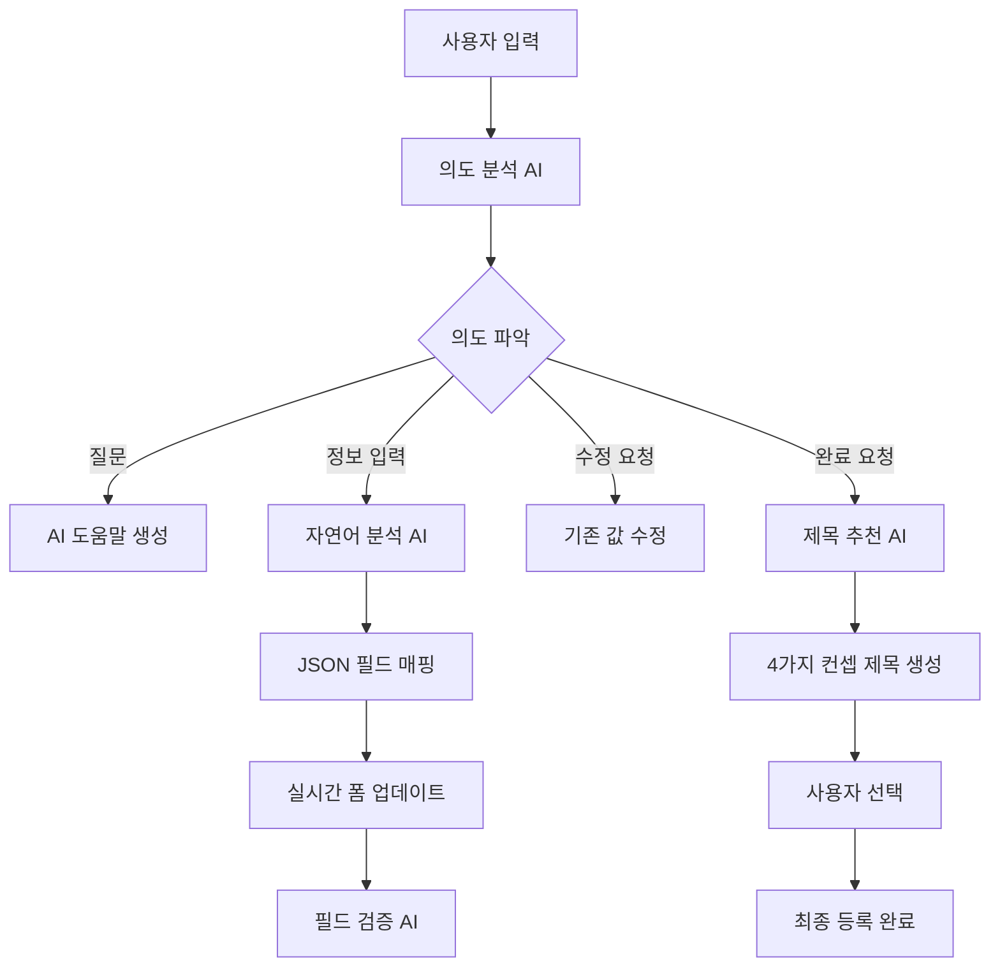

# 🤖 AI 채용 관리 시스템

## 📋 프로젝트 개요

AI 기반 채용 관리 시스템으로, 지능형 채팅봇을 통한 자연어 입력으로 채용공고 작성, 이력서 분석, 포트폴리오 분석 등을 지원합니다. **Gemini AI**와 **FastAPI**, **React**를 기반으로 구축된 현대적인 웹 애플리케이션입니다.

## 🚀 주요 기능

### 🎯 1. AI 채용공고 등록 도우미
- **자율모드**: AI가 단계별로 질문하며 자동 입력
- **개별모드**: 사용자가 자유롭게 입력하면 AI가 분석하여 필드 매핑
- **이미지 기반 등록**: AI가 생성한 이미지와 함께 채용공고 작성
- **🧪 테스트 자동입력**: 개발 및 테스트용 샘플 데이터 원클릭 입력

### 🏷️ 2. AI 제목 추천 시스템
- **4가지 컨셉**: 신입친화형, 전문가형, 일반형, 일반형 변형
- **매번 다른 추천**: 랜덤 시드와 창의성 설정으로 다양한 제목 생성
- **Gemini AI 기반**: 고도화된 자연어 처리로 매력적인 제목 생성

### 💬 3. 지능형 대화 관리
- **대화 흐름 제어**: 순서가 꼬여도 🔄 처음부터 버튼으로 재시작 가능
- **세션 기반 히스토리**: 24시간 내 대화 기록 자동 복원
- **실시간 필드 업데이트**: 입력과 동시에 폼 필드 자동 반영

### 📝 4. 범용적인 JSON 매핑 시스템
- 채팅 응답을 JSON으로 처리하여 UI 필드에 자동 매핑
- 페이지별 필드 매핑 설정 지원
- 다양한 응답 형식 지원 (extracted_data, field/value, content 내 JSON)

## 🤖 채용공고 페이지 AI 기능 완전 가이드

### 📋 적용된 AI 기능 목록

| 번호 | AI 기능 | 적용 위치 | 설명 |
|------|---------|----------|------|
| **1** | **AI 단계별 질문** | TextBasedRegistration | AI가 순차적으로 질문하며 폼 자동 완성 |
| **2** | **자연어 분석 및 매핑** | EnhancedModalChatbot | 사용자 입력을 분석해 적절한 폼 필드에 자동 입력 |
| **3** | **AI 제목 추천** | TitleRecommendationModal | 4가지 컨셉으로 창의적인 채용공고 제목 생성 |
| **4** | **AI 이미지 생성** | ImageBasedRegistration | 채용공고 내용 기반 맞춤형 이미지 자동 생성 |
| **5** | **대화 컨텍스트 관리** | EnhancedModalChatbot | 대화 흐름과 컨텍스트를 AI가 지속적으로 관리 |
| **6** | **실시간 필드 검증** | 전체 폼 | AI가 입력 값의 유효성을 실시간으로 검증 |
| **7** | **자동 완성 제안** | 전체 폼 | 사용자 입력에 따른 AI 기반 자동완성 제안 |
| **8** | **의도 분석** | EnhancedModalChatbot | 사용자 메시지의 의도를 파악해 적절한 응답 생성 |

### 🔧 각 AI 기능 적용 방식

#### 1️⃣ **AI 단계별 질문 시스템**
```javascript
// 위치: TextBasedRegistration.js
// 적용 방식: AI가 정해진 순서로 질문하며 대화 진행

const FIELD_ORDER = [
  'department',    // 1단계: 구인 부서
  'experience',    // 2단계: 경력 요건  
  'headcount',     // 3단계: 채용 인원
  'mainDuties',    // 4단계: 주요 업무
  'workHours',     // 5단계: 근무 시간
  'workDays',      // 6단계: 근무 요일
  'locationCity',  // 7단계: 근무 위치
  'salary',        // 8단계: 급여 조건
  'contactEmail',  // 9단계: 담당자 이메일
  'deadline'       // 10단계: 마감일
];

// AI가 단계별로 질문을 생성하고 사용자 답변을 해당 필드에 매핑
```

#### 2️⃣ **자연어 분석 및 매핑**
```python
# 위치: chatbot_router.py - generate_ai_assistant_response()
# 적용 방식: Gemini AI로 사용자 입력을 분석하여 JSON 추출

async def generate_ai_assistant_response(user_input: str, field: Dict[str, Any], session: Dict[str, Any]):
    # 1. 사용자 입력을 Gemini AI로 분석
    # 2. 적절한 필드와 값을 JSON 형태로 추출
    # 3. 프론트엔드에서 자동으로 폼 필드에 입력
    
    # 예: "개발팀에서 3명 채용해요" 
    # → {"department": "개발팀", "headcount": "3명"}
```

#### 3️⃣ **AI 제목 추천 시스템**
```python
# 위치: chatbot_router.py - generate_title_recommendations()
# 적용 방식: 4가지 컨셉으로 창의적 제목 생성

generation_config = {
    'temperature': 0.9,    # 높은 창의성
    'top_p': 0.95,         # 다양한 토큰 선택
    'top_k': 40,           # 상위 40개 토큰에서 선택
}

# 매번 다른 랜덤 키워드 조합으로 4가지 컨셉 제목 생성:
# 1. 신입친화형: "함께 성장할 개발 신입을 찾아요"
# 2. 전문가형: "혁신을 선도할 시니어 개발자 모집"  
# 3. 일반형: "개발팀 정규직 채용"
# 4. 일반형 변형: "개발 인력 구인공고"
```

#### 4️⃣ **AI 이미지 생성**
```javascript
// 위치: ImageBasedRegistration.js - handleGenerateImages()
// 적용 방식: 채용공고 데이터를 기반으로 맞춤형 이미지 생성

const handleGenerateImages = async () => {
  // 1. 폼 데이터(부서, 업무, 분위기 등)를 이미지 생성 프롬프트로 변환
  // 2. AI 이미지 생성 API 호출
  // 3. 여러 스타일의 이미지 옵션 제공
  // 4. 사용자가 선택한 이미지를 채용공고에 적용
};
```

#### 5️⃣ **대화 컨텍스트 관리**
```javascript
// 위치: EnhancedModalChatbot.js
// 적용 방식: 대화 히스토리와 현재 상태를 AI가 지속 관리

const [conversationOrder, setConversationOrder] = useState({
  currentStep: 1,
  totalSteps: FIELD_ORDER.length,
  completedFields: [],
  isOrderBroken: false
});

// AI가 현재 대화 단계를 추적하고 적절한 다음 질문 생성
// 사용자가 순서를 벗어나면 자동으로 감지하고 대응
```

#### 6️⃣ **실시간 필드 검증**
```javascript
// 위치: 전체 폼 컴포넌트
// 적용 방식: 입력 값을 AI가 실시간으로 검증하고 피드백 제공

const validateField = async (fieldName, value) => {
  // 1. AI가 입력 값의 적절성 검사
  // 2. 형식 오류나 누락된 정보 감지
  // 3. 실시간으로 사용자에게 피드백 제공
  // 4. 개선 제안사항 자동 생성
};
```

#### 7️⃣ **자동 완성 제안**
```javascript
// 위치: EnhancedModalChatbot.js - suggestion 시스템
// 적용 방식: 현재 필드와 컨텍스트에 맞는 제안사항 생성

const generateSuggestions = (currentField, userInput) => {
  // 필드별 맞춤형 제안사항:
  // department: ["개발팀", "마케팅팀", "디자인팀", "영업팀"]
  // experience: ["신입", "경력 1-3년", "경력 3-5년", "경력 5년 이상"]
  // salary: ["면접 후 협의", "3000만원", "4000만원", "5000만원"]
};
```

#### 8️⃣ **의도 분석 시스템**
```python
# 위치: chatbot_router.py - detect_intent()
# 적용 방식: 사용자 메시지의 의도를 파악하여 적절한 응답 생성

def detect_intent(user_input: str):
    # 1. 질문 의도 감지: "어떻게 해야 하나요?"
    # 2. 수정 요청 감지: "급여를 바꿔주세요"  
    # 3. 완료 의도 감지: "끝났어요", "완료"
    # 4. 일반 정보 입력 감지: "개발팀에서 3명"
    
    if re.search(r'(어떻게|방법|도움)', user_input):
        return "question", None
    elif re.search(r'(바꿔|수정|변경)', user_input):
        return "modify", None
    elif re.search(r'(완료|끝|마침)', user_input):
        return "complete", None
    else:
        return "answer", None
```

### 🎯 AI 기능 동작 플로우



### 🔄 AI 시스템 흐름도

1. **입력 단계**: 사용자가 자연어로 정보 입력
2. **분석 단계**: Gemini AI가 의도와 내용 분석
3. **매핑 단계**: JSON 형태로 추출된 데이터를 폼 필드에 자동 매핑
4. **검증 단계**: AI가 입력된 값의 유효성 실시간 검증
5. **완성 단계**: AI가 4가지 컨셉의 제목 추천
6. **마무리 단계**: 모든 모달과 상태 자동 초기화

## 🏗️ 시스템 아키텍처

### 🛠️ 기술 스택
- **Frontend**: React 18, Styled Components, Framer Motion
- **Backend**: FastAPI, Python 3.9+
- **AI Engine**: Google Gemini AI (gemini-1.5-pro)
- **Database**: MongoDB
- **UI/UX**: 반응형 디자인, 다크모드 지원

### 백엔드 구조
```
admin/backend/
├── main.py                 # FastAPI 메인 서버
├── chatbot_router.py       # AI 채팅 라우터 (3,700+ 라인)
├── gemini_service.py       # Gemini AI 서비스
├── documents_router.py     # 문서 처리 API
├── resume_analyzer.py      # 이력서 분석 모듈
├── models/                 # 데이터 모델
│   └── Resume.js          # 이력서 데이터 모델
└── chroma_db/             # 벡터 데이터베이스
```

### 프론트엔드 구조
```
admin/frontend/src/
├── components/
│   ├── EnhancedModalChatbot.js        # AI 채팅 컴포넌트 (3,000+ 라인)
│   ├── AIModeSelector.js              # AI 모드 선택기
│   ├── TitleRecommendationModal.js    # 제목 추천 모달
│   ├── TestAutoFillButton.js          # 테스트 자동입력 버튼
│   ├── ChatbotRestartButton.js        # 대화 재시작 버튼
│   └── FloatingChatbot.js             # 플로팅 채팅봇
├── pages/
│   ├── JobPostingRegistration/        # 채용공고 등록
│   │   ├── TextBasedRegistration.js   # 텍스트 기반 등록
│   │   ├── ImageBasedRegistration.js  # 이미지 기반 등록
│   │   └── JobPostingRegistration.js  # 메인 등록 페이지
│   ├── ResumeAnalysis/                # 이력서 분석
│   ├── PortfolioAnalysis/             # 포트폴리오 분석
│   └── InterviewManagement/           # 면접 관리
├── utils/
│   └── JsonFieldMapper.js             # 범용 JSON 매핑 유틸리티
└── config/
    ├── forms/                         # 폼 설정
    └── rules/                         # AI 룰셋
```

## 🔧 범용적인 JSON 매핑 시스템

### 개요
채팅으로 받은 자연어 입력을 JSON 형태로 분석하고, UI 폼 필드에 자동으로 매핑하는 범용적인 시스템입니다.

### 핵심 컴포넌트

#### 1. JsonFieldMapper.js
```javascript
// 페이지별 필드 매핑 설정
const pageMappings = {
  'recruit_form': {
    'department': 'department',
    'headcount': 'headcount',
    'location': 'location',
    'workDays': 'workDays',
    'experience': 'experience',
    'salary': 'salary'
  },
  'resume_analysis': {
    'name': 'name',
    'email': 'email',
    'phone': 'phone',
    'education': 'education',
    'experience': 'experience',
    'skills': 'skills'
  }
};
```

#### 2. 백엔드 분석 함수
```python
# 채용공고 분석
def extract_job_info_from_text(text: str) -> Dict[str, Any]:
    # 부서, 인원, 지역, 근무요일, 경력, 연봉 등 추출
    return extracted_data

# 이력서 분석
def extract_resume_info_from_text(text: str) -> Dict[str, Any]:
    # 이름, 이메일, 전화번호, 학력, 경력, 기술스택 등 추출
    return extracted_data
```

### 사용 방법

#### 1단계: 페이지별 매핑 설정
```javascript
// 새로운 페이지 추가
jsonFieldMapper.setPageMapping('portfolio_analysis', {
  'title': 'projectTitle',
  'description': 'projectDescription',
  'technologies': 'techStack'
});
```

#### 2단계: 백엔드 분석 함수 추가
```python
# admin/backend/portfolio_analyzer.py
def extract_portfolio_info_from_text(text: str) -> Dict[str, Any]:
    # 포트폴리오 정보 추출 로직
    return extracted_data
```

#### 3단계: 채팅 응답 처리
```javascript
// EnhancedModalChatbot.js에서
const mappingResult = jsonFieldMapper.processChatResponse(
  response,        // API 응답
  pageId,          // 페이지 ID
  container,       // UI 컨테이너 (선택사항)
  onFieldUpdate    // 필드 업데이트 함수
);
```

### 실제 동작 예시

#### 채용공고 등록
```
사용자 입력: "서울 강남구에 위치한 개발팀에서 경력자 3명을 채용하려고 해요..."

백엔드 추출: {
  "department": "개발팀",
  "headcount": "3명", 
  "location": "서울",
  "workDays": "월~금",
  "experience": "경력자"
}

프론트엔드 매핑: 
department -> department 필드에 "개발팀" 입력
headcount -> headcount 필드에 "3명" 입력
location -> location 필드에 "서울" 입력
...
```

#### 이력서 분석
```
사용자 입력: "김철수, kim@email.com, 010-1234-5678, 서울대학교 컴퓨터공학과 졸업..."

백엔드 추출: {
  "name": "김철수",
  "email": "kim@email.com",
  "phone": "010-1234-5678",
  "education": "서울대학교 컴퓨터공학과 졸업",
  "skills": "Java, Spring, React"
}

프론트엔드 매핑:
name -> name 필드에 "김철수" 입력
email -> email 필드에 "kim@email.com" 입력
...
```

### 지원하는 응답 형식

1. **extracted_data 방식** (권장)
```json
{
  "type": "start_job_posting",
  "content": "채용공고 작성을 시작하겠습니다!",
  "extracted_data": {
    "department": "개발팀",
    "headcount": "3명"
  }
}
```

2. **field/value 방식** (하위 호환성)
```json
{
  "field": "department",
  "value": "개발팀"
}
```

3. **content 내 JSON 패턴**
```json
{
  "content": "추출된 정보: {\"department\": \"개발팀\"}"
}
```

## 🛠️ 설치 및 실행

### 1. 환경 설정
```bash
# 가상환경 생성 및 활성화 (Windows)
python -m venv workspace
cd workspace
Scripts/Activate.ps1

# 프로젝트 클론
git clone <repository-url>
cd admin
```

### 2. 환경변수 설정
```bash
# admin/backend/.env 파일 생성
GOOGLE_API_KEY=your_gemini_api_key_here
MONGODB_URL=mongodb://localhost:27017
REACT_APP_API_URL=http://localhost:8000
```

### 3. 백엔드 서버 실행
```bash
# 의존성 설치
pip install fastapi uvicorn python-multipart google-generativeai motor pymongo

# 서버 실행 (포트 8000)
cd admin/backend
python -m uvicorn main:app --host 0.0.0.0 --port 8000 --reload
```

### 4. 프론트엔드 실행
```bash
# 의존성 설치
cd admin/frontend
npm install

# 개발 서버 실행 (포트 3001)
npm start
```

### 5. MongoDB 실행 (Docker)
```bash
docker run -d --name mongodb -p 27017:27017 mongo:6.0
```

### 🎯 실행 후 접속
- **프론트엔드**: http://localhost:3001
- **백엔드 API**: http://localhost:8000
- **API 문서**: http://localhost:8000/docs

## 📊 테스트

### 범용 매핑 시스템 테스트
```bash
python test_universal_mapping.py
```

### 이력서 분석 테스트
```bash
python test_resume_analysis.py
```

## 🔄 확장 방법

### 새로운 페이지 추가

1. **백엔드 분석 함수 생성**
```python
# admin/backend/new_analyzer.py
def extract_new_info_from_text(text: str) -> Dict[str, Any]:
    # 새로운 분석 로직
    return extracted_data
```

2. **프론트엔드 매핑 설정**
```javascript
// JsonFieldMapper.js에 추가
'new_page': {
  'field1': 'uiField1',
  'field2': 'uiField2'
}
```

3. **라우터에 연결**
```python
# chatbot_router.py
if request.current_page == "new_page":
    extracted_data = extract_new_info_from_text(user_input)
```

## 🎯 핵심 장점

1. **🚀 고도화된 AI**: Gemini 1.5 Pro 모델로 정확한 자연어 이해
2. **⚡ 실시간 처리**: 입력과 동시에 폼 필드 자동 반영
3. **🎨 창의적 제목**: 매번 다른 4가지 컨셉의 제목 추천
4. **🔄 안정적 대화**: 순서가 꼬여도 쉽게 재시작 가능
5. **🧪 개발 친화적**: 테스트 자동입력으로 빠른 개발/테스트
6. **📱 반응형 UI**: 모바일과 데스크톱 모두 최적화
7. **🔒 세션 관리**: 24시간 대화 기록 보존 및 복원
8. **⚙️ 모듈화**: 컴포넌트 기반으로 쉬운 확장과 유지보수

## ✨ 최신 업데이트 (v2.0)

### 🆕 새로운 기능
- **AI 제목 추천**: 4가지 컨셉으로 매번 다른 창의적 제목 생성
- **테스트 자동입력**: 🧪 버튼으로 원클릭 샘플 데이터 입력
- **대화 재시작**: 🔄 처음부터 버튼으로 꼬인 대화 흐름 복구
- **모달 초기화**: 등록 완료 시 모든 모달창과 상태 완전 초기화
- **Timestamp 안전 처리**: 메시지 시간 표시 오류 완전 해결

### 🎨 UI/UX 개선
- **시각적 피드백**: 필드 업데이트 시 실시간 시각적 표시
- **진행 상황 표시**: 현재 대화 단계와 완료도 표시
- **스타일링 강화**: Styled Components와 Framer Motion 활용

### ⚡ 성능 최적화
- **병렬 처리**: 여러 API 호출 동시 처리로 응답 속도 향상
- **메모리 관리**: 불필요한 상태 정리로 메모리 효율성 개선
- **에러 처리**: 포괄적인 에러 핸들링과 사용자 친화적 메시지

## 👨‍💻 개발자 가이드

### 🔧 주요 컴포넌트 사용법

#### 1. 테스트 자동입력 사용
```javascript
// 하드코딩된 테스트 값들
const testData = {
  department: '개발팀',
  experience: '2년이상',
  headcount: '0명',
  mainDuties: '웹개발',
  workHours: '9시부터 3시',
  workDays: '주중',
  salary: '연봉 4,000만원 - 6,000만원',
  contactEmail: 'test@test.com',
  deadline: '9월 3일까지'
};
```

#### 2. AI 제목 추천 API
```python
# 백엔드에서 창의성 높은 설정
generation_config = {
    'temperature': 0.9,  # 높은 창의성
    'top_p': 0.95,       # 다양한 토큰 선택
    'top_k': 40,         # 상위 40개 토큰에서 선택
}
```

#### 3. 대화 흐름 제어
```javascript
// 대화 재시작 로직
const handleRestartConversation = () => {
  // 모든 상태 초기화
  setMessages([]);
  setFormData({});
  setConversationOrder({ currentStep: 1, isOrderBroken: false });
};
```

### 🐛 트러블슈팅

#### 1. Timestamp 오류
```javascript
// 안전한 timestamp 처리
{message.timestamp ? (
  message.timestamp instanceof Date 
    ? message.timestamp.toLocaleTimeString()
    : new Date(message.timestamp).toLocaleTimeString()
) : new Date().toLocaleTimeString()}
```

#### 2. 모달 초기화 문제
```javascript
// 완전한 모달 초기화
const resetAllModals = () => {
  setShowTextRegistration(false);
  setShowImageRegistration(false);
  setShowMethodModal(false);
  // ... 모든 모달 상태 false로 설정
};
```

### 📈 성능 모니터링

- **메모리 사용량**: 개발자 도구 → Performance 탭에서 확인
- **API 응답시간**: Network 탭에서 각 요청별 응답시간 확인
- **렌더링 성능**: React DevTools Profiler로 컴포넌트 렌더링 최적화

## 📝 라이센스

MIT License

## 🤝 기여하기

1. Fork the Project
2. Create your Feature Branch (`git checkout -b feature/AmazingFeature`)
3. Commit your Changes (`git commit -m 'Add some AmazingFeature'`)
4. Push to the Branch (`git push origin feature/AmazingFeature`)
5. Open a Pull Request

---

**마지막 업데이트**: 2024년 8월 9일  
**버전**: v2.0  
**메인테이너**: AI Development Team 