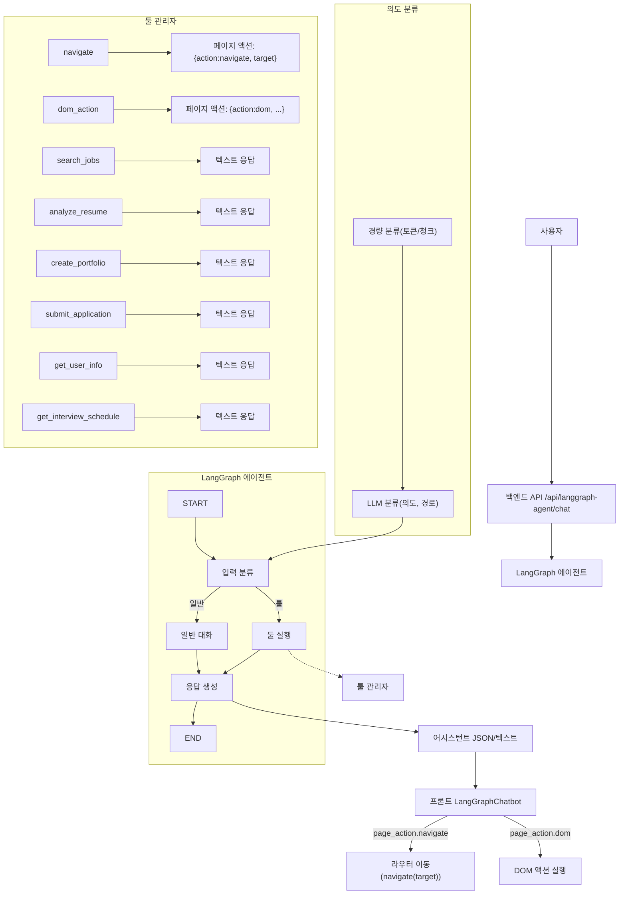

# LangGraph 에이전트 챗봇

## 개요

LangGraph를 이용한 모듈화된 지능형 에이전트 챗봇입니다. 이 시스템은 재사용 가능한 구조로 설계되어 다른 프로젝트에서도 쉽게 활용할 수 있습니다.

## 주요 기능

### 🤖 지능형 대화
- Gemini LLM을 활용한 자연스러운 대화
- 컨텍스트 기반 응답 생성
- 대화 히스토리 관리

### 🛠️ 툴 기반 작업
- 채용 정보 검색
- 이력서 분석
- 포트폴리오 생성
- 지원서 제출
- 사용자 정보 조회
- 면접 일정 관리

### 🔄 모듈화된 구조
- 설정 중앙 관리
- 툴 확장 가능
- 재사용 가능한 컴포넌트

## 파일 구조

```
backend/
├── langgraph_agent.py      # 메인 에이전트 클래스
├── langgraph_router.py     # FastAPI 라우터
├── langgraph_config.py     # 설정 관리
├── langgraph_tools.py      # 툴 관리자
└── LANGGRAPH_README.md     # 이 파일
```

## 설치 및 설정

### 1. 의존성 설치

```bash
pip install -r requirements.txt
```

### 2. 환경 변수 설정

`.env` 파일에 다음을 추가:

```env
# LangGraph 에이전트(대화/분류용)
GOOGLE_API_KEY=your_google_genai_api_key

# 툴 내부 LLM 유틸(네비게이션 경로 추론 등)에서 사용
GEMINI_API_KEY=your_gemini_api_key
```

### 3. 서버 실행

```bash
cd backend
python main.py
```

## 아키텍처 흐름도

<!-- 이미지 버전 -->




## API 엔드포인트

### 채팅
- `POST /api/langgraph-agent/chat` - 에이전트와 대화

### 세션 관리
- `GET /api/langgraph-agent/sessions` - 모든 세션 조회
- `GET /api/langgraph-agent/sessions/{session_id}/history` - 세션 히스토리 조회
- `DELETE /api/langgraph-agent/sessions/{session_id}` - 세션 삭제
- `POST /api/langgraph-agent/sessions/{session_id}/clear` - 세션 히스토리 삭제

### 시스템
- `GET /api/langgraph-agent/health` - 에이전트 상태 확인
- `GET /api/langgraph-agent/tools` - 사용 가능한 툴 목록

## 사용 예시

### 1. 기본 대화

```javascript
// 프론트엔드에서 사용
const response = await fetch('/api/langgraph-agent/chat', {
  method: 'POST',
  headers: { 'Content-Type': 'application/json' },
  body: JSON.stringify({
    user_input: "안녕하세요!",
    session_id: null, // 새 세션 생성
    context: { current_page: "/dashboard" }
  })
});

const data = await response.json();
console.log(data.message); // 에이전트 응답
```

### 상세 흐름도 (스타일 버전) // 이미지 별도

### 2. 툴 사용

```javascript
// 채용 정보 검색
const response = await fetch('/api/langgraph-agent/chat', {
  method: 'POST',
  headers: { 'Content-Type': 'application/json' },
  body: JSON.stringify({
    user_input: "Python 개발자 채용 정보를 검색해주세요",
    session_id: "existing_session_id"
  })
});
```

## 모듈화 구조

### 1. 설정 관리 (`langgraph_config.py`)

중앙에서 모든 설정을 관리합니다:

```python
from langgraph_config import config

# LLM 설정
print(config.llm_model)  # "gemini-1.5-pro"
print(config.llm_temperature)  # 0.7

# 툴 설정
print(config.available_tools)  # ["search_jobs", "analyze_resume", ...]

# 경량 의도 분류(토큰/청크 기반)
from langgraph_config import quick_intent_classify
print(quick_intent_classify("지원자 관리로 이동해줘"))  # ("tool", 0.xx)
```

## 사용 중인 툴과 정책

### 툴 목록(설명 요약)
- navigate: 자연어/JSON 기반 페이지 이동. 허용 라우트 화이트리스트 내에서만 이동. 응답 문구 예: "페이지를 /resume으로 이동합니다. (navigate 툴 적용)"
- dom_action: 클릭/입력/제출/체크/옵션 선택/스크롤/텍스트 조회/존재 확인 등 DOM 액션 JSON 생성. 프론트가 실행
- search_jobs: 모의 채용 검색 결과 요약 반환
- analyze_resume: 이력서 텍스트에서 기술/연차 추출 및 추천/매칭도 산출
- create_portfolio: 포트폴리오 ID 생성 및 안내
- submit_application: 지원서 제출 처리 결과 반환
- get_user_info: 사용자 프로필 요약
- get_interview_schedule: 예정 면접 일정 요약
- create_function_tool: 동적 툴 생성/등록(관리자 전용)

### 실행 정책
- 공개 허용(화이트리스트): navigate, dom_action
- 그 외 툴: 관리자 모드이거나 승인된 동적 툴(trusted)만 실행 가능
- 허용 라우트(allowed_routes): `/`, `/job-posting`, `/new-posting`, `/resume`, `/applicants`, `/interview`, `/interview-calendar`, `/portfolio`, `/cover-letter`, `/talent`, `/users`, `/settings`

참고: 세부 동작/정책은 `docs/langgraph-tools.md`에도 정리되어 있습니다.

## 관리자 전용 가이드(문서 통합)

다음 내용은 별도 관리자용 문서를 통합한 요약입니다.

### 1) 관리자 모드
- 목적: 위험/동적 기능(예: 동적 툴 생성) 사용 권한 제어
- 활성화/비활성: 백엔드 `admin_mode.is_admin_mode(session_id)` 체크를 통해 권한 판정(프론트 `AdminToolsManager` UI와 연계 가능)

### 2) 동적 툴 관리(create_function_tool)
- 기능: 간단한 안전 샘플 코드를 파일로 저장하고 인덱스 업데이트 후 런타임 등록
- 입력(JSON): `{ "name": "echo_tool", "description": "설명" }`
- 저장 위치: 정책의 `storage_dir`(기본값 `admin/backend/dynamic_tools/`)
- 인덱스: `index.json`에 툴 메타(name, description, trusted)
- 신뢰 플래그(trusted): 관리자 승인 시 `true`로 설정하면 공개 툴 화이트리스트 외에도 실행 허용

관련 API(내부):
- 생성: `create_dynamic_tool(name, code, description)`
- 수정: `update_dynamic_tool(name, code?, description?)`
- 삭제: `delete_dynamic_tool(name)`
- 신뢰 변경: `set_dynamic_trusted(name, trusted)`
- 로드: 서버 기동 시 `load_dynamic_tools()`

보안 정책:
- 금지 패턴(예): `fork`, `popen`, `remove(`, `rmdir(`, `unlink(`, `system(` 등 금지 토큰 검사
- `exec` 사용은 샌드박스된 내장만 허용하고 위험 코드 차단

### 3) 공개 툴 화이트리스트
- `allowed_public_tools = ["navigate", "dom_action"]`
- 이외 툴은 관리자 모드 또는 trusted 동적 툴만 실행 허용

### 4) 프론트 관리자 패널
- 컴포넌트: `frontend/src/components/AdminToolsManager.js`
- 기능(예): 동적 툴 생성/목록/신뢰 설정 등 관리 UI 제공(프로젝트 구성에 따라 제한될 수 있음)

### 2. 툴 관리 (`langgraph_tools.py`)

새로운 툴을 쉽게 추가할 수 있습니다:

```python
from langgraph_tools import tool_manager

# 새 툴 등록
def my_custom_tool(query: str, context: Dict[str, Any]) -> str:
    return f"커스텀 툴 실행: {query}"

tool_manager.register_tool("my_custom_tool", my_custom_tool)

# 툴 실행
result = tool_manager.execute_tool("my_custom_tool", "테스트 쿼리")
```

### 3. 에이전트 확장

새로운 기능을 추가하려면:

1. `langgraph_config.py`에 설정/토큰/라우트 추가
2. `langgraph_tools.py`에 툴 구현 (navigate는 LLM으로 허용 라우트 중 선택)
3. `langgraph_agent.py`에서 분류/흐름 보정 (필요시)

## 다른 프로젝트에서 사용하기

### 1. 파일 복사

필요한 파일들을 새 프로젝트로 복사:

```bash
cp langgraph_agent.py /path/to/new/project/
cp langgraph_router.py /path/to/new/project/
cp langgraph_config.py /path/to/new/project/
cp langgraph_tools.py /path/to/new/project/
```

### 2. 설정 수정

`langgraph_config.py`에서 프로젝트에 맞게 설정을 수정:

```python
class LangGraphConfig(BaseSettings):
    # 프로젝트별 설정으로 수정
    system_message: str = "당신은 [프로젝트명]의 AI 어시스턴트입니다..."
    
    # 새로운 툴 추가
    available_tools: List[str] = [
        "existing_tool_1",
        "existing_tool_2",
        "new_tool_1",  # 새로 추가
        "new_tool_2"   # 새로 추가
    ]
```

### 3. 툴 구현

`langgraph_tools.py`에서 새로운 툴을 구현:

```python
def _new_tool_1(self, query: str, context: Dict[str, Any]) -> str:
    """새로운 툴 1"""
    # 툴 로직 구현
    return "새로운 툴 1 실행 결과"

def _new_tool_2(self, query: str, context: Dict[str, Any]) -> str:
    """새로운 툴 2"""
    # 툴 로직 구현
    return "새로운 툴 2 실행 결과"
```

### 4. 라우터에 추가

FastAPI 앱에 라우터를 추가:

```python
from langgraph_router import router as langgraph_router

app.include_router(langgraph_router)
```

## 프론트엔드 연동

### React 컴포넌트 사용

```jsx
import LangGraphChatbot from './components/LangGraphChatbot';

function App() {
  return (
    <div>
      <h1>내 앱</h1>
      <LangGraphChatbot />
    </div>
  );
}
```

### 헤더에 아이콘 추가

```jsx
import { FiMessageCircle } from 'react-icons/fi';

function Header() {
  const [isChatbotOpen, setIsChatbotOpen] = useState(false);
  
  return (
    <header>
      <button onClick={() => setIsChatbotOpen(!isChatbotOpen)}>
        <FiMessageCircle />
      </button>
      {isChatbotOpen && <LangGraphChatbot />}
    </header>
  );
}
```

## 네비게이션 정책

- 허용 라우트(화이트리스트):
  - `/`, `/job-posting`, `/new-posting`, `/resume`, `/applicants`, `/interview`, `/interview-calendar`, `/portfolio`, `/cover-letter`, `/talent`, `/users`, `/settings`
- navigate 툴은 LLM이 위 목록 중 하나만 선택하도록 강제합니다.
- 응답 문구 예시: "페이지를 /resume으로 이동합니다. (navigate 툴 적용)"

## 트러블슈팅

### 1. LLM 초기화 실패

```
LLM 초기화 실패: GOOGLE_API_KEY not found
```

**해결방법**: `.env` 파일에 `GOOGLE_API_KEY`를 올바르게 설정하세요.

### 2. 툴 실행 오류

```
툴 실행 중 오류가 발생했습니다: [오류 메시지]
```

**해결방법**: 
1. 툴 함수의 로직을 확인
2. 필요한 의존성이 설치되어 있는지 확인
3. 입력 데이터 형식을 확인

### 3. 세션 관리 오류

```
세션을 찾을 수 없습니다
```

**해결방법**: 
1. 세션 ID가 올바른지 확인
2. 세션이 만료되었는지 확인
3. 새로운 세션을 생성

## 성능 최적화

### 1. 대화 히스토리 제한

```python
# langgraph_config.py
max_conversation_history: int = 10  # 최근 10개 메시지만 유지
```

### 2. 세션 타임아웃

```python
# langgraph_config.py
session_timeout_minutes: int = 30  # 30분 후 세션 만료
```

### 3. LLM 설정 조정

```python
# langgraph_config.py
llm_temperature: float = 0.7  # 응답 창의성 조절
llm_max_tokens: int = 1000    # 최대 토큰 수 제한
```

## 보안 고려사항

1. **API 키 보안**: 환경 변수를 통해 API 키 관리
2. **입력 검증**: 사용자 입력에 대한 적절한 검증
3. **세션 관리**: 세션 타임아웃 및 정기적인 정리
4. **에러 처리**: 민감한 정보가 노출되지 않도록 에러 메시지 관리

## 라이선스

이 프로젝트는 MIT 라이선스 하에 배포됩니다.

## 기여하기

1. Fork the repository
2. Create your feature branch (`git checkout -b feature/amazing-feature`)
3. Commit your changes (`git commit -m 'Add some amazing feature'`)
4. Push to the branch (`git push origin feature/amazing-feature`)
5. Open a Pull Request


